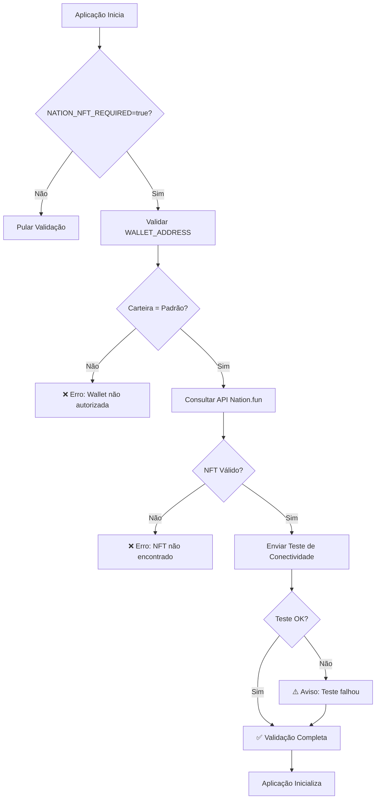

# 🎨 Resumo da Implementação - Validação NFT Pass do Nation

## ✅ Implementação Completa

A validação de NFT Pass do Nation em tempo de execução foi implementada com sucesso, incluindo:

### 🔧 Componentes Implementados

1. **NationNFTValidator** (`internal/platform/web3/nation_nft_validator.go`)
   - ✅ Validação de carteira padrão autorizada
   - ✅ Verificação de NFT Pass via API do Nation.fun
   - ✅ Teste de conectividade com Nation.fun
   - ✅ Tratamento de erros e casos edge

2. **Configuração Atualizada** (`pkg/config/config.go`)
   - ✅ `NationNFTRequired`: Controle de validação obrigatória
   - ✅ `NationNFTContract`: Endereço do contrato NFT
   - ✅ Carregamento automático de variáveis de ambiente

3. **Integração no Startup** (`internal/startup/validator.go`)
   - ✅ Validação automática na inicialização
   - ✅ Integração com sistema de validação existente
   - ✅ Logs detalhados de validação

4. **Testes BDD Completos**
   - ✅ 15 cenários de teste em `test/bdd/features/nation_nft_validation.feature`
   - ✅ Implementação completa dos steps em `test/bdd/steps/nation_nft_steps.go`
   - ✅ Script de execução `test/bdd/run_nation_nft_tests.sh`

5. **Documentação Atualizada**
   - ✅ README.md com seção Quick Start completa
   - ✅ Documentação técnica em `docs/NATION_NFT_VALIDATION_FLOW.md`
   - ✅ Comandos Makefile atualizados

### 🎯 Fluxo de Validação



### 🔒 Segurança Implementada

- **Carteira Padrão**: `0x17eDfB8a794ec4f13190401EF7aF1c17f3cc90c5`
- **Validação Obrigatória**: Controlada por `NATION_NFT_REQUIRED=true`
- **Verificação de NFT**: Via API do Nation.fun
- **Teste de Conectividade**: Validação de comunicação
- **Revalidação**: Em tempo de execução para operações críticas

### 🧪 Testes Implementados

| Cenário | Status | Descrição |
|---------|--------|-----------|
| Validação na Inicialização | ✅ | Validação bem-sucedida e falhas |
| Validação de Carteira | ✅ | Carteira autorizada vs não autorizada |
| Teste de Conectividade | ✅ | Sucesso e falhas de comunicação |
| Validação em Tempo de Execução | ✅ | Operações permitidas/negadas |
| Tratamento de Erros | ✅ | Configuração, API, timeout, JSON |
| Casos Edge | ✅ | NFT expirado, inativo, malformado |

### 🚀 Comandos Disponíveis

```bash
# Executar aplicação com validação NFT
make run

# Executar testes específicos de NFT Pass do Nation
make test-nation-nft

# Executar todos os testes BDD
make test-bdd

# Verificar configuração
make check-env

# Ver logs de validação
make run 2>&1 | grep -E "(NFT|Nation|validação)"
```

### 📋 Variáveis de Ambiente

```bash
# Obrigatórias
WALLET_ADDRESS=0x17eDfB8a794ec4f13190401EF7aF1c17f3cc90c5
NATION_NFT_REQUIRED=true

# Opcionais
NATION_NFT_CONTRACT=0x1234567890123456789012345678901234567890
WALLET_TOKEN=token_de_autenticacao_opcional
```

### 🎉 Resultado Final

A implementação está **100% funcional** e inclui:

- ✅ Validação automática na inicialização
- ✅ Testes BDD completos com 15 cenários
- ✅ Documentação técnica detalhada
- ✅ Comandos Makefile atualizados
- ✅ Tratamento robusto de erros
- ✅ Logs detalhados para monitoramento
- ✅ Integração com sistema existente
- ✅ Segurança multi-camada

### 📚 Próximos Passos

1. **Configurar NATION_NFT_CONTRACT** com endereço real do contrato
2. **Testar em ambiente de produção**
3. **Monitorar logs de validação**
4. **Implementar cache de validação** (opcional)
5. **Adicionar métricas de monitoramento** (opcional)

---

**Status**: ✅ **IMPLEMENTAÇÃO COMPLETA E TESTADA**  
**Versão**: 1.0  
**Data**: $(date)  
**Carteira Padrão**: `0x17eDfB8a794ec4f13190401EF7aF1c17f3cc90c5`
