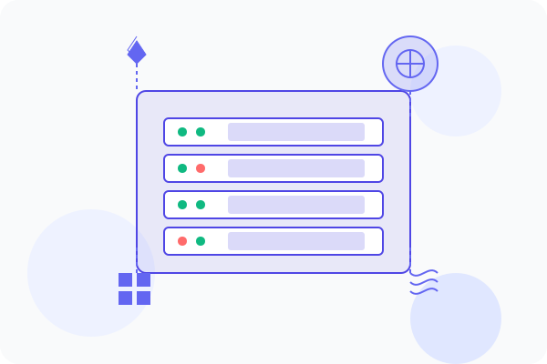
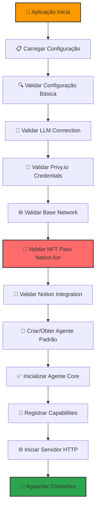
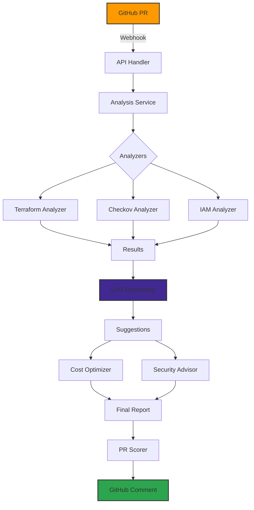
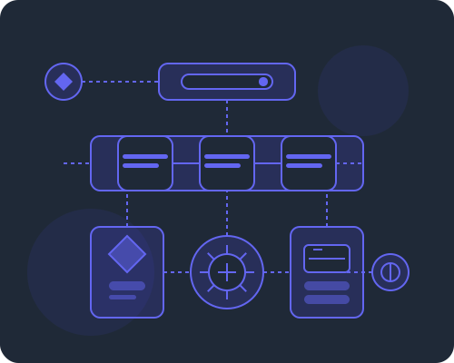
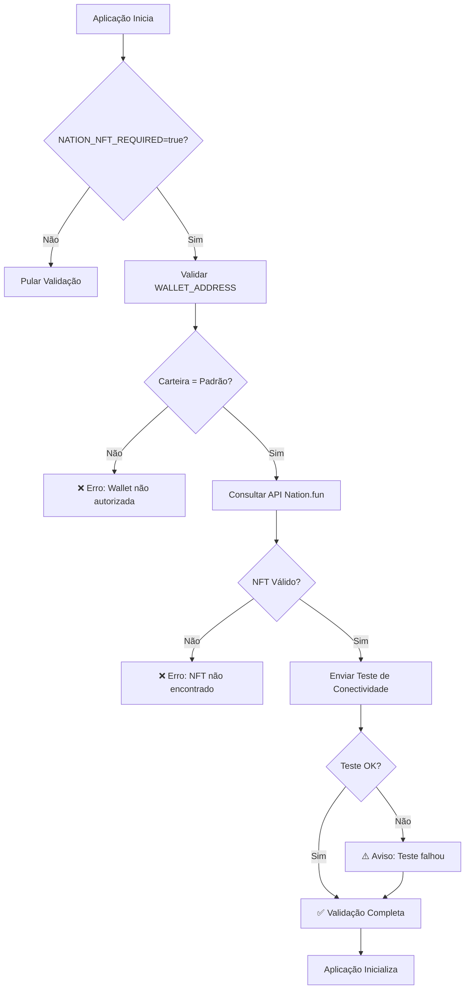
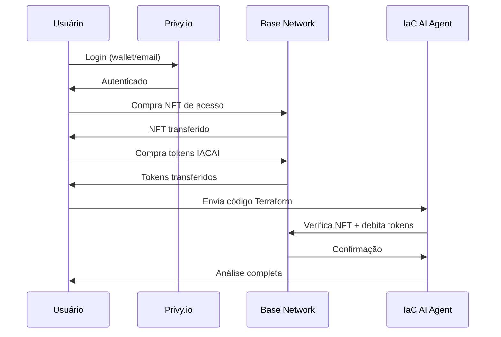

# <div align="center">🤖 IaC AI Agent</div>

<div align="center">


<h3>Agente de IA para análise, revisão e otimização de código Infrastructure as Code</h3>
<h4>Com autenticação Web3 e pagamentos on-chain</h4>

[](https://go.dev/)
[](https://privy.io)
[](https://base.org)
[](https://nation.fun)
[](LICENSE)

</div>

<br>

<div align="center">
  
  
  
  
  
</div>

<br>

## 📊 Visão Geral

<div align="center">
  
</div>

<br>

## 🚀 Processo de Inicialização da Aplicação

### O que acontece quando a aplicação sobe?

Quando você executa `make run` ou `go run cmd/agent/main.go`, a aplicação executa uma sequência rigorosa de validações e inicializações:



### 🔍 Validações Obrigatórias de Startup

A aplicação **NÃO INICIA** sem estas validações:

#### 1. 📋 Validação de Configuração Básica
```bash
📋 Validando configuração básica...
✅ Verificando variáveis obrigatórias:
  - PRIVY_APP_ID: cmgh6un8w007bl10ci0tgitwp
  - WALLET_ADDRESS: 0x17eDfB8a794ec4f13190401EF7aF1c17f3cc90c5
```

#### 2. 🤖 Validação LLM (OBRIGATÓRIO)
```bash
🤖 Validando conexão com LLM...
✅ Testando conexão com LLM via NFT Pass do Nation...
✅ LLM autenticado via NFT Pass do Nation
  - Wallet: 0x17eDfB8a794ec4f13190401EF7aF1c17f3cc90c5
  - Token ID: 12345
  - Tier: Pro
  - Provider: nation.fun
✅ Teste de conectividade LLM bem-sucedido
```

#### 3. 🔐 Validação Privy.io (OBRIGATÓRIO)
```bash
🔐 Validando credenciais Privy.io...
✅ Privy credentials configuradas
  - App ID: cmgh6un8w...
```

#### 4. 🌐 Validação Base Network (OPCIONAL)
```bash
🌐 Validando conexão com Base Network...
✅ Base Network conectado
  - Chain ID: 8453
  - Latest Block: 12345678
```

#### 5. 🎨 Validação NFT Pass Nation.fun (OBRIGATÓRIO)
```bash
🎨 Validando posse do NFT Nation.fun...
✅ Verificando carteira autorizada...
✅ Consultando API Nation.fun...
✅ NFT Pass válido encontrado
✅ Enviando teste de conectividade...
✅ Teste de conectividade bem-sucedido
```

#### 6. 📝 Validação Notion (OPCIONAL)
```bash
📝 Validando integração com Notion...
✅ Notion API conectada
✅ Agente Notion configurado
  - ID: notion-agent-123
  - Name: IaC AI Agent
```

#### 7. 🤖 Criação do Agente Padrão (OBRIGATÓRIO)
```bash
🤖 Verificando agente padrão...
✅ Agente pronto
  - ID: default-agent-123
  - Name: Default Agent
```

### 📊 Relatório Final de Validação

Após todas as validações, a aplicação exibe um relatório completo:

```bash
============================================================
📊 RELATÓRIO DE VALIDAÇÃO DE STARTUP
============================================================
✅ Status: PASSOU

📋 Checklist de Validações:
  ✅ LLM Connection
  ✅ Privy.io Credentials
  ✅ Base Network
  ✅ Nation.fun NFT
  ✅ Notion Integration
  ✅ Default Agent

🤖 Agent Details:
  ID: default-agent-123
  Name: Default Agent

📝 Notion Agent Details:
  ID: notion-agent-123
  Name: IaC AI Agent

============================================================
✅ Validação completa - Aplicação iniciando...
```

### 🔧 Inicialização dos Componentes

Após as validações, a aplicação inicializa os componentes principais:

#### 1. 🤖 Core Agent
```bash
🤖 Initializing agent
  - Agent ID: iac-ai-agent
  - Name: IaC AI Agent
  - Version: 1.0.0
  - Capabilities Count: 2
```

#### 2. 🔧 Capabilities Registration
```bash
✅ Capability registered
  - capability_id: whatsapp
  - name: WhatsApp Capability
  - version: 1.0.0

✅ Capability registered
  - capability_id: iac-analysis
  - name: IaC Analysis Capability
  - version: 1.0.0
```

#### 3. 🌐 HTTP Server Startup
```bash
✅ Starting agent server on :8080
✅ Agent started successfully: iac-ai-agent
```

### 🚨 Comportamento em Caso de Falha

Se qualquer validação obrigatória falhar, a aplicação **NÃO INICIA**:

```bash
============================================================
📊 RELATÓRIO DE VALIDAÇÃO DE STARTUP
============================================================
❌ Status: FALHOU

📋 Checklist de Validações:
  ✅ LLM Connection
  ❌ Privy.io Credentials
  ✅ Base Network
  ❌ Nation.fun NFT
  ✅ Notion Integration
  ❌ Default Agent

❌ Erros Encontrados:
  ❌ Privy validation failed: PRIVY_APP_ID não configurado
  ❌ Nation.fun NFT validation failed: WALLET_ADDRESS não configurado
  ❌ Agent creation failed: WALLET_ADDRESS não configurado

💥 APLICAÇÃO NÃO PODE INICIAR - Validação falhou
Por favor, corrija os erros acima e tente novamente.

Erros críticos:
  - Privy validation failed: PRIVY_APP_ID não configurado
  - Nation.fun NFT validation failed: WALLET_ADDRESS não configurado
  - Agent creation failed: WALLET_ADDRESS não configurado

panic: Startup validation failed
```

### ⚙️ Configuração Mínima para Inicialização

Para a aplicação iniciar com sucesso, você precisa configurar:

```bash
# Arquivo .env mínimo obrigatório
PRIVY_APP_ID=cmgh6un8w007bl10ci0tgitwp
WALLET_ADDRESS=0x17eDfB8a794ec4f13190401EF7aF1c17f3cc90c5
NATION_NFT_REQUIRED=true
LLM_PROVIDER=nation.fun
LLM_MODEL=nation-1
```

### 🔍 Logs de Debug

Para ver logs detalhados do processo de inicialização:

```bash
# Executar com logs detalhados
LOG_LEVEL=debug make run

# Ou diretamente
LOG_LEVEL=debug go run cmd/agent/main.go
```

### 🛠️ Troubleshooting de Startup

| Problema | Causa | Solução |
|----------|-------|---------|
| **"LLM validation failed"** | NFT Pass inválido ou carteira não autorizada | Verificar `WALLET_ADDRESS` e posse do NFT |
| **"Privy validation failed"** | `PRIVY_APP_ID` não configurado | Configurar variável de ambiente |
| **"Nation.fun NFT validation failed"** | Carteira não possui NFT Pass válido | Verificar posse do NFT na carteira |
| **"Base Network validation failed"** | Problema de conectividade | Verificar `BASE_RPC_URL` e conectividade |
| **"Agent creation failed"** | Erro na criação do agente padrão | Verificar configurações de wallet |

<div class="gradient-box">
  <h3>🚀 O que o IaC AI Agent faz?</h3>
</div>

O **IaC AI Agent** é um bot inteligente que analisa código Terraform e fornece:

<div class="feature-grid">
  <div class="feature-card">
    <h4>✅ Análise de Segurança</h4>
    <p>Integração com Checkov para detecção de vulnerabilidades</p>
  </div>
  <div class="feature-card">
    <h4>✅ Análise com LLM</h4>
    <p>Sugestões contextualizadas usando GPT-4/Claude</p>
  </div>
  <div class="feature-card">
    <h4>✅ Detecção de Drift</h4>
    <p>Identifica diferenças entre código e infraestrutura</p>
  </div>
  <div class="feature-card">
    <h4>✅ Otimização de Custos</h4>
    <p>Recomendações para redução de gastos com estimativas</p>
  </div>
  <div class="feature-card">
    <h4>✅ Best Practices</h4>
    <p>Validação de padrões e práticas recomendadas</p>
  </div>
  <div class="feature-card">
    <h4>✅ IAM Analysis</h4>
    <p>Análise especializada de permissões e políticas</p>
  </div>
</div>

## 🧠 Sistema de Agentes Inteligentes



O IaC AI Agent possui um **sistema de agentes inteligentes** que:

- ✨ **Cria automaticamente um agente** quando você inicia pela primeira vez
- 🎨 **4 templates pré-definidos**: General Purpose, Security, Cost, Architecture
- 🧠 **Personalidade customizável**: Ajuste tom, verbosidade, estilo
- 📊 **Conhecimento especializado**: Expertise em AWS, Azure, GCP, Terraform
- 🔧 **Limites configuráveis**: Rate limits, custos, timeouts

<div class="terminal">
<pre>
$ iac-ai-agent init
🤖 <span class="highlight">Verificando agente padrão...</span>
ℹ️  Nenhum agente encontrado
✨ <span class="highlight">Criando novo agente automaticamente...</span>
✅ <span class="success">Novo agente criado: IaC Agent - 0x742d35</span>
</pre>
</div>

## 🔐 Web3 Native

<div align="center">
  
</div>

### Autenticação e Pagamentos Descentralizados

- **Autenticação via Privy.io**: Login com wallet (MetaMask, Coinbase) ou email
- **NFTs de Acesso** (Base Network): 3 tiers de acesso permanente
- **Token IACAI** (ERC-20): Pague por análises com tokens on-chain
- **Privy Onramp**: Compre crypto com cartão/PIX sem ter wallet

## 🏗️ Arquitetura

```mermaid
flowchart TB
    subgraph Frontend
    A[Privy SDK] --- B[Wagmi]
    B --- C[Next.js]
    end
    
    subgraph "Backend Go"
    D[API REST] --- E[Web3 Platform]
    E --- F[LLM]
    D --- G[Analyzers]
    G --- H[Knowledge Base]
    end
    
    subgraph "Base Network L2"
    I[NFT Access] --- J[IACAI Token]
    end
    
    Frontend --> Backend
    Backend --> "Base Network L2"
    
    class Frontend,Backend,"Base Network L2" node
    
    classDef node fill:#f9f9f9,stroke:#333,stroke-width:1px,rx:5px,ry:5px
```

## ⚡ Quick Start - Validação NFT Pass do Nation

### 🎨 Validação de NFT Pass do Nation em Tempo de Execução

O sistema agora inclui validação automática da NFT Pass do Nation.fun para garantir que apenas a carteira padrão autorizada (`0x17eDfB8a794ec4f13190401EF7aF1c17f3cc90c5`) possa acessar funcionalidades críticas.

### 🚀 Setup Rápido (5 minutos)

<div class="terminal">
<pre>
<span class="comment"># 1. Clone e configure</span>
git clone https://github.com/gosouza/iac-ai-agent
cd iac-ai-agent

<span class="comment"># 2. Setup automático</span>
make setup

<span class="comment"># 3. Configure suas credenciais</span>
cp .env-example .env
nano .env  # ← Configure as variáveis obrigatórias

<span class="comment"># 4. Verifique se está tudo OK</span>
make check-env

<span class="comment"># 5. Execute com validação de NFT</span>
make run

<span class="comment"># 6. Teste a validação</span>
curl http://localhost:8080/health
</pre>
</div>

### 🔧 Configuração Obrigatória

Crie o arquivo `.env` com as variáveis essenciais:

```bash
# =====================================================
# VARIÁVEIS OBRIGATÓRIAS PARA VALIDAÇÃO NFT NATION
# =====================================================

# 1. PRIVY.IO (já configurado)
PRIVY_APP_ID=cmgh6un8w007bl10ci0tgitwp

# 2. NATION.FUN NFT (OBRIGATÓRIO)
WALLET_ADDRESS=0x17eDfB8a794ec4f13190401EF7aF1c17f3cc90c5
NATION_NFT_REQUIRED=true
NATION_NFT_CONTRACT=0x1234567890123456789012345678901234567890

# 3. LLM API (Nation.fun - autenticação via carteira Web3)
LLM_PROVIDER=nation.fun
LLM_MODEL=nation-1
LLM_TEMPERATURE=0.2
LLM_MAX_TOKENS=4000

# =====================================================
# VARIÁVEIS RECOMENDADAS
# =====================================================

# BASE NETWORK
BASE_RPC_URL=https://mainnet.base.org
BASE_CHAIN_ID=8453

# FEATURES
ENABLE_NFT_ACCESS=true
ENABLE_TOKEN_PAYMENTS=true
ENABLE_STARTUP_VALIDATION=true
ENABLE_WEB3_AUTH=true

# SERVER
PORT=8080
HOST=0.0.0.0
ENVIRONMENT=development

# LOGGING
LOG_LEVEL=info
LOG_FORMAT=json
```

### 🧪 Teste de Validação NFT

<div class="terminal">
<pre>
<span class="comment"># 1. Executar testes BDD específicos de NFT Pass do Nation</span>
./test/bdd/run_nation_nft_tests.sh

<span class="comment"># 2. Verificar logs de validação</span>
make run 2>&1 | grep -E "(NFT|Nation|validação)"

<span class="comment"># 3. Testar validação manual</span>
curl -X POST http://localhost:8080/api/auth/web3/verify \
  -H "Content-Type: application/json" \
  -d '{"token": "test_token"}'

<span class="comment"># 4. Verificar status da validação</span>
curl http://localhost:8080/api/auth/web3/check-access \
  -H "Content-Type: application/json" \
  -d '{"wallet_address": "0x17eDfB8a794ec4f13190401EF7aF1c17f3cc90c5"}'
</pre>
</div>

### 🔍 Comandos de Diagnóstico

<div class="terminal">
<pre>
<span class="comment"># Verificar configuração de NFT</span>
echo "WALLET_ADDRESS: $WALLET_ADDRESS"
echo "NATION_NFT_REQUIRED: $NATION_NFT_REQUIRED"
echo "NATION_NFT_CONTRACT: $NATION_NFT_CONTRACT"

<span class="comment"># Testar conectividade com API do Nation.fun</span>
curl -X GET "https://api.nation.fun/v1/nft/check/0x17eDfB8a794ec4f13190401EF7aF1c17f3cc90c5"

<span class="comment"># Enviar teste de conectividade</span>
curl -X POST "https://api.nation.fun/v1/test/send" \
  -H "Content-Type: application/json" \
  -d '{"message": "teste de conectividade", "timestamp": '$(date +%s)'}'

<span class="comment"># Verificar logs de validação em tempo real</span>
docker logs -f iac-ai-agent | grep -E "(NFT|Nation|validação)"
</pre>
</div>

### 🚨 Troubleshooting Rápido

| Problema | Solução |
|----------|---------|
| **"wallet não autorizada"** | Verificar se `WALLET_ADDRESS` está correto |
| **"carteira não possui NFT Pass"** | Confirmar que a carteira possui NFT ativo |
| **"API retornou status 500"** | Verificar status da API do Nation.fun |
| **"timeout na comunicação"** | Verificar conectividade de rede |

### 📊 Fluxo de Validação



### 🎯 Primeiro Uso com Validação NFT

<div class="terminal">
<pre>
<span class="comment"># Execute a aplicação</span>
make run

<span class="comment"># Você verá estas validações:</span>
<span class="success">✅ LLM Connection</span>
<span class="success">✅ Privy.io Credentials</span>
<span class="success">✅ Base Network</span>
<span class="success">✅ Nation.fun NFT Ownership</span>
<span class="success">✅ NFT Pass Validation</span>
<span class="success">✅ Nation.fun Connectivity Test</span>

<span class="comment"># Teste a API</span>
curl http://localhost:8080/health
<span class="comment"># Resposta: {"status":"ok","version":"1.0.0","nft_validated":true}</span>

<span class="comment"># Abra no navegador</span>
open http://localhost:8080
</pre>
</div>

### 🛠️ Comandos Makefile Disponíveis

<div class="terminal">
<pre>
<span class="comment"># Comandos principais</span>
make setup          # Setup inicial do projeto
make run            # Executar aplicação com validação NFT
make build          # Compilar binário
make test           # Executar todos os testes
make test-bdd       # Executar testes BDD
make test-nation-nft # Executar testes específicos de NFT Pass do Nation

<span class="comment"># Comandos de desenvolvimento</span>
make dev            # Executar em modo desenvolvimento
make check-env       # Verificar variáveis de ambiente
make lint           # Executar linter
make format         # Formatar código

<span class="comment"># Comandos de Docker</span>
make docker-build   # Construir imagem Docker
make docker-run     # Executar container Docker
make docker-logs    # Ver logs do container

<span class="comment"># Comandos de teste específicos</span>
make test-unit      # Testes unitários
make test-integration # Testes de integração
make test-nation-nft # Testes de validação NFT Pass do Nation
make test-all       # Todos os testes com relatório

<span class="comment"># Comandos de limpeza</span>
make clean          # Limpar arquivos temporários
make clean-docker   # Limpar containers e imagens Docker
make clean-test     # Limpar arquivos de teste
</pre>
</div>

### 📋 Checklist de Validação NFT

<div class="checklist">
  <h3>✅ Antes de Executar</h3>
  <ul>
    <li>✅ <code>WALLET_ADDRESS</code> configurado com carteira padrão</li>
    <li>✅ <code>NATION_NFT_REQUIRED=true</code> definido</li>
    <li>✅ <code>NATION_NFT_CONTRACT</code> configurado (opcional)</li>
    <li>✅ Conectividade com internet para API do Nation.fun</li>
    <li>✅ Arquivo <code>.env</code> criado e configurado</li>
  </ul>
  
  <h3>✅ Durante a Execução</h3>
  <ul>
    <li>✅ Validação de carteira padrão autorizada</li>
    <li>✅ Verificação de NFT Pass via API</li>
    <li>✅ Teste de conectividade com Nation.fun</li>
    <li>✅ Logs de validação exibidos no console</li>
    <li>✅ Aplicação inicializa sem erros</li>
  </ul>
  
  <h3>✅ Após a Execução</h3>
  <ul>
    <li>✅ API responde em <code>http://localhost:8080/health</code></li>
    <li>✅ Endpoint de validação Web3 funcional</li>
    <li>✅ Logs mostram validação bem-sucedida</li>
    <li>✅ Testes BDD passam sem erros</li>
  </ul>
</div>

### 📋 Pré-requisitos Obrigatórios

<div class="warning-box">
  <h3>🚨 Você precisa de apenas 2 coisas:</h3>
  <p>A aplicação <strong>NÃO INICIA</strong> sem elas:</p>
</div>

| ✅ | O que você precisa | Como obter | Tempo |
|----|-------------------|------------|-------|
| 🎨 **NFT Pass do Nation** | NFT válido na carteira padrão | Já possui na carteira `0x17eDfB8a794ec4f13190401EF7aF1c17f3cc90c5` | 0 min |
| 🔐 **Conectividade** | Acesso à API do Nation.fun | Internet funcionando | 0 min |

### 🟢 Já Configurado Automaticamente

| ✅ | Configuração | Status |
|----|-------------|--------|
| 🔐 **Privy.io** | App ID hardcoded | ✅ Pronto |
| 🎨 **Wallet Address** | Endereço hardcoded | ✅ Pronto |
| 🤖 **LLM Provider** | Nation.fun via NFT Pass | ✅ Autenticação automática |
| 🔐 **Secrets** | Git Secrets + Lit Protocol | ✅ Gerenciado automaticamente |

### 🔧 Configuração das Credenciais

Crie o arquivo `.env` com as variáveis essenciais (sem necessidade de API keys externas):

```bash
# ============================================
# 🔴 VARIÁVEIS OBRIGATÓRIAS
# ============================================

# Nation.fun NFT Pass (autenticação automática)
WALLET_ADDRESS=0x17eDfB8a794ec4f13190401EF7aF1c17f3cc90c5
NATION_NFT_REQUIRED=true

# LLM (Nation.fun - sem API key necessária)
LLM_PROVIDER=nation.fun
LLM_MODEL=nation-1

# ============================================
# 🟢 JÁ CONFIGURADO AUTOMATICAMENTE
# ============================================

# ✅ Privy.io App ID: cmgh6un8w007bl10ci0tgitwp (hardcoded)
# ✅ Wallet Address: 0x17eDfB8a794ec4f13190401EF7aF1c17f3cc90c5 (hardcoded)
# ✅ LLM Authentication: Via NFT Pass do Nation (automático)
# ✅ Secrets: Gerenciados via Git Secrets + Lit Protocol

# ============================================
# 🟡 RECOMENDADAS
# ============================================

# BASE NETWORK
BASE_RPC_URL=https://mainnet.base.org        # ← Base Mainnet
BASE_CHAIN_ID=8453                           # ← 8453 = Mainnet

# FEATURES
ENABLE_NFT_ACCESS=true
ENABLE_TOKEN_PAYMENTS=true
ENABLE_STARTUP_VALIDATION=true
```

### 🎯 Primeiro Uso

<div class="terminal">
<pre>
<span class="comment"># Execute a aplicação</span>
make run

<span class="comment"># Você verá estas validações:</span>
<span class="success">✅ LLM Connection</span>
<span class="success">✅ Privy.io Credentials</span>
<span class="success">✅ Base Network</span>
<span class="success">✅ Nation.fun NFT Ownership</span>

<span class="comment"># Teste a API</span>
curl http://localhost:8080/health
# Resposta: {"status":"ok","version":"1.0.0"}

<span class="comment"># Abra no navegador</span>
open http://localhost:8080
</pre>
</div>

### 🧪 Teste Rápido

```bash
# Teste uma análise simples
curl -X POST http://localhost:8080/api/v1/analyze \
  -H "Content-Type: application/json" \
  -d '{
    "code": "resource \"aws_s3_bucket\" \"example\" { bucket = \"my-bucket\" }",
    "type": "terraform_analysis"
  }'
```

### ❌ Problemas Comuns

| Erro | Solução |
|------|---------|
| "wallet não autorizada" | Verificar se `WALLET_ADDRESS` está correto |
| "carteira não possui NFT Pass" | Confirmar que a carteira possui NFT ativo |
| "API retornou status 500" | Verificar status da API do Nation.fun |
| "timeout na comunicação" | Verificar conectividade de rede |
| "NATION_NFT_REQUIRED é obrigatório" | Definir `NATION_NFT_REQUIRED=true` no `.env` |
| "WALLET_ADDRESS não configurado" | Adicionar `WALLET_ADDRESS` no `.env` |

---

## 📚 Documentação Completa

Para informações detalhadas, consulte:

- 📖 **[Índice da Documentação](docs/INDEX.md)** - Navegação completa por categoria
- 📖 **[Estratégia de Configuração](docs/ESTRATEGIA_CONFIGURACAO.md)** - Como funciona a configuração simplificada
- 📖 **[Guia de Instalação Completo](docs/GUIA_INSTALACAO.md)** - Setup detalhado passo-a-passo
- 📖 **[Quick Start Atualizado](docs/QUICKSTART_ATUALIZADO.md)** - Versão expandida
- 📖 **[Exemplos Práticos](docs/EXEMPLOS_PRATICOS.md)** - Casos de uso reais
- 📖 **[Sistema de Agentes](docs/AGENT_SYSTEM.md)** - Como funciona o sistema de IA

## 🎯 Exemplos Práticos de Uso

### 1. Análise de Segurança

```bash
# Analise um recurso S3 para vulnerabilidades
curl -X POST http://localhost:8080/api/v1/analyze \
  -H "Content-Type: application/json" \
  -d '{
    "code": "resource \"aws_s3_bucket\" \"example\" {\n  bucket = \"my-bucket\"\n  versioning {\n    enabled = true\n  }\n}",
    "type": "security_analysis"
  }'
```

### 2. Otimização de Custos

```bash
# Analise custos de instâncias EC2
curl -X POST http://localhost:8080/api/v1/analyze \
  -H "Content-Type: application/json" \
  -d '{
    "code": "resource \"aws_instance\" \"web\" {\n  instance_type = \"t3.large\"\n  ami = \"ami-0c02fb55956c7d316\"\n}",
    "type": "cost_optimization"
  }'
```

### 3. Análise Completa com LLM

```bash
# Análise completa com sugestões inteligentes
curl -X POST http://localhost:8080/api/v1/analyze \
  -H "Content-Type: application/json" \
  -d '{
    "code": "resource \"aws_s3_bucket\" \"example\" {\n  bucket = \"my-bucket\"\n}",
    "type": "full_analysis",
    "include_llm": true
  }'
```

### 4. Geração de Código

```bash
# Peça para gerar código Terraform
curl -X POST http://localhost:8080/api/v1/generate \
  -H "Content-Type: application/json" \
  -d '{
    "prompt": "Crie um bucket S3 com versionamento e criptografia habilitados",
    "type": "terraform_code"
  }'
```

## 🎫 Sistema de Acesso (NFTs)

### Tiers Disponíveis

| Tier | Preço | Benefícios |
|------|-------|------------|
| **Basic** | 0.01 ETH (~$25) | Análises ilimitadas, Checkov, Suporte Discord |
| **Pro** | 0.05 ETH (~$125) | + LLM, Preview, Drift, Priority Support |
| **Enterprise** | 0.2 ETH (~$500) | + API dedicada, Custom KB, SLA 24/7 |

### Como Funciona?



## 💎 Tokens IACAI

<div class="pricing-table">
  <div class="pricing-column">
    <h3>Pacotes Disponíveis</h3>
    <table>
      <tr>
        <th>Pacote</th>
        <th>Tokens</th>
        <th>Preço</th>
        <th>Desconto</th>
      </tr>
      <tr>
        <td>Starter</td>
        <td>100</td>
        <td>0.005 ETH ($10)</td>
        <td>-</td>
      </tr>
      <tr>
        <td>Power</td>
        <td>500</td>
        <td>0.0225 ETH ($45)</td>
        <td>10%</td>
      </tr>
      <tr>
        <td>Pro</td>
        <td>1000</td>
        <td>0.0425 ETH ($85)</td>
        <td>15%</td>
      </tr>
      <tr>
        <td>Enterprise</td>
        <td>5000</td>
        <td>0.1875 ETH ($375)</td>
        <td>25%</td>
      </tr>
    </table>
  </div>
  
  <div class="pricing-column">
    <h3>Tabela de Custos</h3>
    <table>
      <tr>
        <th>Operação</th>
        <th>Custo (IACAI)</th>
      </tr>
      <tr>
        <td>Terraform Analysis</td>
        <td>1</td>
      </tr>
      <tr>
        <td>Checkov Scan</td>
        <td>2</td>
      </tr>
      <tr>
        <td>LLM Analysis</td>
        <td>5</td>
      </tr>
      <tr>
        <td>Preview Analysis</td>
        <td>3</td>
      </tr>
      <tr>
        <td>Security Audit</td>
        <td>10</td>
      </tr>
      <tr>
        <td>Cost Optimization</td>
        <td>5</td>
      </tr>
      <tr>
        <td>Full Review</td>
        <td>15</td>
      </tr>
    </table>
  </div>
</div>

## 📚 Documentação

<div class="doc-grid">
  <div class="doc-card">
    <h3>Guias de Instalação e Configuração</h3>
    <ul>
      <li>📖 <a href="docs/QUICKSTART_ATUALIZADO.md">Quick Start Atualizado</a> - Setup rápido em 5 minutos</li>
      <li>🐳 <a href="docs/INSTALACAO_DOCKER.md">Guia Docker</a> - Instalação com containers</li>
      <li>🔧 <a href="docs/CONFIGURACAO_VARIAVEIS.md">Configuração de Variáveis</a> - Detalhamento completo</li>
      <li>📱 <a href="docs/WHATSAPP_API_KEY_CONFIG.md">WhatsApp API Key</a> - Configuração do WhatsApp</li>
      <li>🖥️ <a href="docs/GUIA_INSTALACAO.md">Guia Completo</a> - Passo-a-passo detalhado</li>
    </ul>
  </div>

  <div class="doc-card">
    <h3>Documentação Técnica</h3>
    <ul>
      <li>🎯 <a href="docs/OBJECTIVE.md">Objetivo do Projeto</a> - Visão completa</li>
      <li>🏗️ <a href="docs/ARCHITECTURE.md">Arquitetura</a> - Design técnico</li>
      <li>🤖 <a href="docs/AGENT_SYSTEM.md">Sistema de Agentes</a> - Documentação completa</li>
      <li>⚡ <a href="docs/AGENT_QUICKSTART.md">Agent Quickstart</a> - Primeiros passos</li>
    </ul>
  </div>
  
  <div class="doc-card">
    <h3>Para Desenvolvedores</h3>
    <ul>
      <li>🔌 <a href="docs/WEB3_INTEGRATION_GUIDE.md">Guia de Integração Web3</a> - Privy + Base</li>
      <li>📝 <a href="docs/IMPLEMENTATION_SUMMARY.md">Resumo de Implementação</a> - O que foi feito</li>
      <li>🗺️ <a href="docs/IMPLEMENTATION_ROADMAP.md">Roadmap</a> - Próximos passos</li>
      <li>🧪 <a href="docs/TESTING.md">Testes</a> - Estratégia e execução</li>
      <li>🔍 <a href="docs/VALIDATION_MODE.md">Modo Validação</a> - Debug e testes</li>
      <li>📊 <a href="docs/BDD_TEST_REPORT.md">Relatório de Testes BDD</a> - Cobertura</li>
      <li>🌐 <a href="docs/WEB3_IMPLEMENTATION_PLAN.md">Plano Web3</a> - Implementação detalhada</li>
    </ul>
  </div>
</div>

## 🧪 Testes

### Configuração do Ambiente de Testes

<div class="terminal">
<pre>
<span class="comment"># 1. Instale as dependências necessárias para testes</span>
go install github.com/cucumber/godog/cmd/godog@latest
go install github.com/onsi/ginkgo/v2/ginkgo@latest

<span class="comment"># 2. Configure o ambiente de testes</span>
cp .env-example .env.test

<span class="comment"># 3. Edite .env.test e adicione chaves de teste</span>
<span class="highlight"># - LLM_API_KEY=sk-... (recomendamos criar uma chave separada para testes)</span>
<span class="highlight"># - PRIVY_APP_ID=app_xxx (ambiente de teste)</span>
<span class="highlight"># - BASE_RPC_URL=https://goerli.base.org (Base Testnet)</span>

<span class="comment"># 4. Prepare o ambiente de testes</span>
make test-setup
</pre>
</div>

### Execução de Testes

<div class="terminal">
<pre>
<span class="comment"># 1. Testes unitários</span>
make test-unit
# ou
go test ./test/unit/... -v

<span class="comment"># 2. Testes de integração</span>
make test-integration
# ou
go test ./test/integration/... -v

<span class="comment"># 3. Testes BDD (Behavior Driven Development)</span>
make test-bdd
# ou
godog test/bdd/features/

<span class="comment"># 4. Executar testes de um cenário específico</span>
godog test/bdd/features/bot_analysis.feature

<span class="comment"># 5. Executar todos os testes e gerar relatório</span>
make test-all
# Relatório HTML será gerado em: ./reports/test-report.html
</pre>
</div>

### Cenários de Teste BDD

Testes completos em Gherkin (português) cobrindo todos os fluxos:

| Arquivo | Descrição | Status |
|---------|-----------|--------|
| **user_onboarding.feature** | Autenticação Privy e onboarding | ✅ Implementado |
| **nft_purchase.feature** | Compra de NFT de acesso | ✅ Implementado |
| **token_purchase.feature** | Compra de tokens IACAI | ✅ Implementado |
| **bot_analysis.feature** | Uso do bot para análise | ✅ Implementado |
| **critical_path.feature** | Testes de fluxos críticos | 🚧 Em desenvolvimento |

#### Exemplo de Cenário BDD

```gherkin
Cenário: Comprar NFT Pro Access usando Privy Onramp
  Dado que minha wallet tem saldo de "0" ETH
  E eu estou visualizando o tier "Pro Access"
  Quando eu clico em "Buy with Card"
  Então devo ver a modal do Privy Onramp
  E devo ver o valor necessário: "0.05 ETH (~$125 USD)"
  Quando eu seleciono "Credit Card" como método de pagamento
  E insiro os dados do cartão
  E concluo o pagamento
  Então devo ver "Payment Processing"
  E em até 10 minutos o ETH deve chegar na wallet
  E o NFT deve ser automaticamente mintado
  E devo receber notificação "NFT Pro Access adquirido!"
```

## 🚀 Deployment

### Opções de Implantação

<div class="deployment-options">
  <div class="deployment-card">
    <h3>Local (Desenvolvimento)</h3>
    <pre>
<span class="comment"># 1. Configurar ambiente</span>
make setup

<span class="comment"># 2. Executar em modo de desenvolvimento</span>
make dev

<span class="comment"># 3. Construir binário</span>
make build

<span class="comment"># 4. Executar binário compilado</span>
./bin/iac-ai-agent
</pre>
  </div>

  <div class="deployment-card">
    <h3>Docker (Recomendado)</h3>
    <pre>
<span class="comment"># 1. Construir imagem</span>
docker build -t iacai-agent .

<span class="comment"># 2. Executar container</span>
docker run -p 8080:8080 \
  --env-file .env \
  iacai-agent

<span class="comment"># 3. Alternativa: usar docker-compose</span>
docker-compose -f configs/docker-compose.yml up -d
</pre>
  </div>
  
  <div class="deployment-card">
    <h3>Produção (Cloud)</h3>
    <pre>
<span class="comment"># 1. AWS ECS/EKS</span>
make deploy-aws

<span class="comment"># 2. Google Cloud Run</span>
make deploy-gcp

<span class="comment"># 3. Azure Container Apps</span>
make deploy-azure
</pre>
  </div>

  <div class="deployment-card">
    <h3>Smart Contracts</h3>
    <pre>
<span class="comment"># 1. Instalar dependências</span>
cd contracts
npm install

<span class="comment"># 2. Configurar chaves privadas</span>
cp .env.example .env
# Adicione PRIVATE_KEY=0x... no .env

<span class="comment"># 3. Deploy na Base Mainnet</span>
npx hardhat run scripts/deploy.ts --network base

<span class="comment"># 4. Verificar contratos</span>
npx hardhat verify --network base [CONTRACT_ADDRESS]
</pre>
    <p>Contratos deployados na <strong>Base Mainnet</strong> (Chain ID 8453):</p>
    <ul>
      <li>NFT Access: <code>0x...</code> (a ser deployado)</li>
      <li>IACAI Token: <code>0x...</code> (a ser deployado)</li>
    </ul>
  </div>
</div>

### Verificação de Deployment

<div class="terminal">
<pre>
<span class="comment"># 1. Verificar se a API está acessível</span>
curl https://seu-dominio.com/health

<span class="comment"># 2. Verificar logs</span>
docker logs -f iacai-agent

<span class="comment"># 3. Monitorar performance</span>
docker stats iacai-agent

<span class="comment"># 4. Verificar variáveis de ambiente</span>
docker exec iacai-agent env | grep PRIVY
</pre>
</div>

## 🛠️ Stack Tecnológica

<div class="tech-stack">
  <div class="tech-column">
    <h3>Backend</h3>
    <ul>
      <li><strong>Linguagem</strong>: Go 1.21+</li>
      <li><strong>Frameworks</strong>: Standard library, Gorilla Mux</li>
      <li><strong>LLM</strong>: OpenAI GPT-4, Anthropic Claude</li>
      <li><strong>Security</strong>: Checkov integration</li>
    </ul>
  </div>
  
  <div class="tech-column">
    <h3>Web3</h3>
    <ul>
      <li><strong>Auth</strong>: Privy.io SDK</li>
      <li><strong>Blockchain</strong>: Base Network (L2 Ethereum)</li>
      <li><strong>Wallets</strong>: MetaMask, Coinbase Wallet, Embedded Wallets</li>
      <li><strong>Onramp</strong>: MoonPay, Transak (via Privy)</li>
      <li><strong>Contracts</strong>: Solidity 0.8.20, OpenZeppelin</li>
    </ul>
  </div>
</div>

## 🎯 Roadmap

<div class="roadmap">
  <div class="roadmap-item completed">
    <span class="roadmap-status">✅</span>
    <span class="roadmap-text">Análise básica de Terraform</span>
  </div>
  <div class="roadmap-item completed">
    <span class="roadmap-status">✅</span>
    <span class="roadmap-text">Integração Checkov</span>
  </div>
  <div class="roadmap-item completed">
    <span class="roadmap-status">✅</span>
    <span class="roadmap-text">LLM Analysis (GPT-4/Claude)</span>
  </div>
  <div class="roadmap-item completed">
    <span class="roadmap-status">✅</span>
    <span class="roadmap-text">Autenticação Web3 (Privy)</span>
  </div>
  <div class="roadmap-item completed">
    <span class="roadmap-status">✅</span>
    <span class="roadmap-text">NFTs de acesso (Base Network)</span>
  </div>
  <div class="roadmap-item completed">
    <span class="roadmap-status">✅</span>
    <span class="roadmap-text">Token IACAI (ERC-20)</span>
  </div>
  <div class="roadmap-item pending">
    <span class="roadmap-status">⏳</span>
    <span class="roadmap-text">Preview Analysis</span>
  </div>
  <div class="roadmap-item pending">
    <span class="roadmap-status">⏳</span>
    <span class="roadmap-text">Drift Detection</span>
  </div>
  <div class="roadmap-item pending">
    <span class="roadmap-status">⏳</span>
    <span class="roadmap-text">Dashboard Web</span>
  </div>
  <div class="roadmap-item pending">
    <span class="roadmap-status">⏳</span>
    <span class="roadmap-text">Integração CI/CD</span>
  </div>
</div>

## 📞 Suporte

- **Issues**: [GitHub Issues](https://github.com/gosouza/iac-ai-agent/issues)
- **Email**: support@iacai.com
- **Discord**: (em breve)
- **Twitter**: [@iacaiagent](https://twitter.com/iacaiagent)

---

<div align="center">
  <p>Made with ❤️ by the IaC AI Agent Team</p>
  <p>
    <strong>Status</strong>: 🚀 Pronto para produção<br>
    <strong>Versão</strong>: 1.0.0<br>
    <strong>Última Atualização</strong>: 2025-10-07
  </p>
</div>

<style>
/* Estilos para o README */
.gradient-box {
  background: linear-gradient(90deg, #7B42BC 0%, #412991 100%);
  color: white;
  padding: 10px 20px;
  border-radius: 8px;
  margin: 20px 0;
}

.feature-grid {
  display: grid;
  grid-template-columns: repeat(auto-fill, minmax(300px, 1fr));
  gap: 20px;
  margin: 20px 0;
}

.feature-card {
  border: 1px solid #e1e4e8;
  border-radius: 8px;
  padding: 16px;
  background-color: #f6f8fa;
  transition: transform 0.3s ease, box-shadow 0.3s ease;
}

.feature-card:hover {
  transform: translateY(-5px);
  box-shadow: 0 10px 20px rgba(0,0,0,0.1);
}

.terminal {
  background-color: #0d1117;
  border-radius: 8px;
  padding: 16px;
  margin: 20px 0;
  overflow-x: auto;
}

.terminal pre {
  color: #c9d1d9;
  margin: 0;
}

.highlight {
  color: #ff7b72;
}

.success {
  color: #7ee787;
}

.comment {
  color: #8b949e;
}

.warning-box {
  background-color: #ffebe9;
  border: 1px solid #ff7b72;
  border-left: 5px solid #ff7b72;
  padding: 16px;
  border-radius: 8px;
  margin: 20px 0;
}

.doc-grid {
  display: grid;
  grid-template-columns: repeat(auto-fill, minmax(300px, 1fr));
  gap: 20px;
  margin: 20px 0;
}

.doc-card {
  border: 1px solid #e1e4e8;
  border-radius: 8px;
  padding: 16px;
  background-color: #f6f8fa;
}

.pricing-table {
  display: grid;
  grid-template-columns: repeat(auto-fill, minmax(300px, 1fr));
  gap: 20px;
  margin: 20px 0;
}

.pricing-column table {
  width: 100%;
  border-collapse: collapse;
}

.pricing-column th, .pricing-column td {
  padding: 8px;
  border: 1px solid #e1e4e8;
  text-align: left;
}

.pricing-column th {
  background-color: #f6f8fa;
}

.deployment-options {
  display: grid;
  grid-template-columns: repeat(auto-fill, minmax(300px, 1fr));
  gap: 20px;
  margin: 20px 0;
}

.deployment-card {
  border: 1px solid #e1e4e8;
  border-radius: 8px;
  padding: 16px;
  background-color: #f6f8fa;
}

.deployment-card pre {
  background-color: #0d1117;
  color: #c9d1d9;
  padding: 16px;
  border-radius: 8px;
  overflow-x: auto;
}

.tech-stack {
  display: grid;
  grid-template-columns: repeat(auto-fill, minmax(300px, 1fr));
  gap: 20px;
  margin: 20px 0;
}

.tech-column {
  border: 1px solid #e1e4e8;
  border-radius: 8px;
  padding: 16px;
  background-color: #f6f8fa;
}

.roadmap {
  margin: 20px 0;
}

.roadmap-item {
  display: flex;
  align-items: center;
  margin-bottom: 10px;
}

.roadmap-status {
  margin-right: 10px;
  font-size: 20px;
}

.roadmap-item.completed .roadmap-text {
  text-decoration: none;
}

.roadmap-item.pending .roadmap-text {
  color: #6e7781;
}

.checklist {
  background-color: #f6f8fa;
  border: 1px solid #e1e4e8;
  border-radius: 8px;
  padding: 20px;
  margin: 20px 0;
}

.checklist h3 {
  color: #24292e;
  margin-top: 0;
  margin-bottom: 15px;
  font-size: 16px;
}

.checklist ul {
  margin: 0;
  padding-left: 20px;
}

.checklist li {
  margin-bottom: 8px;
  color: #586069;
}

.checklist code {
  background-color: #f1f8ff;
  color: #0366d6;
  padding: 2px 6px;
  border-radius: 3px;
  font-size: 12px;
}

@media (max-width: 768px) {
  .feature-grid,
  .doc-grid,
  .pricing-table,
  .deployment-options,
  .tech-stack {
    grid-template-columns: 1fr;
  }
}
</style>