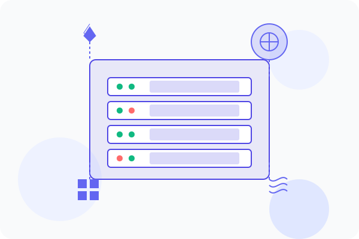
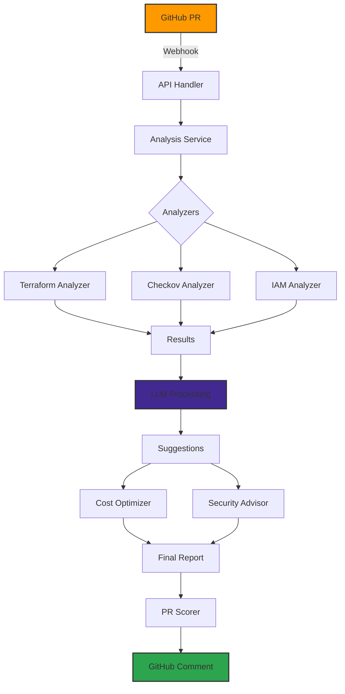
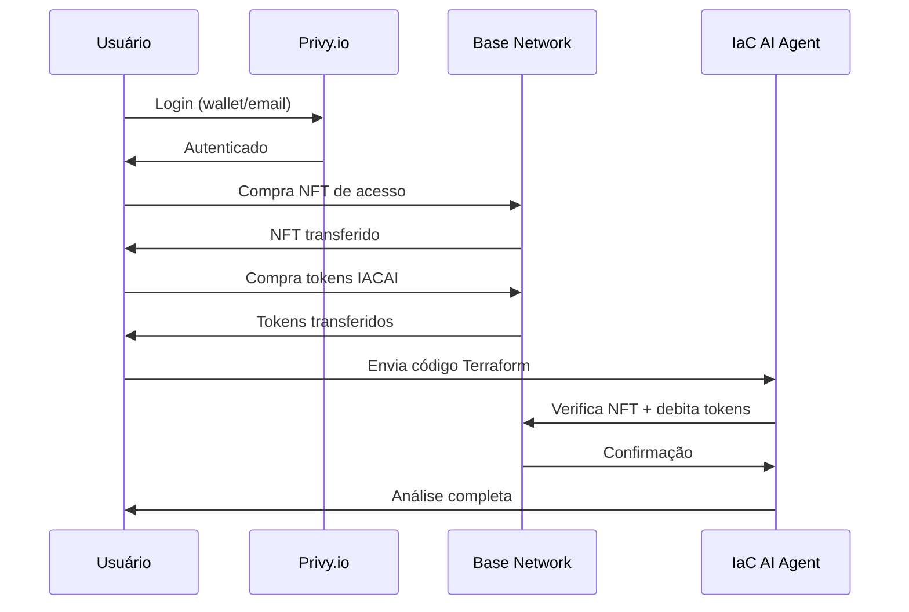

# <div align="center">🤖 IaC AI Agent</div>

<div align="center">


<h3>Agente de IA para análise, revisão e otimização de código Infrastructure as Code</h3>
<h4>Com autenticação Web3 e pagamentos on-chain</h4>

[](https://go.dev/)
[](https://privy.io)
[](https://base.org)
[](https://nation.fun)
[](LICENSE)

</div>

<br>

<div align="center">
  
  
  
  
  
</div>

<br>

## 📊 Visão Geral

<div align="center">
  
</div>

<br>

<div class="gradient-box">
  <h3>🚀 O que o IaC AI Agent faz?</h3>
</div>

O **IaC AI Agent** é um bot inteligente que analisa código Terraform e fornece:

<div class="feature-grid">
  <div class="feature-card">
    <h4>✅ Análise de Segurança</h4>
    <p>Integração com Checkov para detecção de vulnerabilidades</p>
  </div>
  <div class="feature-card">
    <h4>✅ Análise com LLM</h4>
    <p>Sugestões contextualizadas usando GPT-4/Claude</p>
  </div>
  <div class="feature-card">
    <h4>✅ Detecção de Drift</h4>
    <p>Identifica diferenças entre código e infraestrutura</p>
  </div>
  <div class="feature-card">
    <h4>✅ Otimização de Custos</h4>
    <p>Recomendações para redução de gastos com estimativas</p>
  </div>
  <div class="feature-card">
    <h4>✅ Best Practices</h4>
    <p>Validação de padrões e práticas recomendadas</p>
  </div>
  <div class="feature-card">
    <h4>✅ IAM Analysis</h4>
    <p>Análise especializada de permissões e políticas</p>
  </div>
</div>

## 🧠 Sistema de Agentes Inteligentes


```mermaid
graph TD
    A[GitHub PR] -->|Webhook| B[API Handler]
    B --> C[Analysis Service]
    C --> D{Analyzers}
    D --> E[Terraform Analyzer]
    D --> F[Checkov Analyzer]
    D --> G[IAM Analyzer]
    E --> H[Results]
    F --> H
    G --> H
    H --> I[LLM Processing]
    I --> J[Suggestions]
    J --> K[Cost Optimizer]
    J --> L[Security Advisor]
    K --> M[Final Report]
    L --> M
    M --> N[PR Scorer]
    N --> O[GitHub Comment]
    
    style A fill:#ff9900,stroke:#333,stroke-width:2px
    style I fill:#412991,stroke:#333,stroke-width:2px
    style O fill:#2da44e,stroke:#333,stroke-width:2px
```

O IaC AI Agent possui um **sistema de agentes inteligentes** que:

- ✨ **Cria automaticamente um agente** quando você inicia pela primeira vez
- 🎨 **4 templates pré-definidos**: General Purpose, Security, Cost, Architecture
- 🧠 **Personalidade customizável**: Ajuste tom, verbosidade, estilo
- 📊 **Conhecimento especializado**: Expertise em AWS, Azure, GCP, Terraform
- 🔧 **Limites configuráveis**: Rate limits, custos, timeouts

<div class="terminal">
<pre>
$ iac-ai-agent init
🤖 <span class="highlight">Verificando agente padrão...</span>
ℹ️  Nenhum agente encontrado
✨ <span class="highlight">Criando novo agente automaticamente...</span>
✅ <span class="success">Novo agente criado: IaC Agent - 0x742d35</span>
</pre>
</div>

## 🔐 Web3 Native

<div align="center">
  
</div>

### Autenticação e Pagamentos Descentralizados

- **Autenticação via Privy.io**: Login com wallet (MetaMask, Coinbase) ou email
- **NFTs de Acesso** (Base Network): 3 tiers de acesso permanente
- **Token IACAI** (ERC-20): Pague por análises com tokens on-chain
- **Privy Onramp**: Compre crypto com cartão/PIX sem ter wallet

## 🏗️ Arquitetura

```mermaid
flowchart TB
    subgraph Frontend
    A[Privy SDK] --- B[Wagmi]
    B --- C[Next.js]
    end
    
    subgraph "Backend (Go)"
    D[API REST] --- E[Web3 Platform]
    E --- F[LLM]
    D --- G[Analyzers]
    G --- H[Knowledge Base]
    end
    
    subgraph "Base Network (L2)"
    I[NFT Access] --- J[IACAI Token]
    end
    
    Frontend --> Backend
    Backend --> "Base Network (L2)"
    
    class Frontend,Backend,"Base Network (L2)" node
    
    classDef node fill:#f9f9f9,stroke:#333,stroke-width:1px,rx:5px,ry:5px
```

## ⚡ Quick Start

<div class="warning-box">
  <h3>🚨 ANTES DE COMEÇAR - LEIA ISTO!</h3>
  <p>A aplicação <strong>NÃO VAI INICIAR</strong> sem estas 3 coisas configuradas:</p>
</div>

| Requisito | O que é | Onde obter |
|-----------|---------|------------|
| 🎨 **Nation.fun NFT** | NFT de membership da Nation.fun | [nation.fun](https://nation.fun/) |
| 🔐 **Privy.io Account** | Credenciais de autenticação Web3 | [privy.io](https://privy.io) |
| 🤖 **OpenAI API Key** | Chave de API do LLM | [platform.openai.com/api-keys](https://platform.openai.com/api-keys) |

<div class="terminal">
<pre>
<span class="comment"># 1. Clone</span>
git clone https://github.com/gosouza/iac-ai-agent
cd iac-ai-agent

<span class="comment"># 2. Configure variáveis OBRIGATÓRIAS</span>
cp .env.example .env

<span class="comment"># Edite .env e adicione:</span>
<span class="highlight"># - PRIVY_APP_ID=app_xxx</span>
<span class="highlight"># - PRIVY_APP_SECRET=xxx</span>
<span class="highlight"># - WALLET_ADDRESS=0x... (com Nation.fun NFT)</span>
<span class="highlight"># - WALLET_PRIVATE_KEY=0x...</span>
<span class="highlight"># - NATION_NFT_CONTRACT=0x...</span>
<span class="highlight"># - LLM_API_KEY=sk-...</span>

<span class="comment"># 3. Execute</span>
go run cmd/agent/main.go

<span class="comment"># A aplicação vai validar TUDO antes de iniciar!</span>
<span class="success"># ✅ LLM Connection</span>
<span class="success"># ✅ Privy.io Credentials</span>
<span class="success"># ✅ Base Network</span>
<span class="success"># ✅ Nation.fun NFT Ownership</span>

<span class="comment"># 4. Teste</span>
curl http://localhost:8080/health
</pre>
</div>

## 🎫 Sistema de Acesso (NFTs)

### Tiers Disponíveis

| Tier | Preço | Benefícios |
|------|-------|------------|
| **Basic** | 0.01 ETH (~$25) | Análises ilimitadas, Checkov, Suporte Discord |
| **Pro** | 0.05 ETH (~$125) | + LLM, Preview, Drift, Priority Support |
| **Enterprise** | 0.2 ETH (~$500) | + API dedicada, Custom KB, SLA 24/7 |

### Como Funciona?


```mermaid
sequenceDiagram
    participant User as Usuário
    participant Privy as Privy.io
    participant Base as Base Network
    participant Agent as IaC AI Agent
    
    User->>Privy: Login (wallet/email)
    Privy->>User: Autenticado
    User->>Base: Compra NFT de acesso
    Base->>User: NFT transferido
    User->>Base: Compra tokens IACAI
    Base->>User: Tokens transferidos
    User->>Agent: Envia código Terraform
    Agent->>Base: Verifica NFT + debita tokens
    Base->>Agent: Confirmação
    Agent->>User: Análise completa
```

## 💎 Tokens IACAI

<div class="pricing-table">
  <div class="pricing-column">
    <h3>Pacotes Disponíveis</h3>
    <table>
      <tr>
        <th>Pacote</th>
        <th>Tokens</th>
        <th>Preço</th>
        <th>Desconto</th>
      </tr>
      <tr>
        <td>Starter</td>
        <td>100</td>
        <td>0.005 ETH ($10)</td>
        <td>-</td>
      </tr>
      <tr>
        <td>Power</td>
        <td>500</td>
        <td>0.0225 ETH ($45)</td>
        <td>10%</td>
      </tr>
      <tr>
        <td>Pro</td>
        <td>1000</td>
        <td>0.0425 ETH ($85)</td>
        <td>15%</td>
      </tr>
      <tr>
        <td>Enterprise</td>
        <td>5000</td>
        <td>0.1875 ETH ($375)</td>
        <td>25%</td>
      </tr>
    </table>
  </div>
  
  <div class="pricing-column">
    <h3>Tabela de Custos</h3>
    <table>
      <tr>
        <th>Operação</th>
        <th>Custo (IACAI)</th>
      </tr>
      <tr>
        <td>Terraform Analysis</td>
        <td>1</td>
      </tr>
      <tr>
        <td>Checkov Scan</td>
        <td>2</td>
      </tr>
      <tr>
        <td>LLM Analysis</td>
        <td>5</td>
      </tr>
      <tr>
        <td>Preview Analysis</td>
        <td>3</td>
      </tr>
      <tr>
        <td>Security Audit</td>
        <td>10</td>
      </tr>
      <tr>
        <td>Cost Optimization</td>
        <td>5</td>
      </tr>
      <tr>
        <td>Full Review</td>
        <td>15</td>
      </tr>
    </table>
  </div>
</div>

## 📚 Documentação

<div class="doc-grid">
  <div class="doc-card">
    <h3>Para Começar</h3>
    <ul>
      <li>📖 <a href="docs/QUICKSTART.md">Quick Start</a> - Setup em 5 minutos</li>
      <li>🎯 <a href="docs/OBJECTIVE.md">Objetivo do Projeto</a> - Visão completa</li>
      <li>🏗️ <a href="docs/ARCHITECTURE.md">Arquitetura</a> - Design técnico</li>
      <li>🤖 <a href="docs/AGENT_SYSTEM.md">Sistema de Agentes</a> - Documentação completa</li>
    </ul>
  </div>
  
  <div class="doc-card">
    <h3>Para Desenvolvedores</h3>
    <ul>
      <li>🔌 <a href="docs/WEB3_INTEGRATION_GUIDE.md">Guia de Integração Web3</a> - Privy + Base</li>
      <li>📝 <a href="docs/IMPLEMENTATION_SUMMARY.md">Resumo de Implementação</a> - O que foi feito</li>
      <li>🗺️ <a href="docs/IMPLEMENTATION_ROADMAP.md">Roadmap</a> - Próximos passos</li>
      <li>🧪 <a href="docs/TESTING.md">Testes</a> - Estratégia e execução</li>
    </ul>
  </div>
</div>

## 🧪 Testes BDD

Testes completos em Gherkin (português) cobrindo todos os fluxos:

<div class="terminal">
<pre>
<span class="comment"># Instalar Godog</span>
go install github.com/cucumber/godog/cmd/godog@latest

<span class="comment"># Executar todos os testes</span>
godog test/bdd/features/

<span class="comment"># Testes disponíveis:</span>
<span class="success"># ✓ user_onboarding.feature     - Autenticação Privy</span>
<span class="success"># ✓ nft_purchase.feature         - Compra de NFT</span>
<span class="success"># ✓ token_purchase.feature       - Compra de tokens</span>
<span class="success"># ✓ bot_analysis.feature         - Uso do bot</span>
</pre>
</div>

### Exemplo de Cenário BDD

```gherkin
Cenário: Comprar NFT Pro Access usando Privy Onramp
  Dado que minha wallet tem saldo de "0" ETH
  E eu estou visualizando o tier "Pro Access"
  Quando eu clico em "Buy with Card"
  Então devo ver a modal do Privy Onramp
  E devo ver o valor necessário: "0.05 ETH (~$125 USD)"
  Quando eu seleciono "Credit Card" como método de pagamento
  E insiro os dados do cartão
  E concluo o pagamento
  Então devo ver "Payment Processing"
  E em até 10 minutos o ETH deve chegar na wallet
  E o NFT deve ser automaticamente mintado
  E devo receber notificação "NFT Pro Access adquirido!"
```

## 🚀 Deployment

<div class="deployment-options">
  <div class="deployment-card">
    <h3>Backend (Docker)</h3>
    <pre>
# Build
docker build -t iacai-agent .

# Run
docker run -p 8080:8080 \
  -e PRIVY_APP_ID=xxx \
  -e PRIVY_APP_SECRET=xxx \
  -e LLM_API_KEY=xxx \
  -e BASE_RPC_URL=https://mainnet.base.org \
  iacai-agent
</pre>
  </div>
  
  <div class="deployment-card">
    <h3>Smart Contracts</h3>
    <pre>
cd contracts
npm install
npx hardhat run scripts/deploy.ts --network base
</pre>
    <p>Contratos deployados na <strong>Base Mainnet</strong> (Chain ID 8453):</p>
    <ul>
      <li>NFT Access: <code>0x...</code> (a ser deployado)</li>
      <li>IACAI Token: <code>0x...</code> (a ser deployado)</li>
    </ul>
  </div>
</div>

## 🛠️ Stack Tecnológica

<div class="tech-stack">
  <div class="tech-column">
    <h3>Backend</h3>
    <ul>
      <li><strong>Linguagem</strong>: Go 1.21+</li>
      <li><strong>Frameworks</strong>: Standard library, Gorilla Mux</li>
      <li><strong>LLM</strong>: OpenAI GPT-4, Anthropic Claude</li>
      <li><strong>Security</strong>: Checkov integration</li>
    </ul>
  </div>
  
  <div class="tech-column">
    <h3>Web3</h3>
    <ul>
      <li><strong>Auth</strong>: Privy.io SDK</li>
      <li><strong>Blockchain</strong>: Base Network (L2 Ethereum)</li>
      <li><strong>Wallets</strong>: MetaMask, Coinbase Wallet, Embedded Wallets</li>
      <li><strong>Onramp</strong>: MoonPay, Transak (via Privy)</li>
      <li><strong>Contracts</strong>: Solidity 0.8.20, OpenZeppelin</li>
    </ul>
  </div>
</div>

## 🎯 Roadmap

<div class="roadmap">
  <div class="roadmap-item completed">
    <span class="roadmap-status">✅</span>
    <span class="roadmap-text">Análise básica de Terraform</span>
  </div>
  <div class="roadmap-item completed">
    <span class="roadmap-status">✅</span>
    <span class="roadmap-text">Integração Checkov</span>
  </div>
  <div class="roadmap-item completed">
    <span class="roadmap-status">✅</span>
    <span class="roadmap-text">LLM Analysis (GPT-4/Claude)</span>
  </div>
  <div class="roadmap-item completed">
    <span class="roadmap-status">✅</span>
    <span class="roadmap-text">Autenticação Web3 (Privy)</span>
  </div>
  <div class="roadmap-item completed">
    <span class="roadmap-status">✅</span>
    <span class="roadmap-text">NFTs de acesso (Base Network)</span>
  </div>
  <div class="roadmap-item completed">
    <span class="roadmap-status">✅</span>
    <span class="roadmap-text">Token IACAI (ERC-20)</span>
  </div>
  <div class="roadmap-item pending">
    <span class="roadmap-status">⏳</span>
    <span class="roadmap-text">Preview Analysis</span>
  </div>
  <div class="roadmap-item pending">
    <span class="roadmap-status">⏳</span>
    <span class="roadmap-text">Drift Detection</span>
  </div>
  <div class="roadmap-item pending">
    <span class="roadmap-status">⏳</span>
    <span class="roadmap-text">Dashboard Web</span>
  </div>
  <div class="roadmap-item pending">
    <span class="roadmap-status">⏳</span>
    <span class="roadmap-text">Integração CI/CD</span>
  </div>
</div>

## 📞 Suporte

- **Issues**: [GitHub Issues](https://github.com/gosouza/iac-ai-agent/issues)
- **Email**: support@iacai.com
- **Discord**: (em breve)
- **Twitter**: [@iacaiagent](https://twitter.com/iacaiagent)

---

<div align="center">
  <p>Made with ❤️ by the IaC AI Agent Team</p>
  <p>
    <strong>Status</strong>: 🚀 Pronto para produção<br>
    <strong>Versão</strong>: 1.0.0<br>
    <strong>Última Atualização</strong>: 2025-10-07
  </p>
</div>

<style>
/* Estilos para o README */
.gradient-box {
  background: linear-gradient(90deg, #7B42BC 0%, #412991 100%);
  color: white;
  padding: 10px 20px;
  border-radius: 8px;
  margin: 20px 0;
}

.feature-grid {
  display: grid;
  grid-template-columns: repeat(auto-fill, minmax(300px, 1fr));
  gap: 20px;
  margin: 20px 0;
}

.feature-card {
  border: 1px solid #e1e4e8;
  border-radius: 8px;
  padding: 16px;
  background-color: #f6f8fa;
  transition: transform 0.3s ease, box-shadow 0.3s ease;
}

.feature-card:hover {
  transform: translateY(-5px);
  box-shadow: 0 10px 20px rgba(0,0,0,0.1);
}

.terminal {
  background-color: #0d1117;
  border-radius: 8px;
  padding: 16px;
  margin: 20px 0;
  overflow-x: auto;
}

.terminal pre {
  color: #c9d1d9;
  margin: 0;
}

.highlight {
  color: #ff7b72;
}

.success {
  color: #7ee787;
}

.comment {
  color: #8b949e;
}

.warning-box {
  background-color: #ffebe9;
  border: 1px solid #ff7b72;
  border-left: 5px solid #ff7b72;
  padding: 16px;
  border-radius: 8px;
  margin: 20px 0;
}

.doc-grid {
  display: grid;
  grid-template-columns: repeat(auto-fill, minmax(300px, 1fr));
  gap: 20px;
  margin: 20px 0;
}

.doc-card {
  border: 1px solid #e1e4e8;
  border-radius: 8px;
  padding: 16px;
  background-color: #f6f8fa;
}

.pricing-table {
  display: grid;
  grid-template-columns: repeat(auto-fill, minmax(300px, 1fr));
  gap: 20px;
  margin: 20px 0;
}

.pricing-column table {
  width: 100%;
  border-collapse: collapse;
}

.pricing-column th, .pricing-column td {
  padding: 8px;
  border: 1px solid #e1e4e8;
  text-align: left;
}

.pricing-column th {
  background-color: #f6f8fa;
}

.deployment-options {
  display: grid;
  grid-template-columns: repeat(auto-fill, minmax(300px, 1fr));
  gap: 20px;
  margin: 20px 0;
}

.deployment-card {
  border: 1px solid #e1e4e8;
  border-radius: 8px;
  padding: 16px;
  background-color: #f6f8fa;
}

.deployment-card pre {
  background-color: #0d1117;
  color: #c9d1d9;
  padding: 16px;
  border-radius: 8px;
  overflow-x: auto;
}

.tech-stack {
  display: grid;
  grid-template-columns: repeat(auto-fill, minmax(300px, 1fr));
  gap: 20px;
  margin: 20px 0;
}

.tech-column {
  border: 1px solid #e1e4e8;
  border-radius: 8px;
  padding: 16px;
  background-color: #f6f8fa;
}

.roadmap {
  margin: 20px 0;
}

.roadmap-item {
  display: flex;
  align-items: center;
  margin-bottom: 10px;
}

.roadmap-status {
  margin-right: 10px;
  font-size: 20px;
}

.roadmap-item.completed .roadmap-text {
  text-decoration: none;
}

.roadmap-item.pending .roadmap-text {
  color: #6e7781;
}

@media (max-width: 768px) {
  .feature-grid,
  .doc-grid,
  .pricing-table,
  .deployment-options,
  .tech-stack {
    grid-template-columns: 1fr;
  }
}
</style>