# 🌐 Configuração Completa do Ambiente Blockchain - IaC AI Agent

## 📋 Visão Geral

Este documento fornece um guia completo para configurar o ambiente blockchain necessário para criar e operar um agente IaC AI atrelado à sua própria carteira. O sistema utiliza a **Base Network** (Layer 2 da Coinbase) para transações rápidas e baratas, integrado com **Nation.fun** para NFTs de acesso e **Privy.io** para autenticação Web3.

---

## 🏗️ Arquitetura do Sistema


---

## 🎯 Componentes Principais

### 1. **NFT de Acesso (Nation Pass)**
- **Tipo**: ERC-721 (NFT)
- **Função**: Controle de acesso ao agente
- **Tiers**: Basic, Pro, Enterprise
- **Preços**: 0.01 ETH, 0.05 ETH, 0.2 ETH

### 2. **Token de Pagamento (IACAI)**
- **Tipo**: ERC-20 (Token)
- **Função**: Pagamento por análises
- **Supply**: 1,000,000 tokens
- **Pacotes**: 100, 500, 1000, 5000 tokens

### 3. **Contrato do Agente**
- **Função**: Processar pagamentos e liberar análises
- **Segurança**: Apenas executa após confirmação de pagamento
- **Integração**: Conecta com LLM da Nation.fun

---

## 🚀 Passo 1: Configuração da Base Network

### 1.1 Obter ETH na Base Network

#### Opção A: Bridge de Ethereum
```bash
# 1. Acesse o bridge oficial da Base
open https://bridge.base.org

# 2. Conecte sua carteira (MetaMask recomendado)
# 3. Selecione a quantidade de ETH para transferir
# 4. Confirme a transação (taxa ~$5-15)
# 5. Aguarde confirmação (~10 minutos)
```

#### Opção B: Compra Direta via Onramp
```bash
# 1. Use Coinbase Wallet ou MetaMask
# 2. Acesse a aba "Buy" 
# 3. Selecione Base Network
# 4. Compre ETH diretamente com cartão
# 5. Taxa: ~1-3% + gas fees
```

### 1.2 Configurar MetaMask para Base

```javascript
// Adicionar Base Network ao MetaMask
const baseNetwork = {
  chainId: '0x2105', // 8453 em decimal
  chainName: 'Base',
  nativeCurrency: {
    name: 'Ethereum',
    symbol: 'ETH',
    decimals: 18,
  },
  rpcUrls: ['https://mainnet.base.org'],
  blockExplorerUrls: ['https://basescan.org'],
};

// Adicionar via código ou interface do MetaMask
```

### 1.3 Verificar Conexão

```bash
# Verificar saldo na Base Network
# MetaMask → Base Network → Verificar ETH disponível
# Mínimo recomendado: 0.1 ETH para deploy e testes
```

---

## 🎨 Passo 2: Compra do Nation Pass NFT

### 2.1 Acessar Nation.fun

```bash
# 1. Acesse o marketplace
open https://nation.fun

# 2. Conecte sua carteira
# 3. Certifique-se de estar na Base Network
```

### 2.2 Escolher uma Nation

```bash
# Opções disponíveis:
# - Developer Nation (recomendado para devs)
# - DeFi Nation (para DeFi enthusiasts)  
# - AI Nation (para AI builders)
# - Gaming Nation (para game developers)

# Cada Nation tem:
# - Preços diferentes (0.01 - 0.1 ETH)
# - Benefícios específicos
# - Comunidade própria
```

### 2.3 Processo de Compra

```bash
# 1. Navegue até a Nation desejada
# 2. Clique em "Join Nation"
# 3. Selecione o tier (se disponível):
#    - Basic: Acesso básico
#    - Premium: Benefícios extras
#    - VIP: Acesso exclusivo

# 4. Confirme a transação
# 5. Aguarde confirmação (~2-5 minutos)
# 6. NFT será mintado para sua carteira
```

### 2.4 Verificar NFT

```bash
# 1. Abra MetaMask
# 2. Vá para a aba "NFTs"
# 3. Verifique se o Nation Pass aparece
# 4. Anote o endereço do contrato NFT
# 5. Anote o Token ID do seu NFT
```

### 2.5 Obter Informações do Contrato

```bash
# 1. Acesse https://basescan.org
# 2. Cole o endereço do contrato NFT
# 3. Anote:
#    - Contract Address
#    - ABI (se necessário)
#    - Token ID do seu NFT
#    - Metadata URI
```

---

## 🔧 Passo 3: Customização de Smart Contracts

### 3.1 Contrato NFT de Acesso (IACaiAccessNFT.sol)

```solidity
// SPDX-License-Identifier: MIT
pragma solidity ^0.8.20;

import "@openzeppelin/contracts/token/ERC721/ERC721.sol";
import "@openzeppelin/contracts/access/Ownable.sol";
import "@openzeppelin/contracts/utils/Counters.sol";

contract IACaiAccessNFT is ERC721, Ownable {
    using Counters for Counters.Counter;
    
    Counters.Counter private _tokenIdCounter;
    
    // Estrutura para tiers de acesso
    struct AccessTier {
        uint8 tierId;
        string name;
        uint256 price;
        uint256 maxSupply;
        uint256 currentSupply;
        bool isActive;
        string[] benefits;
    }
    
    // Mapeamentos
    mapping(uint256 => AccessTier) public tiers;
    mapping(uint256 => uint8) public tokenTier;
    mapping(address => uint256) public userTokens;
    
    // Eventos
    event NFTPurchased(address indexed buyer, uint256 tokenId, uint8 tier);
    event TierUpgraded(uint256 indexed tokenId, uint8 oldTier, uint8 newTier);
    
    constructor() ERC721("IaC AI Access NFT", "IACAI") Ownable(msg.sender) {
        _setupTiers();
    }
    
    function _setupTiers() private {
        // Tier 1: Basic Access
        tiers[1] = AccessTier({
            tierId: 1,
            name: "Basic Access",
            price: 0.01 ether,
            maxSupply: 10000,
            currentSupply: 0,
            isActive: true,
            benefits: ["Análises básicas", "Suporte Discord"]
        });
        
        // Tier 2: Pro Access  
        tiers[2] = AccessTier({
            tierId: 2,
            name: "Pro Access",
            price: 0.05 ether,
            maxSupply: 5000,
            currentSupply: 0,
            isActive: true,
            benefits: ["Análises com LLM", "Priority Support"]
        });
        
        // Tier 3: Enterprise Access
        tiers[3] = AccessTier({
            tierId: 3,
            name: "Enterprise Access", 
            price: 0.2 ether,
            maxSupply: 1000,
            currentSupply: 0,
            isActive: true,
            benefits: ["API dedicada", "Suporte 24/7", "SLA garantido"]
        });
    }
    
    // Função principal de compra
    function purchaseNFT(uint8 tierId) external payable {
        AccessTier storage tier = tiers[tierId];
        
        require(tier.isActive, "Tier não está ativo");
        require(tier.currentSupply < tier.maxSupply, "Supply esgotado");
        require(msg.value >= tier.price, "Pagamento insuficiente");
        require(userTokens[msg.sender] == 0, "Usuário já possui NFT");
        
        // Mint do NFT
        uint256 tokenId = _tokenIdCounter.current();
        _tokenIdCounter.increment();
        
        _safeMint(msg.sender, tokenId);
        tokenTier[tokenId] = tierId;
        userTokens[msg.sender] = tokenId;
        tier.currentSupply++;
        
        // Refund se pagou mais que o necessário
        if (msg.value > tier.price) {
            payable(msg.sender).transfer(msg.value - tier.price);
        }
        
        emit NFTPurchased(msg.sender, tokenId, tierId);
    }
    
    // Verificar acesso de uma wallet
    function hasAccess(address wallet) external view returns (bool, uint8) {
        uint256 tokenId = userTokens[wallet];
        if (tokenId == 0) return (false, 0);
        return (true, tokenTier[tokenId]);
    }
    
    // Upgrade de tier
    function upgradeTier(uint8 newTierId) external payable {
        uint256 tokenId = userTokens[msg.sender];
        require(tokenId > 0, "Usuário não possui NFT");
        
        uint8 currentTier = tokenTier[tokenId];
        require(newTierId > currentTier, "Novo tier deve ser superior");
        
        AccessTier storage newTier = tiers[newTierId];
        AccessTier storage currentTierData = tiers[currentTier];
        
        uint256 upgradeCost = newTier.price - currentTierData.price;
        require(msg.value >= upgradeCost, "Pagamento insuficiente para upgrade");
        
        tokenTier[tokenId] = newTierId;
        
        if (msg.value > upgradeCost) {
            payable(msg.sender).transfer(msg.value - upgradeCost);
        }
        
        emit TierUpgraded(tokenId, currentTier, newTierId);
    }
    
    // Função para retirar fundos (apenas owner)
    function withdraw() external onlyOwner {
        payable(owner()).transfer(address(this).balance);
    }
}
```

### 3.2 Contrato Token de Pagamento (IACaiToken.sol)

```solidity
// SPDX-License-Identifier: MIT
pragma solidity ^0.8.20;

import "@openzeppelin/contracts/token/ERC20/ERC20.sol";
import "@openzeppelin/contracts/access/Ownable.sol";

contract IACaiToken is ERC20, Ownable {
    // Estrutura para pacotes de tokens
    struct TokenPackage {
        uint8 id;
        uint256 tokenAmount;
        uint256 price;
        uint8 discountPercent;
        bool isActive;
    }
    
    // Mapeamento de pacotes
    mapping(uint8 => TokenPackage) public packages;
    
    // Eventos
    event TokensPurchased(address indexed buyer, uint256 amount, uint256 price);
    event TokensSpent(address indexed spender, uint256 amount, string reason);
    
    constructor() ERC20("IaC AI Token", "IACAI") Ownable(msg.sender) {
        // Mint supply inicial de 1M tokens
        _mint(address(this), 1_000_000 * 10**decimals());
        
        _setupPackages();
    }
    
    function _setupPackages() private {
        // Pacote 1: Starter Pack
        packages[1] = TokenPackage({
            id: 1,
            tokenAmount: 100 * 10**decimals(),
            price: 0.005 ether,
            discountPercent: 0,
            isActive: true
        });
        
        // Pacote 2: Power Pack (10% desconto)
        packages[2] = TokenPackage({
            id: 2,
            tokenAmount: 500 * 10**decimals(),
            price: 0.0225 ether,
            discountPercent: 10,
            isActive: true
        });
        
        // Pacote 3: Pro Pack (15% desconto)
        packages[3] = TokenPackage({
            id: 3,
            tokenAmount: 1000 * 10**decimals(),
            price: 0.0425 ether,
            discountPercent: 15,
            isActive: true
        });
        
        // Pacote 4: Enterprise Pack (25% desconto)
        packages[4] = TokenPackage({
            id: 4,
            tokenAmount: 5000 * 10**decimals(),
            price: 0.1875 ether,
            discountPercent: 25,
            isActive: true
        });
    }
    
    // Comprar tokens
    function buyTokens(uint8 packageId) external payable {
        TokenPackage storage package = packages[packageId];
        
        require(package.isActive, "Pacote não está ativo");
        require(msg.value >= package.price, "Pagamento insuficiente");
        
        // Transferir tokens do contrato para o comprador
        _transfer(address(this), msg.sender, package.tokenAmount);
        
        emit TokensPurchased(msg.sender, package.tokenAmount, package.price);
        
        // Refund se pagou mais que o necessário
        if (msg.value > package.price) {
            payable(msg.sender).transfer(msg.value - package.price);
        }
    }
    
    // Gastar tokens (chamado pelo agente)
    function spendTokens(address spender, uint256 amount, string memory reason) external onlyOwner {
        require(balanceOf(spender) >= amount, "Saldo insuficiente");
        
        _transfer(spender, owner(), amount);
        
        emit TokensSpent(spender, amount, reason);
    }
    
    // Aprovar gasto de tokens pelo agente
    function approveAgentSpending(address agent, uint256 amount) external {
        _approve(msg.sender, agent, amount);
    }
    
    // Retirar fundos (apenas owner)
    function withdraw() external onlyOwner {
        payable(owner()).transfer(address(this).balance);
    }
}
```

### 3.3 Contrato do Agente (IACaiAgent.sol)

```solidity
// SPDX-License-Identifier: MIT
pragma solidity ^0.8.20;

import "@openzeppelin/contracts/access/Ownable.sol";
import "./IACaiToken.sol";
import "./IACaiAccessNFT.sol";

contract IACaiAgent is Ownable {
    IACaiToken public tokenContract;
    IACaiAccessNFT public nftContract;
    
    // Estrutura para operações
    struct Operation {
        string operationType;
        uint256 tokenCost;
        bool isActive;
    }
    
    // Mapeamentos
    mapping(string => Operation) public operations;
    mapping(bytes32 => bool) public processedRequests;
    
    // Eventos
    event AnalysisRequested(address indexed user, string operationType, uint256 tokenCost);
    event AnalysisCompleted(bytes32 indexed requestId, address indexed user, bool success);
    event TokensCharged(address indexed user, uint256 amount, string reason);
    
    constructor(address _tokenContract, address _nftContract) Ownable(msg.sender) {
        tokenContract = IACaiToken(_tokenContract);
        nftContract = IACaiAccessNFT(_nftContract);
        
        _setupOperations();
    }
    
    function _setupOperations() private {
        operations["terraform_analysis"] = Operation("terraform_analysis", 1 * 10**18, true);
        operations["checkov_scan"] = Operation("checkov_scan", 2 * 10**18, true);
        operations["llm_analysis"] = Operation("llm_analysis", 5 * 10**18, true);
        operations["preview_analysis"] = Operation("preview_analysis", 3 * 10**18, true);
        operations["security_audit"] = Operation("security_audit", 10 * 10**18, true);
        operations["full_review"] = Operation("full_review", 15 * 10**18, true);
    }
    
    // Função principal: solicitar análise
    function requestAnalysis(string memory operationType) external returns (bytes32) {
        // Verificar se usuário tem NFT de acesso
        (bool hasAccess, uint8 tier) = nftContract.hasAccess(msg.sender);
        require(hasAccess, "Usuário não possui NFT de acesso");
        
        // Verificar se operação existe e está ativa
        Operation memory operation = operations[operationType];
        require(operation.isActive, "Operação não disponível");
        
        // Verificar se usuário tem tokens suficientes
        require(tokenContract.balanceOf(msg.sender) >= operation.tokenCost, "Saldo insuficiente");
        
        // Gerar ID único para a requisição
        bytes32 requestId = keccak256(abi.encodePacked(msg.sender, operationType, block.timestamp));
        
        // Marcar como processada (evitar duplicação)
        processedRequests[requestId] = true;
        
        // Cobrar tokens ANTES de processar
        tokenContract.spendTokens(msg.sender, operation.tokenCost, operationType);
        
        emit AnalysisRequested(msg.sender, operationType, operation.tokenCost);
        emit TokensCharged(msg.sender, operation.tokenCost, operationType);
        
        return requestId;
    }
    
    // Função para marcar análise como concluída (chamada pelo backend)
    function markAnalysisCompleted(bytes32 requestId, bool success) external onlyOwner {
        require(processedRequests[requestId], "Requisição não encontrada");
        
        // Em produção, aqui você poderia implementar lógica adicional
        // como reembolso em caso de falha, etc.
        
        emit AnalysisCompleted(requestId, msg.sender, success);
    }
    
    // Verificar se usuário pode realizar operação
    function canPerformOperation(address user, string memory operationType) external view returns (bool) {
        // Verificar NFT de acesso
        (bool hasAccess, uint8 tier) = nftContract.hasAccess(user);
        if (!hasAccess) return false;
        
        // Verificar se operação existe
        Operation memory operation = operations[operationType];
        if (!operation.isActive) return false;
        
        // Verificar saldo de tokens
        return tokenContract.balanceOf(user) >= operation.tokenCost;
    }
    
    // Obter custo de uma operação
    function getOperationCost(string memory operationType) external view returns (uint256) {
        Operation memory operation = operations[operationType];
        return operation.tokenCost;
    }
    
    // Atualizar custo de operação (apenas owner)
    function updateOperationCost(string memory operationType, uint256 newCost) external onlyOwner {
        operations[operationType].tokenCost = newCost;
    }
    
    // Ativar/desativar operação (apenas owner)
    function toggleOperation(string memory operationType, bool isActive) external onlyOwner {
        operations[operationType].isActive = isActive;
    }
}
```

### 3.4 Deploy dos Contratos

```bash
# 1. Instalar dependências
npm install --save-dev hardhat @openzeppelin/contracts

# 2. Configurar Hardhat
npx hardhat init

# 3. Configurar hardhat.config.js para Base
module.exports = {
  solidity: "0.8.20",
  networks: {
    base: {
      url: "https://mainnet.base.org",
      accounts: [process.env.PRIVATE_KEY], // Sua private key
      chainId: 8453,
    },
    baseGoerli: {
      url: "https://goerli.base.org", 
      accounts: [process.env.PRIVATE_KEY],
      chainId: 84531,
    }
  }
};

# 4. Deploy na testnet primeiro
npx hardhat run scripts/deploy.js --network baseGoerli

# 5. Deploy na mainnet
npx hardhat run scripts/deploy.js --network base
```

---

## 🔐 Passo 4: Gatilhos e Métodos de Segurança

### 4.1 Fluxo de Segurança Completo

```mermaid
sequenceDiagram
    participant U as Usuário
    participant F as Frontend
    participant B as Backend
    participant C as Smart Contract
    participant L as LLM Service
    
    U->>F: Solicita análise
    F->>B: POST /api/analyze
    B->>C: Verificar NFT de acesso
    C-->>B: ✅ Acesso confirmado
    B->>C: Verificar saldo de tokens
    C-->>B: ✅ Saldo suficiente
    B->>C: Cobrar tokens ANTES
    C-->>B: ✅ Tokens cobrados
    B->>L: Chamar LLM com pagamento confirmado
    L-->>B: Resposta da análise
    B->>F: Retornar resultado
    F->>U: Exibir análise
```



### 4.2 Validações de Segurança

#### 4.2.1 Validação de NFT de Acesso

```go
// internal/services/web3_auth_service.go
func (s *Web3AuthService) ValidateNFTAccess(ctx context.Context, walletAddress string) (bool, uint8, error) {
    // 1. Verificar se wallet possui NFT
    nftAccess, err := s.nftAccess.CheckAccess(ctx, walletAddress)
    if err != nil {
        return false, 0, fmt.Errorf("erro ao verificar NFT: %w", err)
    }
    
    if nftAccess == nil {
        return false, 0, fmt.Errorf("wallet não possui NFT de acesso")
    }
    
    // 2. Verificar se NFT está ativo
    if !nftAccess.IsActive {
        return false, 0, fmt.Errorf("NFT de acesso está inativo")
    }
    
    // 3. Verificar se não expirou
    if nftAccess.ExpiresAt > 0 && uint64(time.Now().Unix()) > nftAccess.ExpiresAt {
        return false, 0, fmt.Errorf("NFT de acesso expirou")
    }
    
    return true, nftAccess.Tier.TierID, nil
}
```

#### 4.2.2 Validação de Saldo de Tokens

```go
func (s *Web3AuthService) ValidateTokenBalance(ctx context.Context, walletAddress string, operationType string) (bool, error) {
    // 1. Obter custo da operação
    cost, err := s.botToken.CalculateTokenCost(operationType)
    if err != nil {
        return false, fmt.Errorf("erro ao calcular custo: %w", err)
    }
    
    // 2. Verificar saldo atual
    balance, err := s.botToken.GetBalance(ctx, walletAddress)
    if err != nil {
        return false, fmt.Errorf("erro ao obter saldo: %w", err)
    }
    
    // 3. Comparar saldo com custo
    if balance.Balance.Cmp(cost) < 0 {
        return false, fmt.Errorf("saldo insuficiente: tem %s, precisa %s",
            s.botToken.FormatTokenAmount(balance.Balance),
            s.botToken.FormatTokenAmount(cost))
    }
    
    return true, nil
}
```

#### 4.2.3 Cobrança Segura de Tokens

```go
func (s *Web3AuthService) ChargeTokens(ctx context.Context, walletAddress string, operationType string) error {
    // 1. Calcular custo
    cost, err := s.botToken.CalculateTokenCost(operationType)
    if err != nil {
        return fmt.Errorf("erro ao calcular custo: %w", err)
    }
    
    // 2. Verificar saldo novamente (double-check)
    hasBalance, err := s.ValidateTokenBalance(ctx, walletAddress, operationType)
    if err != nil || !hasBalance {
        return fmt.Errorf("saldo insuficiente para operação")
    }
    
    // 3. Cobrar tokens ANTES de processar
    err = s.botToken.SpendTokens(ctx, walletAddress, cost, operationType)
    if err != nil {
        return fmt.Errorf("erro ao cobrar tokens: %w", err)
    }
    
    // 4. Registrar cobrança
    s.logger.Info("Tokens cobrados com sucesso",
        "wallet", walletAddress,
        "operation", operationType,
        "cost", s.botToken.FormatTokenAmount(cost))
    
    return nil
}
```

### 4.3 Rate Limiting por Tier

```go
func (s *Web3AuthService) CheckRateLimit(ctx context.Context, walletAddress string, tier uint8) (bool, error) {
    // Obter limite baseado no tier
    var limit int
    switch tier {
    case 1: // Basic
        limit = s.config.Web3.BasicTierRateLimit // 100 req/hora
    case 2: // Pro  
        limit = s.config.Web3.ProTierRateLimit   // 1000 req/hora
    case 3: // Enterprise
        limit = s.config.Web3.EnterpriseTierRateLimit // 10000 req/hora
    default:
        limit = 5 // Usuários sem NFT
    }
    
    // Verificar uso atual (implementar com Redis em produção)
    currentUsage := s.getCurrentUsage(ctx, walletAddress)
    
    if currentUsage >= limit {
        return false, fmt.Errorf("limite de requisições atingido: %d/%d", currentUsage, limit)
    }
    
    return true, nil
}
```

### 4.4 Validação de Operações Permitidas

```go
func (s *Web3AuthService) IsOperationAllowed(ctx context.Context, walletAddress string, operation string) (bool, error) {
    // 1. Verificar NFT de acesso
    hasAccess, tier, err := s.ValidateNFTAccess(ctx, walletAddress)
    if err != nil {
        return false, err
    }
    
    if !hasAccess {
        // Apenas operações públicas permitidas
        publicOps := []string{"view_docs", "basic_analysis"}
        for _, op := range publicOps {
            if op == operation {
                return true, nil
            }
        }
        return false, nil
    }
    
    // 2. Verificar se operação é permitida para o tier
    allowedOps := s.determineAllowedOperations(int(tier))
    for _, op := range allowedOps {
        if op == operation {
            return true, nil
        }
    }
    
    return false, fmt.Errorf("operação não permitida para tier %d", tier)
}
```

### 4.5 Middleware de Segurança

```go
// api/rest/middleware.go
func Web3AuthMiddleware(authService *services.Web3AuthService) gin.HandlerFunc {
    return func(c *gin.Context) {
        // 1. Extrair token de autenticação
        token := c.GetHeader("Authorization")
        if token == "" {
            c.JSON(401, gin.H{"error": "Token de autenticação necessário"})
            c.Abort()
            return
        }
        
        // 2. Verificar token
        user, err := authService.VerifyToken(c.Request.Context(), token)
        if err != nil {
            c.JSON(401, gin.H{"error": "Token inválido"})
            c.Abort()
            return
        }
        
        // 3. Verificar NFT de acesso
        hasAccess, tier, err := authService.ValidateNFTAccess(c.Request.Context(), user.WalletAddress)
        if err != nil || !hasAccess {
            c.JSON(403, gin.H{"error": "NFT de acesso necessário"})
            c.Abort()
            return
        }
        
        // 4. Verificar rate limit
        canProceed, err := authService.CheckRateLimit(c.Request.Context(), user.WalletAddress, tier)
        if err != nil || !canProceed {
            c.JSON(429, gin.H{"error": "Limite de requisições atingido"})
            c.Abort()
            return
        }
        
        // 5. Adicionar informações do usuário ao contexto
        c.Set("user", user)
        c.Set("tier", tier)
        c.Next()
    }
}
```

---

## 🔧 Passo 5: Configuração Completa do Privy

### 5.1 Criar Conta no Privy.io

```bash
# 1. Acesse o dashboard
open https://privy.io

# 2. Crie uma conta ou faça login
# 3. Clique em "Create New App"
# 4. Preencha as informações:
#    - App Name: IaC AI Agent
#    - Description: Infrastructure as Code AI Agent
#    - Website URL: https://seu-dominio.com
```

### 5.2 Configurar App no Privy

#### 5.2.1 Configurações Básicas

```yaml
App Settings:
  App Name: IaC AI Agent
  App Description: Infrastructure as Code AI Agent with Web3 integration
  Website URL: https://iacai.yourdomain.com
  Logo: [Upload your logo]
  
Allowed Origins:
  - http://localhost:3000
  - http://localhost:8080
  - https://iacai.yourdomain.com
  - https://staging.iacai.yourdomain.com
```

#### 5.2.2 Métodos de Login

```yaml
Login Methods:
  ✅ Wallet (MetaMask, Coinbase Wallet, WalletConnect)
  ✅ Email
  ✅ Social (Google, GitHub) - Opcional
  
Wallet Configuration:
  ✅ Enable wallet login
  ✅ Enable email login
  ✅ Enable social login
  ✅ Enable embedded wallets
  
Embedded Wallets:
  ✅ Enable embedded wallets
  Default Chain: Base (8453)
  Supported Chains:
    - Ethereum Mainnet (1)
    - Base (8453)
    - Base Goerli (84531) - Para testes
```

#### 5.2.3 Configuração de Onramp

```yaml
Onramp Configuration:
  ✅ Enable fiat onramp
  
Providers:
  ✅ MoonPay
  ✅ Transak
  
Supported Currencies:
  Fiat:
    - USD
    - EUR
    - BRL
    - GBP
    - CAD
    - AUD
  
  Crypto:
    - ETH
    - USDC
    - USDT
  
Supported Networks:
  - Base (8453)
  - Ethereum (1)
```

### 5.3 Obter Credenciais

```bash
# 1. No dashboard do Privy, vá para "Settings"
# 2. Clique em "API Keys"
# 3. Copie:
#    - App ID (formato: app_xxxxxxxxxxxxxx)
#    - App Secret (formato: privy_secret_xxxxxxxxxxxxxx)

# 4. Configure as variáveis de ambiente:
export PRIVY_APP_ID="app_cmzuw6w6p0002mg08i6q84v3x"
export PRIVY_APP_SECRET="privy_secret_xxxxxxxxxxxxxx"
```

### 5.4 Integração Frontend

#### 5.4.1 Instalação do SDK

```bash
# Instalar SDK do Privy
npm install @privy-io/react-auth @privy-io/wagmi

# Instalar dependências do Wagmi
npm install wagmi viem @tanstack/react-query
```

#### 5.4.2 Configuração do Provider

```tsx
// app/providers.tsx
import { PrivyProvider } from '@privy-io/react-auth';
import { WagmiProvider } from '@privy-io/wagmi';
import { QueryClient, QueryClientProvider } from '@tanstack/react-query';
import { base } from 'wagmi/chains';

const queryClient = new QueryClient();

export function Providers({ children }: { children: React.ReactNode }) {
  return (
    <PrivyProvider
      appId={process.env.NEXT_PUBLIC_PRIVY_APP_ID!}
      config={{
        loginMethods: ['wallet', 'email'],
        appearance: {
          theme: 'light',
          accentColor: '#676FFF',
          logo: 'https://your-domain.com/logo.png',
        },
        embeddedWallets: {
          createOnLogin: 'users-without-wallets',
        },
        defaultChain: base,
        supportedChains: [base],
      }}
    >
      <QueryClientProvider client={queryClient}>
        <WagmiProvider>
          {children}
        </WagmiProvider>
      </QueryClientProvider>
    </PrivyProvider>
  );
}
```

#### 5.4.3 Componente de Autenticação

```tsx
// components/AuthButton.tsx
import { usePrivy } from '@privy-io/react-auth';
import { useWallets } from '@privy-io/react-auth';

export function AuthButton() {
  const { ready, authenticated, login, logout } = usePrivy();
  const { wallets } = useWallets();

  if (!ready) {
    return <div>Carregando...</div>;
  }

  if (authenticated) {
    return (
      <div className="flex items-center gap-4">
        <div className="text-sm">
          {wallets[0]?.address.slice(0, 6)}...{wallets[0]?.address.slice(-4)}
        </div>
        <button 
          onClick={logout}
          className="px-4 py-2 bg-red-500 text-white rounded"
        >
          Logout
        </button>
      </div>
    );
  }

  return (
    <button 
      onClick={login}
      className="px-4 py-2 bg-blue-500 text-white rounded"
    >
      Conectar Carteira
    </button>
  );
}
```

### 5.5 Integração Backend

#### 5.5.1 Cliente Privy

```go
// internal/platform/web3/privy_client.go
package web3

import (
    "bytes"
    "context"
    "encoding/json"
    "fmt"
    "net/http"
    "time"
)

type PrivyClient struct {
    appID     string
    appSecret string
    baseURL   string
    httpClient *http.Client
}

type PrivyUser struct {
    ID            string `json:"id"`
    WalletAddress string `json:"walletAddress"`
    Email         string `json:"email"`
    CreatedAt     string `json:"createdAt"`
}

type PrivyTokenResponse struct {
    AccessToken string `json:"accessToken"`
    User        PrivyUser `json:"user"`
}

func NewPrivyClient(appID, appSecret string) *PrivyClient {
    return &PrivyClient{
        appID:     appID,
        appSecret: appSecret,
        baseURL:   "https://auth.privy.io/api/v1",
        httpClient: &http.Client{
            Timeout: 30 * time.Second,
        },
    }
}

func (p *PrivyClient) VerifyToken(token string) (*PrivyUser, error) {
    url := fmt.Sprintf("%s/verify", p.baseURL)
    
    reqBody := map[string]string{
        "token": token,
    }
    
    jsonData, err := json.Marshal(reqBody)
    if err != nil {
        return nil, fmt.Errorf("erro ao serializar requisição: %w", err)
    }
    
    req, err := http.NewRequest("POST", url, bytes.NewBuffer(jsonData))
    if err != nil {
        return nil, fmt.Errorf("erro ao criar requisição: %w", err)
    }
    
    req.Header.Set("Content-Type", "application/json")
    req.Header.Set("Authorization", "Bearer "+p.appSecret)
    
    resp, err := p.httpClient.Do(req)
    if err != nil {
        return nil, fmt.Errorf("erro na requisição: %w", err)
    }
    defer resp.Body.Close()
    
    if resp.StatusCode != http.StatusOK {
        return nil, fmt.Errorf("token inválido: status %d", resp.StatusCode)
    }
    
    var response PrivyTokenResponse
    if err := json.NewDecoder(resp.Body).Decode(&response); err != nil {
        return nil, fmt.Errorf("erro ao decodificar resposta: %w", err)
    }
    
    return &response.User, nil
}
```

### 5.6 Configuração de Variáveis de Ambiente

```bash
# .env
# ============================================
# PRIVY.IO CONFIGURATION
# ============================================

# App ID do Privy (obtido no dashboard)
PRIVY_APP_ID=app_cmzuw6w6p0002mg08i6q84v3x

# App Secret do Privy (obtido no dashboard)
PRIVY_APP_SECRET=privy_secret_xxxxxxxxxxxxxx

# URL de verificação (padrão)
PRIVY_VERIFICATION_KEY_URL=https://api.privy.io/v1/siwe/keys

# ============================================
# BASE NETWORK CONFIGURATION
# ============================================

# RPC URL da Base Network
BASE_RPC_URL=https://mainnet.base.org

# Chain ID da Base Network
BASE_CHAIN_ID=8453

# ============================================
# SMART CONTRACTS (após deploy)
# ============================================

# Endereço do contrato NFT de acesso
NFT_ACCESS_CONTRACT_ADDRESS=0x147e832418Cc06A501047019E956714271098b89

# Endereço do contrato de token
BOT_TOKEN_CONTRACT_ADDRESS=0x1234567890123456789012345678901234567890

# Endereço do contrato do agente
AGENT_CONTRACT_ADDRESS=0xabcdef1234567890abcdef1234567890abcdef12

# ============================================
# NATION.FUN CONFIGURATION
# ============================================

# Endereço da sua wallet que possui NFT
WALLET_ADDRESS=0x742d35Cc6634C0532925a3b844Bc9e7595f0bEb

# Token de autenticação da Nation.fun
WALLET_TOKEN=nft_v1_abc123...

# Endereço do contrato Nation.fun NFT
NATION_NFT_CONTRACT=0x1234567890123456789012345678901234567890

# ============================================
# FEATURES
# ============================================

# Habilitar acesso via NFT
ENABLE_NFT_ACCESS=true

# Habilitar pagamentos com token
ENABLE_TOKEN_PAYMENTS=true

# Habilitar validação no startup
ENABLE_STARTUP_VALIDATION=true

# ============================================
# RATE LIMITING
# ============================================

# Limites por tier (requisições por hora)
BASIC_TIER_RATE_LIMIT=100
PRO_TIER_RATE_LIMIT=1000
ENTERPRISE_TIER_RATE_LIMIT=10000
```

---

## 🧪 Passo 6: Testes e Validação

### 6.1 Testes de Integração

```bash
# 1. Executar testes de integração
cd test/integration
go test -v ./...

# 2. Testar compra de NFT
go test -v -run TestNFTPurchase

# 3. Testar compra de tokens
go test -v -run TestTokenPurchase

# 4. Testar análise com cobrança
go test -v -run TestAnalysisWithPayment
```

### 6.2 Validação de Startup

```bash
# Executar aplicação e verificar validações
go run cmd/agent/main.go

# Saída esperada:
# ✅ Validando conexão com Base Network...
# ✅ Validando credenciais Privy.io...
# ✅ Validando NFT de acesso...
# ✅ Validando saldo de tokens...
# ✅ Validando conexão com LLM...
# 🚀 Aplicação iniciada com sucesso!
```

### 6.3 Testes de Segurança

```bash
# 1. Testar sem NFT de acesso
curl -X POST http://localhost:8080/api/analyze \
  -H "Authorization: Bearer invalid_token" \
  -d '{"code": "resource aws_instance test {}"}'

# Deve retornar: 403 Forbidden

# 2. Testar com saldo insuficiente
curl -X POST http://localhost:8080/api/analyze \
  -H "Authorization: Bearer valid_token" \
  -d '{"code": "resource aws_instance test {}"}'

# Deve retornar: 402 Payment Required

# 3. Testar rate limiting
for i in {1..101}; do
  curl -X POST http://localhost:8080/api/analyze \
    -H "Authorization: Bearer valid_token" \
    -d '{"code": "resource aws_instance test {}"}'
done

# Deve retornar: 429 Too Many Requests após limite
```

---

## 🔍 Troubleshooting

### Problemas Comuns

#### 1. **Erro de Conexão com Base Network**

```bash
# Verificar RPC URL
curl -X POST https://mainnet.base.org \
  -H "Content-Type: application/json" \
  -d '{"jsonrpc":"2.0","method":"eth_blockNumber","params":[],"id":1}'

# Deve retornar: {"jsonrpc":"2.0","id":1,"result":"0x..."}
```

#### 2. **Erro de Validação de NFT**

```bash
# Verificar se NFT existe na Base Network
# 1. Acesse https://basescan.org
# 2. Cole o endereço do contrato NFT
# 3. Verifique se seu Token ID existe
# 4. Confirme que está na sua wallet
```

#### 3. **Erro de Autenticação Privy**

```bash
# Verificar credenciais
echo $PRIVY_APP_ID
echo $PRIVY_APP_SECRET

# Testar conexão
curl -X POST https://auth.privy.io/api/v1/verify \
  -H "Authorization: Bearer $PRIVY_APP_SECRET" \
  -H "Content-Type: application/json" \
  -d '{"token": "test_token"}'
```

#### 4. **Erro de Saldo Insuficiente**

```bash
# Verificar saldo de tokens
# 1. Acesse https://basescan.org
# 2. Cole o endereço do contrato de token
# 3. Verifique o saldo da sua wallet
# 4. Compre mais tokens se necessário
```

### Logs de Debug

```bash
# Habilitar logs detalhados
export LOG_LEVEL=debug

# Executar aplicação
go run cmd/agent/main.go

# Verificar logs de Web3
tail -f logs/web3.log

# Verificar logs de autenticação
tail -f logs/auth.log
```

---

## 📊 Monitoramento e Métricas

### 6.1 Métricas de Uso

```go
// internal/metrics/metrics.go
type Web3Metrics struct {
    NFTPurchases     int64
    TokenPurchases   int64
    AnalysisRequests int64
    TokensSpent      int64
    FailedPayments   int64
}

func (m *Web3Metrics) RecordNFTPurchase(tier uint8) {
    atomic.AddInt64(&m.NFTPurchases, 1)
    // Registrar métricas específicas do tier
}

func (m *Web3Metrics) RecordAnalysisRequest(operationType string, tokensSpent int64) {
    atomic.AddInt64(&m.AnalysisRequests, 1)
    atomic.AddInt64(&m.TokensSpent, tokensSpent)
}
```

### 6.2 Dashboard de Monitoramento

```bash
# Configurar Prometheus + Grafana
# 1. Instalar Prometheus
# 2. Configurar métricas do Go
# 3. Criar dashboard no Grafana
# 4. Monitorar:
#    - NFTs vendidos por tier
#    - Tokens comprados por pacote
#    - Análises realizadas por tipo
#    - Revenue em ETH
#    - Taxa de conversão
```

---

## 🚀 Deploy em Produção

### 7.1 Configuração de Produção

```yaml
# docker-compose.prod.yml
version: '3.8'
services:
  iac-ai-agent:
    build: .
    environment:
      - ENV=production
      - LOG_LEVEL=info
      - BASE_RPC_URL=https://mainnet.base.org
      - BASE_CHAIN_ID=8453
      - ENABLE_NFT_ACCESS=true
      - ENABLE_TOKEN_PAYMENTS=true
    env_file:
      - .env.prod
    ports:
      - "8080:8080"
    restart: unless-stopped
    
  redis:
    image: redis:alpine
    ports:
      - "6379:6379"
    restart: unless-stopped
    
  prometheus:
    image: prom/prometheus
    ports:
      - "9090:9090"
    volumes:
      - ./prometheus.yml:/etc/prometheus/prometheus.yml
    restart: unless-stopped
```

### 7.2 Configuração de Domínio

```bash
# 1. Configurar DNS
# A record: iacai.yourdomain.com -> IP do servidor

# 2. Configurar SSL
certbot --nginx -d iacai.yourdomain.com

# 3. Atualizar Privy Origins
# Dashboard Privy -> Settings -> Allowed Origins
# Adicionar: https://iacai.yourdomain.com
```

### 7.3 Backup e Segurança

```bash
# 1. Backup das chaves privadas
# Armazenar em cofre seguro (AWS KMS, HashiCorp Vault)

# 2. Backup dos contratos
# Salvar ABI e endereços dos contratos

# 3. Monitoramento de segurança
# Configurar alertas para transações suspeitas
# Monitorar saldos dos contratos
# Verificar integridade dos NFTs
```

---

## 📚 Recursos Adicionais

### Documentação Oficial

- [Base Network Docs](https://docs.base.org/)
- [Privy.io Docs](https://docs.privy.io/)
- [Nation.fun Docs](https://docs.nation.fun/)
- [OpenZeppelin Contracts](https://docs.openzeppelin.com/contracts/)

### Ferramentas Úteis

- [Basescan](https://basescan.org/) - Explorer da Base Network
- [Base Bridge](https://bridge.base.org/) - Bridge Ethereum ↔ Base
- [Hardhat](https://hardhat.org/) - Framework de desenvolvimento
- [Remix](https://remix.ethereum.org/) - IDE online para Solidity

### Comunidades

- [Base Discord](https://discord.gg/buildonbase)
- [Privy Discord](https://discord.gg/privy)
- [Nation.fun Discord](https://discord.gg/nationfun)

---

## ✅ Checklist Final

### Antes de Deploy

- [ ] NFT da Nation.fun adquirido
- [ ] Conta Privy.io configurada
- [ ] Smart contracts deployados na Base Network
- [ ] Variáveis de ambiente configuradas
- [ ] Testes de integração passando
- [ ] Validação de startup funcionando
- [ ] Rate limiting configurado
- [ ] Monitoramento implementado

### Após Deploy

- [ ] Domínio configurado
- [ ] SSL certificado instalado
- [ ] Origins atualizados no Privy
- [ ] Métricas funcionando
- [ ] Backup das chaves realizado
- [ ] Documentação atualizada
- [ ] Equipe treinada

---

## 🎯 Conclusão

Este guia fornece uma configuração completa do ambiente blockchain para o IaC AI Agent. O sistema implementa múltiplas camadas de segurança:

1. **Controle de Acesso**: NFTs da Nation.fun
2. **Pagamento Seguro**: Tokens ERC-20 com cobrança prévia
3. **Autenticação Robusta**: Privy.io com múltiplos métodos
4. **Rate Limiting**: Limites por tier de acesso
5. **Validação Contínua**: Verificações em cada requisição

O agente só executa análises após confirmação de pagamento, garantindo que os usuários sejam cobrados apenas quando receberem valor real. A integração com a Base Network oferece transações rápidas e baratas, enquanto o Privy.io simplifica a experiência do usuário com Web3.

Para suporte adicional, consulte a documentação específica de cada componente ou entre em contato com a comunidade através dos canais oficiais.
