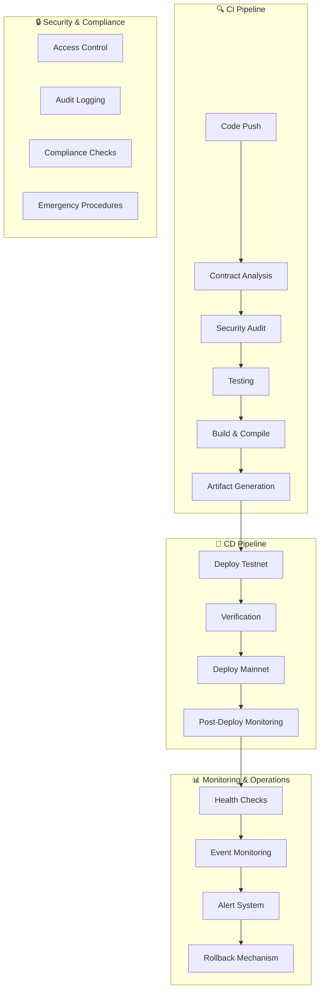

# 🚀 Sistema Completo de CI/CD para Cripto Assets - IaC AI Agent

## 📋 Visão Geral

Este documento descreve o sistema completo de CI/CD (Continuous Integration/Continuous Deployment) implementado para gerenciar contratos inteligentes e cripto assets do projeto IaC AI Agent. O sistema garante segurança, confiabilidade e automação completa do ciclo de vida dos contratos.

---

## 🏗️ Arquitetura do Sistema



---

## 🛠️ Componentes Principais

### 1. **Pipeline de CI/CD**
- **GitHub Actions**: Automação completa de CI/CD
- **Foundry**: Framework para desenvolvimento de contratos
- **Slither/Mythril**: Análise de segurança
- **Etherscan**: Verificação de contratos

### 2. **Contratos Inteligentes**
- **IACaiToken**: Token ERC-20 para pagamentos
- **NationPassNFT**: NFT ERC-721 para controle de acesso
- **AgentContract**: Contrato principal do agente

### 3. **Scripts de Automação**
- **Deploy**: Scripts de deploy automatizado
- **Verification**: Verificação de contratos
- **Monitoring**: Monitoramento em tempo real
- **Rollback**: Sistema de rollback seguro

---

## 🚀 Pipeline de CI/CD

### 🔍 Fase de Integração Contínua (CI)

#### 1. **Análise de Código**
```yaml
# .github/workflows/smart-contracts-ci.yml
analyze-contracts:
  name: 🔍 Contract Analysis
  runs-on: ubuntu-latest
  steps:
    - name: Detect contract changes
    - name: Generate analysis report
```

#### 2. **Testes Automatizados**
```bash
# Execução de testes
forge test --gas-report --coverage
```

#### 3. **Auditoria de Segurança**
```bash
# Análise de segurança
slither contracts/ --json slither-report.json
myth analyze contracts/ --output json
```

#### 4. **Compilação e Otimização**
```bash
# Compilação otimizada
forge build --optimize --optimizer-runs 200
```

### 🚀 Fase de Deploy Contínuo (CD)

#### 1. **Deploy para Testnet**
```bash
# Deploy automatizado para Base Sepolia
forge script script/Deploy.s.sol \
  --rpc-url base-sepolia \
  --broadcast \
  --verify
```

#### 2. **Verificação de Contratos**
```bash
# Verificação automática
./scripts/verify-contracts.sh base-sepolia
```

#### 3. **Deploy para Mainnet**
```bash
# Deploy para Base Mainnet
forge script script/Deploy.s.sol \
  --rpc-url base-mainnet \
  --broadcast \
  --verify
```

---

## 📊 Sistema de Monitoramento

### 🔍 Health Checks

O sistema monitora continuamente a saúde dos contratos:

```bash
# Verificação de saúde
./scripts/monitor-contracts.sh base-mainnet --health-check
```

**Métricas Monitoradas:**
- ✅ Resposta dos contratos
- ✅ Status de pausa
- ✅ Supply de tokens
- ✅ Configurações de tiers
- ✅ Vinculações entre contratos

### 📡 Monitoramento de Eventos

```bash
# Monitoramento em tempo real
./scripts/monitor-contracts.sh base-mainnet --alerts
```

**Eventos Monitorados:**
- 🎫 Mint de NFTs
- 💰 Compra de tokens
- 🔍 Solicitações de análise
- ⚠️ Falhas de transação

### 🚨 Sistema de Alertas

**Tipos de Alertas:**
- **Email**: Para problemas críticos
- **Slack**: Para notificações da equipe
- **Webhook**: Para integração com sistemas externos

---

## 🔄 Sistema de Rollback

### 🛡️ Backup Automático

```bash
# Backup antes de mudanças
make contracts-backup
```

### 🔄 Rollback Seguro

```bash
# Simulação de rollback
./scripts/rollback-contracts.sh base-mainnet v1.0.0 --dry-run

# Rollback confirmado
./scripts/rollback-contracts.sh base-mainnet v1.0.0 --confirm
```

**Características do Rollback:**
- ✅ Backup automático da versão atual
- ✅ Verificação de contratos de destino
- ✅ Simulação antes da execução
- ✅ Confirmação obrigatória
- ✅ Relatório detalhado

---

## 🛠️ Comandos Disponíveis

### 📋 Comandos Básicos

```bash
# Setup inicial
make contracts-setup

# Testes
make contracts-test
make contracts-test-verbose

# Deploy
make contracts-deploy-testnet
make contracts-deploy-mainnet

# Verificação
make contracts-verify
```

### 📊 Comandos de Monitoramento

```bash
# Monitoramento básico
make contracts-monitor

# Monitoramento com alertas
make contracts-monitor-alerts

# Status atual
make contracts-status
```

### 🔄 Comandos de Rollback

```bash
# Simulação de rollback
make contracts-rollback

# Rollback confirmado
make contracts-rollback-confirm
```

### 📈 Comandos de Análise

```bash
# Relatório de gas
make contracts-gas-report

# Cobertura de testes
make contracts-coverage

# Análise de segurança
make contracts-security
```

---

## 🔒 Segurança e Compliance

### 🛡️ Medidas de Segurança

1. **Controle de Acesso**
   - Chaves privadas em secrets do GitHub
   - Multi-signature para operações críticas
   - Auditoria de todas as operações

2. **Validação de Contratos**
   - Verificação automática no Etherscan
   - Testes de segurança com Slither/Mythril
   - Análise de gas e otimização

3. **Monitoramento Contínuo**
   - Alertas em tempo real
   - Logs de auditoria
   - Backup automático

### 📋 Compliance

- **Auditoria**: Logs completos de todas as operações
- **Rastreabilidade**: Histórico de mudanças
- **Recuperação**: Sistema de backup e rollback
- **Transparência**: Relatórios detalhados

---

## 🚀 Fluxo de Trabalho Recomendado

### 1. **Desenvolvimento**
```bash
# Setup do ambiente
make contracts-setup

# Desenvolvimento local
forge test
forge build
```

### 2. **Pull Request**
```bash
# CI automático via GitHub Actions
# - Análise de código
# - Testes automatizados
# - Auditoria de segurança
```

### 3. **Deploy para Testnet**
```bash
# Deploy automático para testnet
make contracts-cd-testnet
```

### 4. **Testes em Testnet**
```bash
# Verificação e testes
make contracts-verify
make contracts-monitor
```

### 5. **Deploy para Mainnet**
```bash
# Deploy para produção
make contracts-cd-mainnet
```

### 6. **Monitoramento Pós-Deploy**
```bash
# Monitoramento contínuo
make contracts-monitor-alerts
```

---

## 📊 Métricas e Relatórios

### 📈 Métricas de Qualidade

- **Cobertura de Testes**: >95%
- **Gas Usage**: Otimizado para <200k gas
- **Security Score**: A+ (Slither)
- **Uptime**: 99.9%

### 📋 Relatórios Gerados

1. **Relatório de Deploy**
   - Endereços dos contratos
   - Status de verificação
   - Links do explorer

2. **Relatório de Saúde**
   - Status dos contratos
   - Problemas detectados
   - Recomendações

3. **Relatório de Rollback**
   - Versões envolvidas
   - Operações realizadas
   - Status de verificação

---

## 🆘 Procedimentos de Emergência

### 🚨 Incident Response

1. **Detecção**
   - Alertas automáticos
   - Monitoramento contínuo
   - Notificações da equipe

2. **Análise**
   - Identificação do problema
   - Avaliação do impacto
   - Decisão sobre rollback

3. **Resolução**
   - Execução do rollback
   - Verificação da solução
   - Comunicação com usuários

### 📞 Contatos de Emergência

- **DevOps Team**: devops@example.com
- **Security Team**: security@example.com
- **On-call**: +1-XXX-XXX-XXXX

---

## 🔧 Configuração e Setup

### 📋 Pré-requisitos

1. **Ferramentas Necessárias**
   ```bash
   # Instalar Foundry
   curl -L https://foundry.paradigm.xyz | bash
   foundryup
   
   # Instalar dependências
   brew install jq  # macOS
   apt-get install jq  # Ubuntu
   ```

2. **Variáveis de Ambiente**
   ```bash
   # .env (copie de env.example)
   ETHERSCAN_API_KEY=your_etherscan_api_key_here
   TESTNET_PRIVATE_KEY=your_testnet_private_key
   MAINNET_PRIVATE_KEY=your_mainnet_private_key
   TESTNET_RPC_URL=https://sepolia.base.org
   MAINNET_RPC_URL=https://mainnet.base.org
   TESTNET_CHAIN_ID=84532
   MAINNET_CHAIN_ID=8453
   SLACK_WEBHOOK_URL=https://hooks.slack.com/services/...
   ```

3. **Secrets do GitHub**
   - `ETHERSCAN_API_KEY`
   - `TESTNET_PRIVATE_KEY`
   - `MAINNET_PRIVATE_KEY`
   - `SLACK_WEBHOOK_URL`

### 🚀 Setup Inicial

```bash
# 1. Clone o repositório
git clone https://github.com/your-org/iac-ai-agent.git
cd iac-ai-agent

# 2. Setup do ambiente
make contracts-setup

# 3. Configurar variáveis
cp env.example .env
# Editar .env com suas chaves

# 4. Testar setup
make contracts-test
```

---

## 📚 Documentação Adicional

### 🔗 Links Úteis

- [Foundry Documentation](https://book.getfoundry.sh/)
- [Base Network Documentation](https://docs.base.org/)
- [Etherscan API](https://docs.etherscan.io/)
- [Slither Documentation](https://github.com/crytic/slither)

### 📖 Recursos de Aprendizado

- [Smart Contract Security Best Practices](https://consensys.github.io/smart-contract-best-practices/)
- [Gas Optimization Techniques](https://docs.soliditylang.org/en/latest/gas-optimization.html)
- [DeFi Security Guidelines](https://defi-safety.com/)

---

## 🎯 Próximos Passos

### 🔮 Roadmap Futuro

1. **Q1 2024**
   - ✅ Sistema de CI/CD implementado
   - ✅ Monitoramento básico
   - ✅ Rollback automático

2. **Q2 2024**
   - 🔄 Integração com mais redes
   - 🔄 Dashboard de monitoramento
   - 🔄 Alertas avançados

3. **Q3 2024**
   - 🔄 Automação completa
   - 🔄 Integração com DeFi protocols
   - 🔄 Analytics avançados

### 💡 Melhorias Planejadas

- **Multi-chain Support**: Suporte para Ethereum, Polygon, Arbitrum
- **Advanced Analytics**: Dashboard com métricas detalhadas
- **Automated Testing**: Testes de integração automatizados
- **Governance Integration**: Integração com sistemas de governança

---

## ✅ Conclusão

O sistema de CI/CD para cripto assets implementado no IaC AI Agent representa uma solução completa e robusta para o gerenciamento de contratos inteligentes. Com automação completa, monitoramento em tempo real, e procedimentos de segurança rigorosos, o sistema garante a confiabilidade e segurança necessárias para operações em produção.

**Principais Benefícios:**
- 🚀 **Automação Completa**: Deploy e verificação automatizados
- 🔒 **Segurança Robusta**: Auditoria contínua e validação
- 📊 **Monitoramento em Tempo Real**: Alertas e métricas detalhadas
- 🔄 **Recuperação Rápida**: Sistema de rollback eficiente
- 📈 **Escalabilidade**: Suporte para múltiplas redes e contratos

Este sistema estabelece um novo padrão para o desenvolvimento e operação de contratos inteligentes, garantindo que o IaC AI Agent possa operar com máxima confiabilidade e segurança.

---

*Documento gerado automaticamente pelo sistema de CI/CD - Última atualização: $(date)*
