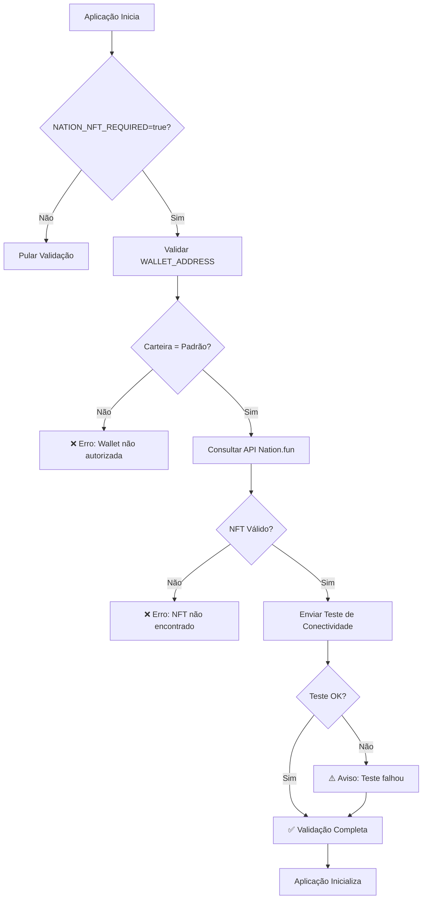
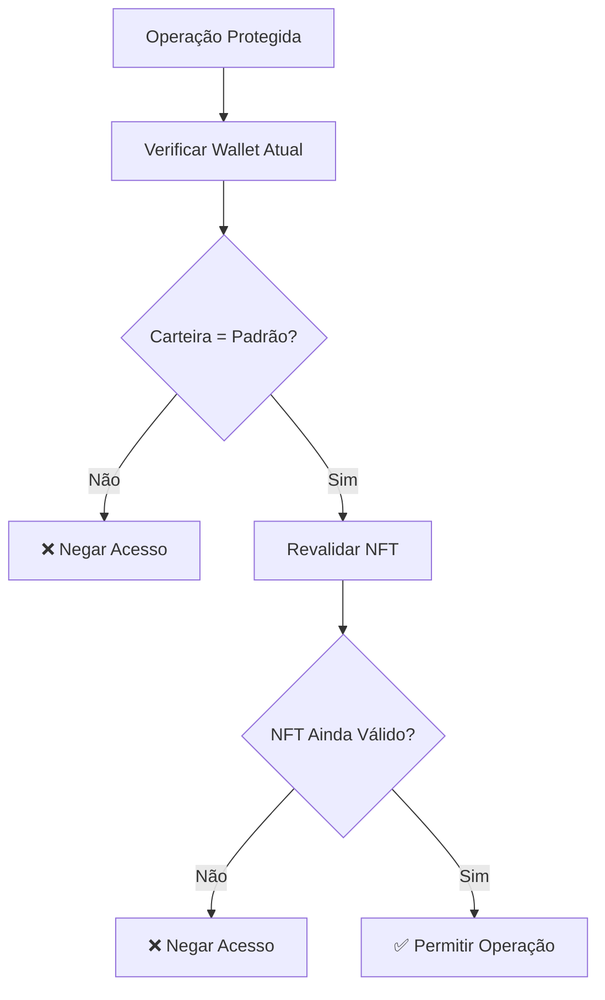

# 🎨 Validação de NFT Pass do Nation em Tempo de Execução

## 📋 Visão Geral

Este documento descreve a implementação completa da validação de NFT Pass do Nation.fun em tempo de execução para o sistema IaC AI Agent. O fluxo garante que apenas a carteira padrão autorizada (`0x17eDfB8a794ec4f13190401EF7aF1c17f3cc90c5`) possa acessar funcionalidades críticas do sistema.

## 🔄 Fluxo de Validação

### 1. Inicialização da Aplicação



### 2. Validação em Tempo de Execução



## 🛠️ Implementação Técnica

### Componentes Principais

1. **NationNFTValidator** (`internal/platform/web3/nation_nft_validator.go`)
   - Validação de NFT Pass do Nation
   - Teste de conectividade com API
   - Verificação de carteira autorizada

2. **Configuração** (`pkg/config/config.go`)
   - `NationNFTRequired`: Se validação é obrigatória
   - `NationNFTContract`: Endereço do contrato NFT
   - `WalletAddress`: Carteira padrão autorizada

3. **Integração no Startup** (`internal/startup/validator.go`)
   - Validação automática na inicialização
   - Integração com sistema de validação existente

### Variáveis de Ambiente

```bash
# Obrigatórias para validação
WALLET_ADDRESS=0x17eDfB8a794ec4f13190401EF7aF1c17f3cc90c5
NATION_NFT_REQUIRED=true

# Opcionais
NATION_NFT_CONTRACT=0x1234567890123456789012345678901234567890
WALLET_TOKEN=token_de_autenticacao_opcional
```

## 🧪 Testes BDD

### Arquivo de Feature
- **Localização**: `test/bdd/features/nation_nft_validation.feature`
- **Cenários**: 15 cenários cobrindo todos os fluxos
- **Tags**: `@nation_nft`, `@startup_validation`, `@security`

### Cenários Principais

1. **Validação na Inicialização**
   - ✅ Validação bem-sucedida
   - ❌ Carteira não autorizada
   - ❌ NFT inexistente
   - ❌ NFT expirado/inativo

2. **Teste de Conectividade**
   - ✅ Teste bem-sucedido
   - ❌ API indisponível
   - ❌ Timeout de conexão

3. **Validação em Tempo de Execução**
   - ✅ Operação permitida
   - ❌ Operação negada

4. **Tratamento de Erros**
   - ❌ Configuração incorreta
   - ❌ JSON malformado
   - ❌ Erro HTTP

### Executar Testes

```bash
# Executar todos os testes de NFT Pass do Nation
./test/bdd/run_nation_nft_tests.sh

# Executar testes específicos
godog test/bdd/features/nation_nft_validation.feature --tags="@nation_nft"
```

## 🔒 Segurança

### Carteira Padrão Autorizada

- **Endereço**: `0x17eDfB8a794ec4f13190401EF7aF1c17f3cc90c5`
- **Permissões**: Acesso exclusivo a funcionalidades críticas
- **Validação**: Verificação obrigatória em todas as operações

### Camadas de Segurança

1. **Validação de Endereço**: Verificação de formato e autorização
2. **Validação de NFT**: Consulta à API do Nation.fun
3. **Teste de Conectividade**: Verificação de comunicação
4. **Revalidação**: Verificação contínua em tempo de execução

## 📊 Monitoramento

### Logs de Validação

```go
// Logs de sucesso
logger.Info("NFT Pass do Nation validado com sucesso",
    "wallet", walletAddress,
    "token_id", nftResponse.Data.TokenID,
    "tier", nftResponse.Data.Tier)

// Logs de erro
logger.Error("Falha na validação de NFT na inicialização", 
    "error", err)
```

### Métricas Importantes

- Tempo de validação
- Taxa de sucesso/falha
- Latência da API do Nation.fun
- Frequência de revalidação

## 🚀 Deploy e Configuração

### Ambiente de Desenvolvimento

```bash
# Configurar variáveis
export WALLET_ADDRESS=0x17eDfB8a794ec4f13190401EF7aF1c17f3cc90c5
export NATION_NFT_REQUIRED=true
export NATION_NFT_CONTRACT=0x1234567890123456789012345678901234567890

# Executar aplicação
go run cmd/agent/main.go
```

### Ambiente de Produção

```bash
# Docker Compose
docker-compose -f configs/docker-compose.prod.yml up -d

# Verificar logs de validação
docker logs iac-ai-agent | grep "NFT Pass"
```

## 🔧 Troubleshooting

### Problemas Comuns

1. **"wallet não autorizada"**
   - Verificar se `WALLET_ADDRESS` está correto
   - Confirmar que é a carteira padrão autorizada

2. **"carteira não possui NFT Pass do Nation válido"**
   - Verificar se a carteira possui NFT ativo
   - Confirmar conectividade com API do Nation.fun

3. **"API retornou status 500"**
   - Verificar status da API do Nation.fun
   - Implementar retry logic se necessário

4. **"timeout na comunicação"**
   - Verificar conectividade de rede
   - Ajustar timeout se necessário

### Comandos de Diagnóstico

```bash
# Verificar configuração
curl -X GET "https://api.nation.fun/v1/nft/check/0x17eDfB8a794ec4f13190401EF7aF1c17f3cc90c5"

# Testar conectividade
curl -X POST "https://api.nation.fun/v1/test/send" \
  -H "Content-Type: application/json" \
  -d '{"message": "teste", "timestamp": 1234567890}'

# Verificar logs
docker logs iac-ai-agent | grep -E "(NFT|Nation|validação)"
```

## 📈 Próximos Passos

### Melhorias Planejadas

1. **Cache de Validação**
   - Implementar cache para reduzir chamadas à API
   - TTL configurável para revalidação

2. **Retry Logic**
   - Implementar retry automático em caso de falha
   - Backoff exponencial para requisições

3. **Métricas Avançadas**
   - Prometheus metrics para monitoramento
   - Alertas automáticos para falhas

4. **Validação Assíncrona**
   - Validação em background
   - Não bloquear inicialização da aplicação

### Integrações Futuras

1. **Lit Protocol**
   - Integração com threshold cryptography
   - Armazenamento seguro de chaves

2. **Smart Contracts**
   - Validação direta na blockchain
   - Redução de dependência de APIs externas

3. **Multi-Chain**
   - Suporte a múltiplas blockchains
   - Validação cross-chain

## 📚 Referências

- [Nation.fun API Documentation](https://docs.nation.fun/)
- [NationPassNFT Smart Contract](../contracts/src/NationPassNFT.sol)
- [BDD Test Implementation](../test/bdd/features/nation_nft_validation.feature)
- [Web3 Integration Guide](../docs/WEB3_INTEGRATION_GUIDE.md)

---

**Status**: ✅ Implementado e Testado  
**Versão**: 1.0  
**Última Atualização**: $(date)
