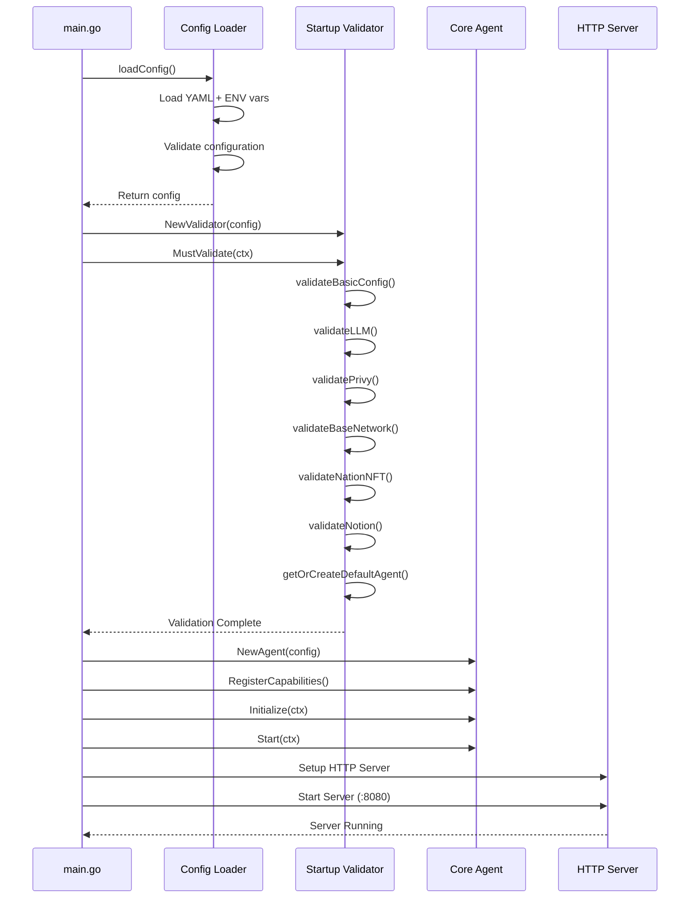

# 🚀 Processo de Startup da Aplicação - IaC AI Agent

## Visão Geral

Este documento detalha o processo completo de inicialização da aplicação IaC AI Agent, incluindo todas as validações, verificações e inicializações que ocorrem quando a aplicação é executada.

## 📋 Fluxo de Inicialização

### 1. Ponto de Entrada

A aplicação inicia através de dois pontos de entrada principais:

- **Agente Principal**: `cmd/agent/main.go`
- **Agente WhatsApp**: `cmd/whatsapp-agent/main.go`

### 2. Sequência de Inicialização



## 🔍 Validações Detalhadas

### 1. Validação de Configuração Básica

**Arquivo**: `internal/startup/validator.go:142-156`

```go
func (v *Validator) validateBasicConfig(result *ValidationResult) error {
    required := map[string]string{
        "PRIVY_APP_ID":   v.config.Web3.PrivyAppID,
        "WALLET_ADDRESS": os.Getenv("WALLET_ADDRESS"),
    }
    
    for key, value := range required {
        if value == "" {
            return fmt.Errorf("variável obrigatória não configurada: %s", key)
        }
    }
    return nil
}
```

**O que verifica**:
- ✅ `PRIVY_APP_ID` está configurado
- ✅ `WALLET_ADDRESS` está configurado

### 2. Validação LLM

**Arquivo**: `internal/startup/validator.go:158-198`

```go
func (v *Validator) validateLLM(ctx context.Context, result *ValidationResult) error {
    // Verificar se temos NFT Pass do Nation válido
    if !v.config.Web3.NationNFTRequired {
        return nil
    }
    
    // Criar validador de NFT do Nation para teste
    nationValidator := web3.NewNationNFTValidator(v.config, v.logger)
    
    // Validar NFT Pass do Nation
    nftResponse, err := nationValidator.ValidateWalletNFT(ctx, v.config.Web3.WalletAddress)
    if err != nil {
        return fmt.Errorf("falha na validação de NFT Pass do Nation para LLM: %w", err)
    }
    
    // Enviar teste de conectividade para o agente Nation.fun
    testResponse, err := nationValidator.SendTestToNation(ctx, "Teste de conectividade LLM via NFT Pass")
    
    return nil
}
```

**O que verifica**:
- ✅ NFT Pass do Nation válido na carteira
- ✅ Conectividade com API Nation.fun
- ✅ Teste de comunicação com LLM

### 3. Validação Privy.io

**Arquivo**: `internal/startup/validator.go:200-211`

```go
func (v *Validator) validatePrivy(result *ValidationResult) error {
    if v.config.Web3.PrivyAppID == "" {
        return fmt.Errorf("PRIVY_APP_ID não configurado")
    }
    
    // TODO: Fazer chamada de teste à API do Privy quando implementado
    v.logger.Info("Privy credentials configuradas",
        "app_id", v.config.Web3.PrivyAppID[:8]+"...")
    
    return nil
}
```

**O que verifica**:
- ✅ `PRIVY_APP_ID` está configurado
- 🔄 Validação de API (implementação futura)

### 4. Validação Base Network

**Arquivo**: `internal/startup/validator.go:213-249`

```go
func (v *Validator) validateBaseNetwork(ctx context.Context, result *ValidationResult) error {
    if v.config.Web3.BaseRPCURL == "" {
        return fmt.Errorf("BASE_RPC_URL não configurado")
    }
    
    // Conectar ao RPC
    client, err := ethclient.Dial(v.config.Web3.BaseRPCURL)
    if err != nil {
        return fmt.Errorf("falha ao conectar com Base RPC: %w", err)
    }
    defer client.Close()
    
    // Obter chain ID
    chainID, err := client.ChainID(ctx)
    if err != nil {
        return fmt.Errorf("falha ao obter chain ID: %w", err)
    }
    
    // Validar chain ID
    expectedChainID := big.NewInt(int64(v.config.Web3.BaseChainID))
    if chainID.Cmp(expectedChainID) != 0 {
        return fmt.Errorf("chain ID incorreto: esperado %s, obtido %s", expectedChainID, chainID)
    }
    
    return nil
}
```

**O que verifica**:
- ✅ Conectividade com Base Network RPC
- ✅ Chain ID correto (8453 para Mainnet)
- ✅ Bloco mais recente acessível

### 5. Validação NFT Pass Nation.fun

**Arquivo**: `internal/startup/validator.go:251-282`

```go
func (v *Validator) validateNationNFT(ctx context.Context, result *ValidationResult) error {
    if !v.config.Web3.NationNFTRequired {
        return nil
    }
    
    walletAddress := v.config.Web3.WalletAddress
    if walletAddress == "" {
        return fmt.Errorf("WALLET_ADDRESS não configurado")
    }
    
    // Validar formato do endereço
    if !common.IsHexAddress(walletAddress) {
        return fmt.Errorf("WALLET_ADDRESS inválido: %s", walletAddress)
    }
    
    // Criar validador de NFT do Nation
    nationValidator := web3.NewNationNFTValidator(v.config, v.logger)
    
    // Executar validação completa (NFT + teste de conectividade)
    if err := nationValidator.ValidateAtStartup(ctx); err != nil {
        return fmt.Errorf("validação de NFT Pass do Nation falhou: %w", err)
    }
    
    return nil
}
```

**O que verifica**:
- ✅ Formato válido do endereço da carteira
- ✅ Posse de NFT Pass válido
- ✅ Conectividade com API Nation.fun
- ✅ Teste de comunicação

### 6. Validação Notion (Opcional)

**Arquivo**: `internal/startup/validator.go:284-324`

```go
func (v *Validator) validateNotion(ctx context.Context, result *ValidationResult) error {
    if !v.config.Notion.EnableAgentCreation {
        return nil
    }
    
    if v.config.Notion.APIKey == "" {
        return fmt.Errorf("NOTION_API_KEY não configurado")
    }
    
    // Cria serviço Notion
    notionService, err := services.NewNotionAgentService(v.config, v.logger)
    if err != nil {
        return fmt.Errorf("erro ao criar serviço Notion: %w", err)
    }
    
    // Verifica se serviço está disponível
    if !notionService.IsServiceAvailable(ctx) {
        return fmt.Errorf("serviço Notion não está disponível")
    }
    
    // Se auto-create está habilitado, cria/obtém agente
    if v.config.Notion.AutoCreateOnStartup {
        agent, err := notionService.GetOrCreateDefaultAgent(ctx)
        if err != nil {
            return fmt.Errorf("erro ao obter/criar agente Notion: %w", err)
        }
        
        result.NotionAgentID = agent.ID
        result.NotionAgentName = agent.Name
    }
    
    return nil
}
```

**O que verifica**:
- ✅ API Key do Notion configurada (se habilitado)
- ✅ Conectividade com API Notion
- ✅ Criação/obtenção do agente Notion

## 🤖 Inicialização do Core Agent

### 1. Criação do Agente

**Arquivo**: `cmd/agent/main.go:26-28`

```go
// Criar agente principal
agent := core.NewAgent(config)
```

### 2. Registro de Capabilities

**Arquivo**: `cmd/agent/main.go:29-33`

```go
// Registrar habilidades
if err := registerCapabilities(agent); err != nil {
    log.Fatalf("Failed to register capabilities: %v", err)
}
```

**Capabilities registradas**:
- **WhatsApp Capability**: Para processamento de mensagens WhatsApp
- **IaC Analysis Capability**: Para análise de código Infrastructure as Code

### 3. Inicialização e Start

**Arquivo**: `cmd/agent/main.go:34-43`

```go
// Inicializar agente
ctx := context.Background()
if err := agent.Initialize(ctx); err != nil {
    log.Fatalf("Failed to initialize agent: %v", err)
}

// Iniciar agente
if err := agent.Start(ctx); err != nil {
    log.Fatalf("Failed to start agent: %v", err)
}
```

## 🌐 Configuração do Servidor HTTP

### 1. Criação do Handler REST

**Arquivo**: `cmd/agent/main.go:47-48`

```go
// Criar handler REST
agentHandler := rest.NewAgentHandler(agent)
```

### 2. Configuração de Rotas

**Arquivo**: `cmd/agent/main.go:50-58`

```go
// Configurar rotas
router := mux.NewRouter()

// Middleware
router.Use(rest.LoggingMiddleware)
router.Use(rest.TokenValidationMiddleware("your_verify_token_here"))

// Registrar rotas
agentHandler.RegisterRoutes(router)
```

### 3. Configuração do Servidor

**Arquivo**: `cmd/agent/main.go:60-67`

```go
// Configurar servidor HTTP
server := &http.Server{
    Addr:         ":8080",
    Handler:      router,
    ReadTimeout:  15 * time.Second,
    WriteTimeout: 15 * time.Second,
    IdleTimeout:  60 * time.Second,
}
```

### 4. Inicialização do Servidor

**Arquivo**: `cmd/agent/main.go:69-75`

```go
// Iniciar servidor em goroutine
go func() {
    log.Printf("Starting agent server on :8080")
    if err := server.ListenAndServe(); err != nil && err != http.ErrServerClosed {
        log.Fatalf("Failed to start server: %v", err)
    }
}()
```

## 🔄 Graceful Shutdown

### 1. Captura de Sinais

**Arquivo**: `cmd/agent/main.go:77-80`

```go
// Aguardar sinal de interrupção
quit := make(chan os.Signal, 1)
signal.Notify(quit, syscall.SIGINT, syscall.SIGTERM)
<-quit
```

### 2. Shutdown Ordenado

**Arquivo**: `cmd/agent/main.go:82-98`

```go
log.Println("Shutting down agent...")

// Graceful shutdown
ctx, cancel := context.WithTimeout(context.Background(), 30*time.Second)
defer cancel()

// Parar agente
if err := agent.Stop(ctx); err != nil {
    log.Printf("Failed to stop agent: %v", err)
}

// Parar servidor
if err := server.Shutdown(ctx); err != nil {
    log.Fatalf("Server forced to shutdown: %v", err)
}

log.Println("Agent stopped successfully")
```

## 📊 Relatório de Validação

### Estrutura do Relatório

**Arquivo**: `internal/startup/validator.go:35-50`

```go
type ValidationResult struct {
    Success              bool
    LLMValidated         bool
    NationNFTValidated   bool
    PrivyValidated       bool
    BaseNetworkValidated bool
    NotionValidated      bool
    AgentCreated         bool
    AgentID              string
    AgentName            string
    NotionAgentID        string
    NotionAgentName      string
    Errors               []string
    Warnings             []string
}
```

### Exemplo de Relatório de Sucesso

```bash
============================================================
📊 RELATÓRIO DE VALIDAÇÃO DE STARTUP
============================================================
✅ Status: PASSOU

📋 Checklist de Validações:
  ✅ LLM Connection
  ✅ Privy.io Credentials
  ✅ Base Network
  ✅ Nation.fun NFT
  ✅ Notion Integration
  ✅ Default Agent

🤖 Agent Details:
  ID: default-agent-123
  Name: Default Agent

📝 Notion Agent Details:
  ID: notion-agent-123
  Name: IaC AI Agent

============================================================
✅ Validação completa - Aplicação iniciando...
```

### Exemplo de Relatório de Falha

```bash
============================================================
📊 RELATÓRIO DE VALIDAÇÃO DE STARTUP
============================================================
❌ Status: FALHOU

📋 Checklist de Validações:
  ✅ LLM Connection
  ❌ Privy.io Credentials
  ✅ Base Network
  ❌ Nation.fun NFT
  ✅ Notion Integration
  ❌ Default Agent

❌ Erros Encontrados:
  ❌ Privy validation failed: PRIVY_APP_ID não configurado
  ❌ Nation.fun NFT validation failed: WALLET_ADDRESS não configurado
  ❌ Agent creation failed: WALLET_ADDRESS não configurado

💥 APLICAÇÃO NÃO PODE INICIAR - Validação falhou
Por favor, corrija os erros acima e tente novamente.

Erros críticos:
  - Privy validation failed: PRIVY_APP_ID não configurado
  - Nation.fun NFT validation failed: WALLET_ADDRESS não configurado
  - Agent creation failed: WALLET_ADDRESS não configurado

panic: Startup validation failed
```

## ⚙️ Configuração Mínima

### Variáveis Obrigatórias

```bash
# Arquivo .env mínimo obrigatório
PRIVY_APP_ID=cmgh6un8w007bl10ci0tgitwp
WALLET_ADDRESS=0x17eDfB8a794ec4f13190401EF7aF1c17f3cc90c5
NATION_NFT_REQUIRED=true
LLM_PROVIDER=nation.fun
LLM_MODEL=nation-1
```

### Variáveis Opcionais

```bash
# Base Network
BASE_RPC_URL=https://mainnet.base.org
BASE_CHAIN_ID=8453

# Notion (opcional)
NOTION_API_KEY=secret_xxx
NOTION_ENABLE_AGENT_CREATION=true
NOTION_AUTO_CREATE_ON_STARTUP=true

# Logging
LOG_LEVEL=info
LOG_FORMAT=json

# Server
PORT=8080
HOST=0.0.0.0
```

## 🛠️ Troubleshooting

### Problemas Comuns

| Erro | Causa | Solução |
|------|-------|---------|
| `"LLM validation failed"` | NFT Pass inválido ou carteira não autorizada | Verificar `WALLET_ADDRESS` e posse do NFT |
| `"Privy validation failed"` | `PRIVY_APP_ID` não configurado | Configurar variável de ambiente |
| `"Nation.fun NFT validation failed"` | Carteira não possui NFT Pass válido | Verificar posse do NFT na carteira |
| `"Base Network validation failed"` | Problema de conectividade | Verificar `BASE_RPC_URL` e conectividade |
| `"Agent creation failed"` | Erro na criação do agente padrão | Verificar configurações de wallet |

### Logs de Debug

```bash
# Executar com logs detalhados
LOG_LEVEL=debug make run

# Ou diretamente
LOG_LEVEL=debug go run cmd/agent/main.go
```

### Comandos de Diagnóstico

```bash
# Verificar configuração
make check-env

# Verificar conectividade
curl http://localhost:8080/health

# Verificar logs em tempo real
docker logs -f iac-ai-agent
```

## 🔧 Personalização do Startup

### Desabilitar Validações

```bash
# Desabilitar validação de NFT
NATION_NFT_REQUIRED=false

# Desabilitar validação de startup
ENABLE_STARTUP_VALIDATION=false

# Desabilitar Notion
NOTION_ENABLE_AGENT_CREATION=false
```

### Modo de Desenvolvimento

```bash
# Executar em modo desenvolvimento
make dev

# Ou com variáveis específicas
ENVIRONMENT=development LOG_LEVEL=debug make run
```

## 📚 Referências

- **Código Principal**: `cmd/agent/main.go`
- **Validador**: `internal/startup/validator.go`
- **Configuração**: `pkg/config/config.go`
- **Core Agent**: `internal/agent/core/agent.go`
- **API REST**: `api/rest/`

## 🎯 Próximos Passos

1. **Implementar validação de API Privy.io**
2. **Adicionar métricas de startup**
3. **Implementar health checks mais detalhados**
4. **Adicionar suporte a múltiplos ambientes**
5. **Implementar cache de validações**
