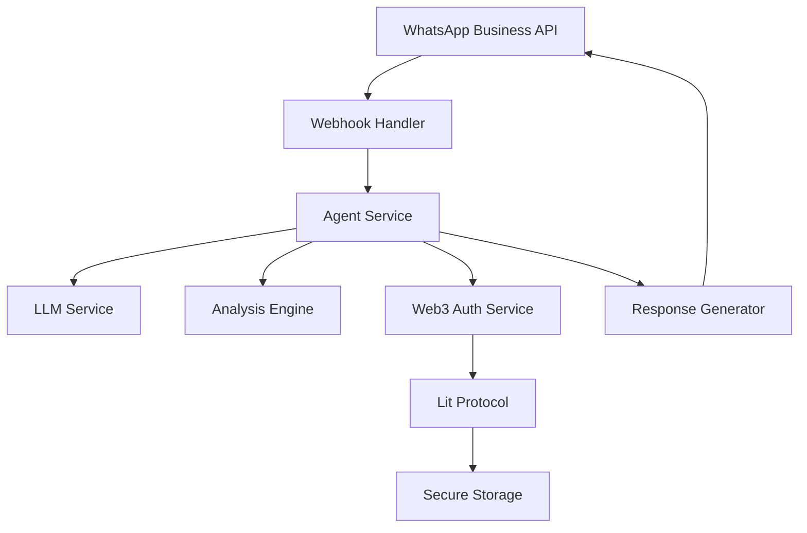

# 🤖 Guia de Desenvolvimento: Criando Agentes WhatsApp

## 📋 Visão Geral

Este guia detalha como criar novos agentes com habilidade WhatsApp no IaC AI Agent, incluindo templates, exemplos de código e melhores práticas.

---

## 🏗️ Arquitetura do Sistema

### Componentes Principais



### Fluxo de Processamento

1. **Recepção**: Mensagem via WhatsApp Webhook
2. **Autenticação**: Verificação via Web3 + Lit Protocol
3. **Processamento**: Análise do comando e código
4. **Resposta**: Geração e envio da resposta
5. **Billing**: Cobrança de tokens IACAI

---

## 🚀 Criando um Novo Agente WhatsApp

### Template Básico

```go
// internal/agent/whatsapp/agent.go
package whatsapp

import (
    "context"
    "fmt"
    "log"
    
    "github.com/iac-ai-agent/internal/models"
    "github.com/iac-ai-agent/internal/services"
)

type WhatsAppAgent struct {
    ID          string
    Name        string
    Description string
    WalletAddr  string
    APIKey      string
    Service     *services.AgentService
    LLMService  *services.LLMService
}

// NewWhatsAppAgent cria um novo agente WhatsApp
func NewWhatsAppAgent(config *WhatsAppAgentConfig) (*WhatsAppAgent, error) {
    // Verificar wallet e NFT
    if err := verifyWalletNFT(config.WalletAddr); err != nil {
        return nil, fmt.Errorf("wallet verification failed: %w", err)
    }
    
    // Recuperar chave API via Lit Protocol
    apiKey, err := recoverAPIKey(config.WalletAddr)
    if err != nil {
        return nil, fmt.Errorf("failed to recover API key: %w", err)
    }
    
    return &WhatsAppAgent{
        ID:          generateAgentID(),
        Name:        config.Name,
        Description: config.Description,
        WalletAddr:  config.WalletAddr,
        APIKey:      apiKey,
        Service:     services.NewAgentService(),
        LLMService:  services.NewLLMService(),
    }, nil
}

// ProcessMessage processa mensagens recebidas
func (a *WhatsAppAgent) ProcessMessage(ctx context.Context, msg *WhatsAppMessage) (*WhatsAppResponse, error) {
    // Verificar autenticação
    if err := a.authenticate(ctx, msg.From); err != nil {
        return nil, fmt.Errorf("authentication failed: %w", err)
    }
    
    // Processar comando
    command, err := a.parseCommand(msg.Text)
    if err != nil {
        return a.handleError("Comando inválido. Use /help para ver comandos disponíveis.")
    }
    
    // Executar comando
    response, err := a.executeCommand(ctx, command)
    if err != nil {
        return a.handleError(fmt.Sprintf("Erro ao executar comando: %v", err))
    }
    
    // Cobrar tokens se necessário
    if command.RequiresPayment {
        if err := a.chargeTokens(ctx, msg.From, command.TokenCost); err != nil {
            log.Printf("Failed to charge tokens: %v", err)
        }
    }
    
    return response, nil
}
```

### Configuração do Agente

```go
// internal/agent/whatsapp/config.go
package whatsapp

type WhatsAppAgentConfig struct {
    Name        string `json:"name" yaml:"name"`
    Description string `json:"description" yaml:"description"`
    WalletAddr  string `json:"wallet_address" yaml:"wallet_address"`
    WebhookURL  string `json:"webhook_url" yaml:"webhook_url"`
    VerifyToken string `json:"verify_token" yaml:"verify_token"`
}

// DefaultConfig retorna configuração padrão
func DefaultConfig() *WhatsAppAgentConfig {
    return &WhatsAppAgentConfig{
        Name:        "IaC AI Agent WhatsApp",
        Description: "Agente para análise de infraestrutura via WhatsApp",
        WalletAddr:  "0x17eDfB8a794ec4f13190401EF7aF1c17f3cc90c5", // Wallet padrão
        WebhookURL:  "",
        VerifyToken: "",
    }
}
```

---

## 📱 Implementação de Comandos

### Sistema de Comandos

```go
// internal/agent/whatsapp/commands.go
package whatsapp

import (
    "strings"
    "regexp"
)

type Command struct {
    Name           string
    Description    string
    Pattern        *regexp.Regexp
    Handler        func(*WhatsAppAgent, *CommandContext) (*WhatsAppResponse, error)
    RequiresPayment bool
    TokenCost      int
}

type CommandContext struct {
    Message   *WhatsAppMessage
    Agent     *WhatsAppAgent
    Args      []string
    CodeBlock string
}

// AvailableCommands retorna comandos disponíveis
func AvailableCommands() map[string]*Command {
    return map[string]*Command{
        "analyze": {
            Name:            "analyze",
            Description:    "Analisa código Terraform",
            Pattern:        regexp.MustCompile(`^/analyze\s*(.*)`),
            Handler:        handleAnalyzeCommand,
            RequiresPayment: true,
            TokenCost:      1,
        },
        "security": {
            Name:            "security",
            Description:    "Verifica segurança do código",
            Pattern:        regexp.MustCompile(`^/security\s*(.*)`),
            Handler:        handleSecurityCommand,
            RequiresPayment: true,
            TokenCost:      1,
        },
        "cost": {
            Name:            "cost",
            Description:    "Otimiza custos do código",
            Pattern:        regexp.MustCompile(`^/cost\s*(.*)`),
            Handler:        handleCostCommand,
            RequiresPayment: true,
            TokenCost:      1,
        },
        "help": {
            Name:            "help",
            Description:    "Lista comandos disponíveis",
            Pattern:        regexp.MustCompile(`^/help`),
            Handler:        handleHelpCommand,
            RequiresPayment: false,
            TokenCost:      0,
        },
        "status": {
            Name:            "status",
            Description:    "Status do agente",
            Pattern:        regexp.MustCompile(`^/status`),
            Handler:        handleStatusCommand,
            RequiresPayment: false,
            TokenCost:      0,
        },
    }
}

// handleAnalyzeCommand processa comando de análise
func handleAnalyzeCommand(agent *WhatsAppAgent, ctx *CommandContext) (*WhatsAppResponse, error) {
    if ctx.CodeBlock == "" {
        return &WhatsAppResponse{
            Text: "❌ Por favor, forneça o código Terraform para análise.\n\nExemplo:\n/analyze\n```hcl\nresource \"aws_instance\" \"web\" {\n  instance_type = \"t3.micro\"\n}\n```",
        }, nil
    }
    
    // Executar análise
    analysis, err := agent.Service.AnalyzeCode(ctx.CodeBlock)
    if err != nil {
        return &WhatsAppResponse{
            Text: fmt.Sprintf("❌ Erro na análise: %v", err),
        }, nil
    }
    
    // Gerar resposta
    response := fmt.Sprintf("✅ Análise concluída!\n\n")
    response += fmt.Sprintf("🔍 Problemas encontrados: %d\n", len(analysis.Issues))
    
    for _, issue := range analysis.Issues {
        response += fmt.Sprintf("• %s\n", issue.Description)
    }
    
    if len(analysis.Suggestions) > 0 {
        response += "\n💡 Sugestões:\n"
        for _, suggestion := range analysis.Suggestions {
            response += fmt.Sprintf("• %s\n", suggestion)
        }
    }
    
    response += fmt.Sprintf("\n💰 Custo: %d token(s) IACAI", ctx.Agent.TokenCost)
    
    return &WhatsAppResponse{
        Text: response,
    }, nil
}
```

---

## 🔐 Integração com Web3 e Lit Protocol

### Autenticação e Armazenamento Seguro

```go
// internal/platform/web3/whatsapp_auth.go
package web3

import (
    "context"
    "crypto/ecdsa"
    "fmt"
    
    "github.com/ethereum/go-ethereum/crypto"
    "github.com/iac-ai-agent/internal/platform/web3"
)

// WhatsAppAuthService gerencia autenticação WhatsApp
type WhatsAppAuthService struct {
    litClient *web3.LitClient
    walletAddr string
}

// NewWhatsAppAuthService cria novo serviço de autenticação
func NewWhatsAppAuthService(walletAddr string) *WhatsAppAuthService {
    return &WhatsAppAuthService{
        litClient:  web3.NewLitClient(),
        walletAddr: walletAddr,
    }
}

// StoreAPIKey armazena chave API de forma segura
func (s *WhatsAppAuthService) StoreAPIKey(ctx context.Context, apiKey string) error {
    // Gerar chave simétrica AES-256
    aesKey := generateAESKey()
    
    // Criptografar chave API
    encryptedAPIKey, err := encryptWithAES(apiKey, aesKey)
    if err != nil {
        return fmt.Errorf("failed to encrypt API key: %w", err)
    }
    
    // Criptografar chave AES com Lit Protocol
    encryptedAESKey, err := s.litClient.EncryptKey(ctx, aesKey, s.walletAddr)
    if err != nil {
        return fmt.Errorf("failed to encrypt AES key: %w", err)
    }
    
    // Armazenar dados criptografados
    storageData := &APIKeyStorage{
        EncryptedAPIKey: encryptedAPIKey,
        EncryptedAESKey: encryptedAESKey,
        WalletAddress:   s.walletAddr,
        Timestamp:       time.Now(),
    }
    
    return s.storeEncryptedData(ctx, storageData)
}

// RecoverAPIKey recupera chave API
func (s *WhatsAppAuthService) RecoverAPIKey(ctx context.Context) (string, error) {
    // Recuperar dados criptografados
    storageData, err := s.getEncryptedData(ctx, s.walletAddr)
    if err != nil {
        return "", fmt.Errorf("failed to get encrypted data: %w", err)
    }
    
    // Descriptografar chave AES com Lit Protocol
    aesKey, err := s.litClient.DecryptKey(ctx, storageData.EncryptedAESKey, s.walletAddr)
    if err != nil {
        return "", fmt.Errorf("failed to decrypt AES key: %w", err)
    }
    
    // Descriptografar chave API
    apiKey, err := decryptWithAES(storageData.EncryptedAPIKey, aesKey)
    if err != nil {
        return "", fmt.Errorf("failed to decrypt API key: %w", err)
    }
    
    return apiKey, nil
}

// VerifyWalletNFT verifica se wallet possui NFT Nation.fun
func (s *WhatsAppAuthService) VerifyWalletNFT(ctx context.Context) error {
    // Verificar se wallet é a padrão autorizada
    if s.walletAddr != "0x17eDfB8a794ec4f13190401EF7aF1c17f3cc90c5" {
        return fmt.Errorf("wallet not authorized for WhatsApp API access")
    }
    
    // Verificar NFT Nation.fun
    hasNFT, err := s.litClient.CheckNFTOwnership(ctx, s.walletAddr, "nation.fun")
    if err != nil {
        return fmt.Errorf("failed to check NFT ownership: %w", err)
    }
    
    if !hasNFT {
        return fmt.Errorf("wallet does not own required Nation.fun NFT")
    }
    
    return nil
}
```

---

## 📊 Sistema de Billing e Tokens

### Gerenciamento de Tokens IACAI

```go
// internal/services/billing_service.go
package services

import (
    "context"
    "fmt"
    "time"
)

type BillingService struct {
    tokenContract *web3.TokenContract
    agentService  *AgentService
}

// ChargeTokens cobra tokens por uso
func (s *BillingService) ChargeTokens(ctx context.Context, userAddr string, amount int) error {
    // Verificar saldo
    balance, err := s.tokenContract.GetBalance(ctx, userAddr)
    if err != nil {
        return fmt.Errorf("failed to get balance: %w", err)
    }
    
    if balance < amount {
        return fmt.Errorf("insufficient balance: %d tokens required, %d available", amount, balance)
    }
    
    // Transferir tokens
    txHash, err := s.tokenContract.Transfer(ctx, userAddr, s.agentService.WalletAddr, amount)
    if err != nil {
        return fmt.Errorf("failed to transfer tokens: %w", err)
    }
    
    // Registrar transação
    transaction := &TokenTransaction{
        UserAddress:    userAddr,
        AgentAddress:   s.agentService.WalletAddr,
        Amount:         amount,
        TransactionHash: txHash,
        Timestamp:      time.Now(),
        Service:        "whatsapp_analysis",
    }
    
    return s.recordTransaction(ctx, transaction)
}

// GetUsageStats retorna estatísticas de uso
func (s *BillingService) GetUsageStats(ctx context.Context, userAddr string) (*UsageStats, error) {
    stats, err := s.getUserStats(ctx, userAddr)
    if err != nil {
        return nil, fmt.Errorf("failed to get usage stats: %w", err)
    }
    
    return &UsageStats{
        TotalRequests:    stats.TotalRequests,
        TokensConsumed:   stats.TokensConsumed,
        LastRequest:      stats.LastRequest,
        RequestsToday:    stats.RequestsToday,
        AverageCost:      stats.AverageCost,
    }, nil
}
```

---

## 🧪 Testes e Validação

### Testes Unitários

```go
// internal/agent/whatsapp/agent_test.go
package whatsapp

import (
    "context"
    "testing"
    
    "github.com/stretchr/testify/assert"
    "github.com/stretchr/testify/mock"
)

func TestWhatsAppAgent_ProcessMessage(t *testing.T) {
    // Setup
    config := &WhatsAppAgentConfig{
        Name:        "Test Agent",
        Description: "Test Description",
        WalletAddr:  "0x17eDfB8a794ec4f13190401EF7aF1c17f3cc90c5",
    }
    
    agent, err := NewWhatsAppAgent(config)
    assert.NoError(t, err)
    assert.NotNil(t, agent)
    
    // Test cases
    tests := []struct {
        name     string
        message  *WhatsAppMessage
        expected string
    }{
        {
            name: "help command",
            message: &WhatsAppMessage{
                From: "test_user",
                Text: "/help",
            },
            expected: "Comandos disponíveis",
        },
        {
            name: "analyze command",
            message: &WhatsAppMessage{
                From: "test_user",
                Text: "/analyze\n```hcl\nresource \"aws_instance\" \"web\" {\n  instance_type = \"t3.micro\"\n}\n```",
            },
            expected: "Análise concluída",
        },
    }
    
    for _, tt := range tests {
        t.Run(tt.name, func(t *testing.T) {
            response, err := agent.ProcessMessage(context.Background(), tt.message)
            assert.NoError(t, err)
            assert.Contains(t, response.Text, tt.expected)
        })
    }
}

func TestWhatsAppAgent_Authentication(t *testing.T) {
    // Mock authentication service
    mockAuth := &MockAuthService{}
    mockAuth.On("VerifyWalletNFT", mock.Anything, "0x17eDfB8a794ec4f13190401EF7aF1c17f3cc90c5").Return(nil)
    
    config := &WhatsAppAgentConfig{
        WalletAddr: "0x17eDfB8a794ec4f13190401EF7aF1c17f3cc90c5",
    }
    
    agent, err := NewWhatsAppAgent(config)
    assert.NoError(t, err)
    
    // Test authentication
    err = agent.authenticate(context.Background(), "test_user")
    assert.NoError(t, err)
}
```

### Testes de Integração

```go
// test/integration/whatsapp_agent_test.go
package integration

import (
    "context"
    "testing"
    "time"
    
    "github.com/iac-ai-agent/internal/agent/whatsapp"
)

func TestWhatsAppAgentIntegration(t *testing.T) {
    // Setup integration test environment
    setupTestEnvironment(t)
    
    // Create test agent
    config := &whatsapp.WhatsAppAgentConfig{
        Name:        "Integration Test Agent",
        Description: "Agent for integration testing",
        WalletAddr:  "0x17eDfB8a794ec4f13190401EF7aF1c17f3cc90c5",
    }
    
    agent, err := whatsapp.NewWhatsAppAgent(config)
    assert.NoError(t, err)
    
    // Test full message flow
    message := &whatsapp.WhatsAppMessage{
        From: "test_user",
        Text: "/analyze\n```hcl\nresource \"aws_instance\" \"web\" {\n  instance_type = \"t3.micro\"\n}\n```",
    }
    
    response, err := agent.ProcessMessage(context.Background(), message)
    assert.NoError(t, err)
    assert.Contains(t, response.Text, "Análise concluída")
    
    // Verify billing
    stats, err := agent.GetUsageStats(context.Background(), "test_user")
    assert.NoError(t, err)
    assert.Equal(t, 1, stats.TokensConsumed)
}
```

---

## 📈 Monitoramento e Logs

### Sistema de Logging

```go
// internal/agent/whatsapp/logging.go
package whatsapp

import (
    "log"
    "time"
)

type WhatsAppLogger struct {
    agentID string
}

// LogMessage logs incoming messages
func (l *WhatsAppLogger) LogMessage(msg *WhatsAppMessage) {
    log.Printf("[%s] WhatsApp Message - From: %s, Text: %s, Time: %s",
        l.agentID, msg.From, msg.Text, time.Now().Format(time.RFC3339))
}

// LogResponse logs outgoing responses
func (l *WhatsAppLogger) LogResponse(response *WhatsAppResponse) {
    log.Printf("[%s] WhatsApp Response - Text: %s, Time: %s",
        l.agentID, response.Text, time.Now().Format(time.RFC3339))
}

// LogError logs errors
func (l *WhatsAppLogger) LogError(err error, context string) {
    log.Printf("[%s] WhatsApp Error - Context: %s, Error: %v, Time: %s",
        l.agentID, context, err, time.Now().Format(time.RFC3339))
}

// LogBilling logs billing events
func (l *WhatsAppLogger) LogBilling(userAddr string, amount int, txHash string) {
    log.Printf("[%s] WhatsApp Billing - User: %s, Amount: %d, TX: %s, Time: %s",
        l.agentID, userAddr, amount, txHash, time.Now().Format(time.RFC3339))
}
```

---

## 🚀 Deploy e Produção

### Docker Configuration

```dockerfile
# Dockerfile.whatsapp-agent
FROM golang:1.21-alpine AS builder

WORKDIR /app
COPY . .
RUN go mod download
RUN go build -o whatsapp-agent ./cmd/whatsapp-agent

FROM alpine:latest
RUN apk --no-cache add ca-certificates
WORKDIR /root/
COPY --from=builder /app/whatsapp-agent .
COPY --from=builder /app/configs ./configs

EXPOSE 8080
CMD ["./whatsapp-agent"]
```

### Kubernetes Deployment

```yaml
# k8s/whatsapp-agent-deployment.yaml
apiVersion: apps/v1
kind: Deployment
metadata:
  name: whatsapp-agent
spec:
  replicas: 3
  selector:
    matchLabels:
      app: whatsapp-agent
  template:
    metadata:
      labels:
        app: whatsapp-agent
    spec:
      containers:
      - name: whatsapp-agent
        image: iac-ai-agent/whatsapp-agent:latest
        ports:
        - containerPort: 8080
        env:
        - name: LLM_API_KEY
          valueFrom:
            secretKeyRef:
              name: llm-secrets
              key: api-key
        - name: WALLET_ADDRESS
          value: "0x17eDfB8a794ec4f13190401EF7aF1c17f3cc90c5"
        resources:
          requests:
            memory: "256Mi"
            cpu: "250m"
          limits:
            memory: "512Mi"
            cpu: "500m"
```

---

## 📚 Recursos Adicionais

### Templates de Resposta

```go
// internal/agent/whatsapp/templates.go
package whatsapp

var ResponseTemplates = map[string]string{
    "welcome": `🤖 Olá! Sou o IaC AI Agent.

Posso ajudar você a analisar código Terraform, verificar segurança e otimizar custos.

Comandos disponíveis:
• /analyze - Analisa código Terraform
• /security - Verifica segurança
• /cost - Otimiza custos
• /help - Lista comandos
• /status - Status do agente

Envie seu código e eu farei a análise!`,

    "error": `❌ Ops! Algo deu errado.

Verifique se:
• O comando está correto
• O código está bem formatado
• Você tem tokens suficientes

Use /help para ver comandos disponíveis.`,

    "insufficient_tokens": `💰 Saldo insuficiente!

Você precisa de mais tokens IACAI para usar este serviço.

Comandos gratuitos:
• /help
• /status

Para análises, você precisa de tokens IACAI.`,
}
```

### Configuração de Rate Limiting

```go
// internal/agent/whatsapp/rate_limiter.go
package whatsapp

import (
    "context"
    "time"
    "sync"
)

type RateLimiter struct {
    limits map[string]int
    usage  map[string][]time.Time
    mutex  sync.RWMutex
}

func NewRateLimiter() *RateLimiter {
    return &RateLimiter{
        limits: map[string]int{
            "basic":      100,  // 100 requests/hour
            "pro":        1000, // 1000 requests/hour
            "enterprise": 10000, // 10000 requests/hour
        },
        usage: make(map[string][]time.Time),
    }
}

func (r *RateLimiter) CheckLimit(ctx context.Context, userAddr string, tier string) error {
    r.mutex.Lock()
    defer r.mutex.Unlock()
    
    limit := r.limits[tier]
    now := time.Now()
    
    // Clean old requests
    cutoff := now.Add(-time.Hour)
    var validRequests []time.Time
    
    for _, reqTime := range r.usage[userAddr] {
        if reqTime.After(cutoff) {
            validRequests = append(validRequests, reqTime)
        }
    }
    
    if len(validRequests) >= limit {
        return fmt.Errorf("rate limit exceeded: %d requests in the last hour", len(validRequests))
    }
    
    // Add current request
    r.usage[userAddr] = append(validRequests, now)
    
    return nil
}
```

---

## 🔗 Links e Referências

- [WhatsApp Business API Documentation](https://developers.facebook.com/docs/whatsapp/api/)
- [Lit Protocol Documentation](https://developer.litprotocol.com/)
- [Go Ethereum Documentation](https://geth.ethereum.org/docs/)
- [IaC AI Agent GitHub](https://github.com/iac-ai-agent)

---

**Última atualização**: Dezembro 2024  
**Versão**: 1.0.0  
**Autor**: IaC AI Agent Development Team
