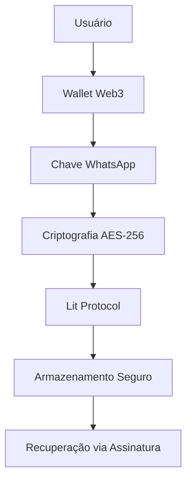

# 📱 Configuração Completa WhatsApp API e Criação de Agentes

## 🔐 Informações Sensíveis e Aprovação de Wallet

⚠️ **IMPORTANTE**: O WhatsApp API contém informações extremamente sensíveis. Para acessar esta funcionalidade, é necessário ter aprovação da wallet padrão:

**Wallet Padrão**: `0x17eDfB8a794ec4f13190401EF7aF1c17f3cc90c5`

Esta wallet possui as permissões necessárias para:
- Configurar novos agentes WhatsApp
- Gerenciar chaves de API sensíveis
- Autorizar integrações com WhatsApp Business API

---

## 📋 Pré-requisitos

### 1. Wallet Web3 com NFT Nation.fun
- **Endereço**: `0x17eDfB8a794ec4f13190401EF7aF1c17f3cc90c5` (padrão)
- **Requisito**: Possuir NFT da [Nation.fun](https://nation.fun/)
- **Rede**: Base Network (Chain ID: 84531)

### 2. WhatsApp Business API
- **Conta**: [WhatsApp Business Platform](https://business.facebook.com/settings/whatsapp-business-api)
- **Token de Acesso**: Chave de API válida
- **Número Verificado**: Número de telefone verificado na plataforma

### 3. Configuração do Ambiente
- **LLM_API_KEY**: Chave da OpenAI (obrigatória)
- **Privy App ID**: `cmgh6un8w007bl10ci0tgitwp` (já configurado)

---

## 🚀 Configuração Passo a Passo

### Passo 1: Configuração Inicial do Ambiente

1. **Copie o arquivo de exemplo**:
```bash
cp env.example .env
```

2. **Configure a única variável obrigatória**:
```bash
# .env
LLM_PROVIDER=nation.fun
LLM_MODEL=nation-1
# Não é necessária chave de API - acesso via NFT Nation.fun
```

3. **Inicie o agente**:
```bash
make run
```

### Passo 2: Configuração da Chave WhatsApp via Interface Web

1. **Acesse a interface web**: `http://localhost:8080`

2. **Navegue para**: Configurações → API WhatsApp

3. **Conecte sua wallet Web3**:
   - Clique em "Conectar Carteira"
   - Use MetaMask ou WalletConnect
   - Confirme a conexão

4. **Configure a chave WhatsApp**:
   - Insira sua chave de API do WhatsApp Business
   - Clique em "Armazenar"
   - Assine a mensagem na sua wallet

### Passo 3: Verificação da Configuração

```bash
# Verificar se o agente foi criado
curl -X GET http://localhost:8080/api/v1/agent/status

# Verificar configuração WhatsApp
curl -X GET http://localhost:8080/api/v1/agent/whatsapp/config
```

---

## 🤖 Criação de Novo Agente WhatsApp

### Método 1: Criação Automática (Recomendado)

O sistema cria automaticamente um agente WhatsApp quando detecta:
- Wallet válida com NFT Nation.fun
- Chave WhatsApp configurada via Lit Protocol

### Método 2: Criação Manual via API

```bash
# Criar novo agente WhatsApp
curl -X POST http://localhost:8080/api/v1/agent/create \
  -H "Content-Type: application/json" \
  -d '{
    "type": "whatsapp",
    "name": "Meu Agente WhatsApp",
    "description": "Agente para análise de infraestrutura via WhatsApp",
    "wallet_address": "0x17eDfB8a794ec4f13190401EF7aF1c17f3cc90c5"
  }'
```

### Método 3: Criação via Interface Web

1. **Acesse**: `http://localhost:8080/agents`
2. **Clique em**: "Criar Novo Agente"
3. **Selecione**: Tipo "WhatsApp"
4. **Configure**: Nome e descrição
5. **Confirme**: Criação do agente

---

## 🔒 Segurança e Armazenamento

### Lit Protocol Integration

O sistema utiliza [Lit Protocol](https://developer.litprotocol.com/) para armazenamento seguro:



### Fluxo de Segurança

1. **Criptografia Local**: Chave WhatsApp é criptografada com AES-256
2. **Criptografia Lit**: Chave AES é protegida pelo Lit Protocol
3. **Acesso Condicionado**: Apenas wallet autorizada pode descriptografar
4. **Armazenamento Descentralizado**: Dados podem ser armazenados em qualquer lugar

---

## 📱 Funcionalidades do Agente WhatsApp

### Comandos Disponíveis

| Comando | Descrição | Custo |
|---------|-----------|-------|
| `/analyze <código>` | Analisa código Terraform | 1 token IACAI |
| `/security <código>` | Verificação de segurança | 1 token IACAI |
| `/cost <código>` | Otimização de custos | 1 token IACAI |
| `/help` | Lista comandos disponíveis | Gratuito |
| `/status` | Status do agente | Gratuito |

### Exemplo de Uso

```
Usuário: /analyze
resource "aws_instance" "web" {
  instance_type = "t3.micro"
  ami           = "ami-0c02fb55956c7d316"
}

Agente: ✅ Análise concluída!
🔍 Problemas encontrados:
- Falta de tags obrigatórias
- AMI pode estar desatualizada
- Recomendo usar t3.small para produção

💰 Custo: 1 token IACAI debitado
```

---

## 🔧 Configuração Avançada

### Webhook WhatsApp

1. **Configure webhook**:
```bash
curl -X POST https://api.whatsapp.com/v1/webhooks \
  -H "Authorization: Bearer SUA_CHAVE_WHATSAPP" \
  -d '{
    "url": "https://seu-dominio.com/api/v1/webhook/whatsapp",
    "verify_token": "seu_token_verificacao"
  }'
```

2. **Configure no agente**:
```bash
curl -X PUT http://localhost:8080/api/v1/agent/whatsapp/webhook \
  -H "Content-Type: application/json" \
  -d '{
    "webhook_url": "https://seu-dominio.com/api/v1/webhook/whatsapp",
    "verify_token": "seu_token_verificacao"
  }'
```

### Rate Limiting por Tier

| Tier | Limite/Hora | Preço |
|------|-------------|-------|
| Basic | 100 requests | Gratuito |
| Pro | 1,000 requests | 10 tokens IACAI |
| Enterprise | 10,000 requests | 100 tokens IACAI |

---

## 🛠️ Troubleshooting

### Problemas Comuns

#### 1. Erro de Autenticação WhatsApp
```bash
# Verificar chave API
curl -X GET http://localhost:8080/api/v1/agent/whatsapp/test
```

**Solução**: Verifique se a chave está ativa e correta

#### 2. Falha ao Recuperar Chave
```bash
# Verificar wallet conectada
curl -X GET http://localhost:8080/api/v1/wallet/status
```

**Solução**: Use a mesma wallet que armazenou a chave

#### 3. Agente Não Responde
```bash
# Verificar logs
tail -f logs/agent.log
```

**Solução**: Verifique configuração do webhook e conectividade

### Logs e Monitoramento

```bash
# Ver logs em tempo real
make logs

# Verificar status do agente
make status

# Testar conectividade WhatsApp
make test-whatsapp
```

---

## 📊 Monitoramento e Métricas

### Dashboard de Uso

Acesse `http://localhost:8080/dashboard` para:
- Métricas de uso por agente
- Tokens consumidos
- Requests por hora
- Status de conectividade

### API de Métricas

```bash
# Obter métricas do agente
curl -X GET http://localhost:8080/api/v1/agent/whatsapp/metrics

# Obter estatísticas de uso
curl -X GET http://localhost:8080/api/v1/agent/whatsapp/stats
```

---

## 🔗 Referências e Links Úteis

- [WhatsApp Business API](https://developers.facebook.com/docs/whatsapp/api/)
- [Lit Protocol Documentation](https://developer.litprotocol.com/)
- [Nation.fun Platform](https://nation.fun/)
- [Base Network](https://base.org/)
- [Privy.io Documentation](https://docs.privy.io/)

---

## ⚠️ Avisos Importantes

1. **Nunca compartilhe sua chave privada da wallet**
2. **Mantenha sua chave WhatsApp API segura**
3. **Use apenas a wallet autorizada**: `0x17eDfB8a794ec4f13190401EF7aF1c17f3cc90c5`
4. **Monitore o uso de tokens IACAI**
5. **Configure webhooks corretamente para produção**

---

**Última atualização**: Dezembro 2024  
**Versão**: 1.0.0  
**Autor**: IaC AI Agent Team
