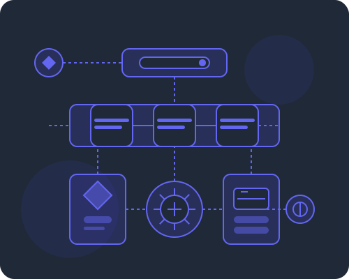

# Configuração Segura da API do WhatsApp

## Visão Geral

Este documento descreve a implementação de armazenamento seguro para a chave da API do WhatsApp no IaC AI Agent, usando criptografia baseada em Web3 e Lit Protocol.

Esta abordagem garante que:
1. Apenas o usuário dono da chave pode acessá-la, através de sua carteira Web3
2. A chave nunca é armazenada em texto puro, mesmo em bancos de dados públicos
3. O controle de acesso é gerenciado por criptografia, não apenas por permissões de banco de dados

## Arquitetura da Solução

### Fluxo de Armazenamento

1. **Usuário conecta sua carteira Web3** (Metamask, WalletConnect, etc.)
2. **Usuário fornece sua chave da API do WhatsApp** através da interface
3. **Sistema gera uma chave simétrica AES-256** para criptografar a chave da API
4. **Usuário assina uma mensagem** para autorizar o armazenamento
5. **A chave da API é criptografada localmente** usando AES-256
6. **A chave simétrica AES é criptografada pelo Lit Protocol** com condições de acesso
7. **Os dados criptografados são armazenados** no sistema
   
### Fluxo de Recuperação

1. **Usuário conecta sua carteira Web3**
2. **Usuário assina uma mensagem** para autenticar
3. **Sistema recupera os dados criptografados**
4. **Lit Protocol verifica a assinatura** e as condições de acesso
5. **Lit Protocol descriptografa a chave simétrica AES**
6. **Sistema usa a chave AES para descriptografar** a chave da API
7. **Sistema utiliza a chave da API para operações com o WhatsApp**

## Componentes Implementados

### Backend (Go)

1. **APIKeyStorage** (`internal/platform/web3/api_key_storage.go`)
   - Gerencia o armazenamento e recuperação seguros das chaves de API
   - Implementa criptografia AES-256 e integração com Lit Protocol
   - Verifica assinaturas de carteiras Web3

### Frontend (JavaScript)

1. **WhatsAppAPIKeyManager** (`js/whatsapp-api-key.js`)
   - Cliente para gerenciar a chave da API do WhatsApp no navegador
   - Implementa criptografia do lado do cliente
   - Integra-se com provedores Web3 como MetaMask

2. **WhatsAppKeyManager Component** (`js/components/WhatsAppKeyManager.js`)
   - Interface de usuário para gerenciar as chaves
   - Funcionalidades de armazenar, recuperar e excluir chaves
   - Feedback visual sobre operações

## Tecnologias Utilizadas

- **Criptografia AES-256** para proteção da chave
- **Lit Protocol** para gerenciamento de acesso baseado em criptografia
- **Web3.js/ethers.js** para interação com carteiras e assinaturas
- **Go Ethereum** para verificação de assinaturas no backend

## Como Utilizar

### Configurando uma Nova Chave

1. Acesse a seção "Configurações > API WhatsApp" na interface do usuário
2. Conecte sua carteira Web3 clicando no botão "Conectar Carteira"
3. Insira sua chave da API do WhatsApp no campo indicado
4. Clique em "Armazenar" para iniciar o processo
5. Assine a mensagem na janela da sua carteira Web3
6. Aguarde a confirmação de armazenamento bem-sucedido

### Recuperando uma Chave Existente

1. Acesse a seção "Configurações > API WhatsApp"
2. Conecte a mesma carteira Web3 usada para armazenar a chave
3. Clique em "Recuperar Chave"
4. Assine a mensagem na janela da sua carteira Web3
5. A chave será exibida temporariamente na interface

### Excluindo uma Chave

1. Acesse a seção "Configurações > API WhatsApp"
2. Conecte a mesma carteira Web3 usada para armazenar a chave
3. Clique em "Excluir Chave"
4. Assine a mensagem na janela da sua carteira Web3
5. A chave será removida permanentemente

## Considerações de Segurança

- **Nunca compartilhe sua chave privada da carteira Web3**
- **Não compartilhe screenshots da chave da API quando exibida**
- As chaves são criptografadas no navegador antes de serem enviadas para o servidor
- Apenas o dono da carteira Web3 que armazenou a chave pode recuperá-la
- Mesmo que o banco de dados seja comprometido, as chaves continuam protegidas pela criptografia

## Troubleshooting

### Problemas Comuns

1. **Erro "Assinatura Inválida"**
   - Certifique-se de estar usando a mesma carteira Web3 que armazenou a chave
   - Tente reconectar sua carteira e repetir o processo

2. **Erro "Nenhuma Chave Encontrada"**
   - Verifique se você já armazenou uma chave anteriormente
   - Confirme que está usando a carteira correta

3. **Erro "Falha ao Conectar Carteira"**
   - Certifique-se que sua extensão de carteira (ex: MetaMask) está instalada e desbloqueada
   - Tente atualizar a página e reconectar

## Referências

- [Lit Protocol Documentation](https://developer.litprotocol.com/)
- [Web3.js Documentation](https://web3js.readthedocs.io/)
- [AES Encryption](https://en.wikipedia.org/wiki/Advanced_Encryption_Standard)
- [WhatsApp Business API Documentation](https://developers.facebook.com/docs/whatsapp/api/)
