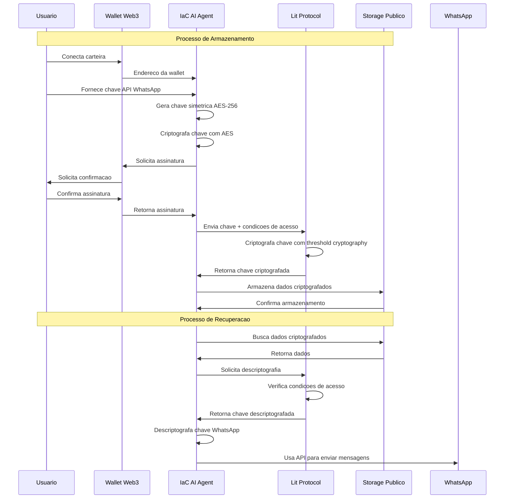

# 📱 Integração WhatsApp - IaC AI Agent

## Visão Geral

O IaC AI Agent pode funcionar como um chatbot do WhatsApp, permitindo interação via mensagens e fornecendo análises de infraestrutura sob demanda. A integração utiliza o **Lit Protocol** para armazenamento seguro da chave de API do WhatsApp, garantindo que apenas o dono da wallet possa acessá-la.

## 🔐 Armazenamento Seguro com Lit Protocol

O sistema utiliza o [Lit Protocol](https://github.com/govinda777/web3-secret-lit-protocol) para armazenar a chave de API do WhatsApp de forma segura em bancos de dados públicos. Esta abordagem inovadora permite:

1. **Criptografia baseada em wallet**: Apenas o dono da wallet pode descriptografar a chave
2. **Armazenamento descentralizado**: A chave pode ser armazenada em qualquer lugar
3. **Acesso condicionado**: Definimos condições de acesso baseadas em blockchain



## 🚀 Como Configurar

### Opção 1: Configuração Automática (Recomendada)

1. Inicie o agente apenas com `WALLET_ADDRESS` configurado
2. O sistema criará automaticamente um agente do tipo WhatsApp
3. Configure a chave do WhatsApp via API:

```bash
curl -X POST http://localhost:8080/api/v1/agent/whatsapp/key \
  -H "Content-Type: application/json" \
  -d '{"api_key": "sua_chave_whatsapp_aqui"}'
```

### Opção 2: Configuração Manual

Se preferir configurar manualmente:

1. Adicione ao arquivo `.env`:
```
WHATSAPP_API_KEY=sua_chave_aqui
```

2. O sistema armazenará a chave usando Lit Protocol na primeira execução

## 📋 Requisitos

- **Wallet com NFT da Nation.fun**: Necessário para criar o agente
- **Chave de API do WhatsApp Business**: [Obtenha aqui](https://business.facebook.com/settings/whatsapp-business-api)
- **Conta no Lit Protocol**: Criada automaticamente usando sua wallet

## 🤖 Funcionalidades do Chatbot

O agente WhatsApp pode:

- Receber comandos via mensagens
- Analisar snippets de código Terraform
- Enviar relatórios e alertas
- Responder a consultas sobre infraestrutura
- Executar análises de segurança sob demanda

## 🔄 Fluxo de Execução

1. **Inicialização**:
   - Verificação da wallet e NFT
   - Criação do agente WhatsApp (se não existir)
   - Recuperação segura da chave API via Lit Protocol

2. **Processamento de Mensagens**:
   - Recebimento via webhook do WhatsApp
   - Análise do conteúdo e comandos
   - Execução da operação solicitada
   - Cobrança de 1 token IACAI por análise

3. **Respostas**:
   - Geração de resposta contextualizada
   - Envio via API do WhatsApp
   - Registro de uso para billing

## 💰 Cobrança por Uso

Cada interação que envolve análise de código ou consulta ao LLM consome 1 token IACAI:

- **Análise de código**: 1 token
- **Consulta de segurança**: 1 token
- **Verificação de drift**: 1 token
- **Mensagens simples**: Gratuitas

## 🔗 Referências

- [Documentação Lit Protocol](https://developer.litprotocol.com/)
- [WhatsApp Business API](https://developers.facebook.com/docs/whatsapp/api/reference)
- [Web3 Secret Storage](https://github.com/govinda777/web3-secret-lit-protocol)

## 🛠️ Solução de Problemas

| Problema | Solução |
|----------|---------|
| Falha ao recuperar chave | Verifique se a wallet conectada é a mesma que armazenou a chave |
| Erro de autenticação WhatsApp | Verifique se a chave API está ativa e correta |
| Mensagens não enviadas | Confirme que o número está verificado na plataforma WhatsApp Business |

---

**Nota**: Esta integração combina o poder da análise de infraestrutura com a conveniência da comunicação via WhatsApp, tudo protegido pela segurança da tecnologia blockchain.
