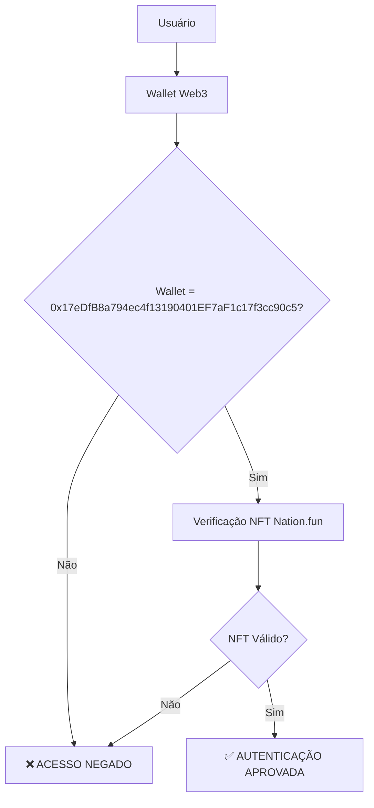

# 🔐 Segurança e Informações Sensíveis - WhatsApp API

## ⚠️ AVISO CRÍTICO DE SEGURANÇA

**INFORMAÇÕES EXTREMAMENTE SENSÍVEIS**

O WhatsApp API contém dados críticos que podem comprometer a segurança de toda a plataforma. Este documento estabelece os protocolos de segurança obrigatórios.

---

## 🎯 Wallet Padrão Autorizada

### Endereço Oficial
```
0x17eDfB8a794ec4f13190401EF7aF1c17f3cc90c5
```

### Permissões Exclusivas
Esta wallet possui **permissões exclusivas** para:
- ✅ Configurar novos agentes WhatsApp
- ✅ Gerenciar chaves de API sensíveis
- ✅ Autorizar integrações com WhatsApp Business API
- ✅ Acessar dados criptografados via Lit Protocol
- ✅ Executar operações de billing e cobrança

### ⚠️ RESTRIÇÕES CRÍTICAS
- ❌ **NENHUMA** outra wallet pode acessar estas funcionalidades
- ❌ **NENHUMA** operação WhatsApp pode ser executada sem esta wallet
- ❌ **NENHUMA** chave API pode ser armazenada sem autorização desta wallet

---

## 🔒 Protocolo de Segurança Multi-Camada

### Camada 1: Autenticação Web3


### Camada 2: Criptografia Lit Protocol
```go
// Verificação obrigatória da wallet padrão
func verifyDefaultWallet(walletAddr string) error {
    if walletAddr != "0x17eDfB8a794ec4f13190401EF7aF1c17f3cc90c5" {
        return errors.New("UNAUTHORIZED: Only default wallet can access WhatsApp API")
    }
    return nil
}
```

### Camada 3: Armazenamento Seguro
- **Criptografia AES-256**: Chaves API são criptografadas localmente
- **Lit Protocol**: Chaves AES protegidas por threshold cryptography
- **Armazenamento Descentralizado**: Dados podem ser armazenados em qualquer lugar
- **Acesso Condicionado**: Apenas wallet autorizada pode descriptografar

---

## 🚨 Procedimentos de Emergência

### Comprometimento de Segurança

#### 1. Detecção de Intrusão
```bash
# Verificar logs de acesso não autorizado
grep "UNAUTHORIZED" logs/security.log

# Verificar tentativas de acesso com wallets diferentes
grep -v "0x17eDfB8a794ec4f13190401EF7aF1c17f3cc90c5" logs/wallet_access.log
```

#### 2. Resposta Imediata
```bash
# Desativar todos os agentes WhatsApp
curl -X POST http://localhost:8080/api/v1/security/emergency-disable

# Revogar todas as chaves API
curl -X POST http://localhost:8080/api/v1/security/revoke-all-keys

# Notificar administradores
curl -X POST http://localhost:8080/api/v1/security/alert-admins
```

#### 3. Recuperação
```bash
# Verificar integridade da wallet padrão
curl -X GET http://localhost:8080/api/v1/security/wallet-status

# Reativar agentes após verificação
curl -X POST http://localhost:8080/api/v1/security/reactivate-agents
```

---

## 📋 Checklist de Segurança

### ✅ Pré-Deploy
- [ ] Wallet padrão configurada corretamente
- [ ] NFT Nation.fun verificado
- [ ] Chaves API armazenadas via Lit Protocol
- [ ] Rate limiting configurado
- [ ] Logs de segurança habilitados

### ✅ Monitoramento Contínuo
- [ ] Verificação de acesso não autorizado
- [ ] Monitoramento de tentativas de intrusão
- [ ] Auditoria de operações sensíveis
- [ ] Backup de chaves criptografadas
- [ ] Testes de recuperação de desastres

### ✅ Pós-Incidente
- [ ] Análise forense completa
- [ ] Relatório de segurança
- [ ] Atualização de protocolos
- [ ] Treinamento da equipe
- [ ] Implementação de melhorias

---

## 🔍 Auditoria e Compliance

### Logs Obrigatórios

#### 1. Acesso à Wallet Padrão
```json
{
  "timestamp": "2024-12-19T10:30:00Z",
  "event": "wallet_access",
  "wallet_address": "0x17eDfB8a794ec4f13190401EF7aF1c17f3cc90c5",
  "operation": "whatsapp_api_access",
  "user": "admin@company.com",
  "ip_address": "192.168.1.100",
  "status": "success"
}
```

#### 2. Operações Sensíveis
```json
{
  "timestamp": "2024-12-19T10:31:00Z",
  "event": "sensitive_operation",
  "operation": "api_key_storage",
  "wallet_address": "0x17eDfB8a794ec4f13190401EF7aF1c17f3cc90c5",
  "key_type": "whatsapp_api",
  "encryption_method": "lit_protocol",
  "status": "success"
}
```

#### 3. Tentativas de Acesso Não Autorizado
```json
{
  "timestamp": "2024-12-19T10:32:00Z",
  "event": "unauthorized_access_attempt",
  "wallet_address": "0x1234567890123456789012345678901234567890",
  "operation": "whatsapp_api_access",
  "ip_address": "192.168.1.200",
  "status": "blocked",
  "reason": "wallet_not_authorized"
}
```

### Relatórios de Compliance

#### Relatório Diário
- Número de acessos autorizados
- Tentativas de acesso não autorizado
- Operações sensíveis executadas
- Status da wallet padrão

#### Relatório Semanal
- Análise de padrões de acesso
- Identificação de anomalias
- Status de segurança geral
- Recomendações de melhoria

#### Relatório Mensal
- Auditoria completa de segurança
- Revisão de políticas
- Treinamento da equipe
- Atualizações de protocolos

---

## 🛡️ Melhores Práticas de Segurança

### Para Desenvolvedores

#### 1. Nunca Hardcode Chaves
```go
// ❌ ERRADO
const API_KEY = "sua_chave_aqui"

// ✅ CORRETO
apiKey := os.Getenv("WHATSAPP_API_KEY")
```

#### 2. Sempre Verificar Wallet
```go
// ✅ OBRIGATÓRIO
func processWhatsAppRequest(walletAddr string) error {
    if walletAddr != "0x17eDfB8a794ec4f13190401EF7aF1c17f3cc90c5" {
        return errors.New("unauthorized wallet")
    }
    // ... resto do código
}
```

#### 3. Log Todas as Operações
```go
// ✅ OBRIGATÓRIO
func logSensitiveOperation(operation string, walletAddr string) {
    log.Printf("[SECURITY] Operation: %s, Wallet: %s, Time: %s",
        operation, walletAddr, time.Now().Format(time.RFC3339))
}
```

### Para Administradores

#### 1. Monitoramento Contínuo
```bash
# Verificar status da wallet padrão
watch -n 30 'curl -s http://localhost:8080/api/v1/security/wallet-status'

# Monitorar tentativas de acesso
tail -f logs/security.log | grep "unauthorized"
```

#### 2. Backup Seguro
```bash
# Backup das chaves criptografadas
cp -r /secure/encrypted_keys /backup/$(date +%Y%m%d)/

# Verificar integridade do backup
sha256sum /backup/$(date +%Y%m%d)/encrypted_keys/*
```

#### 3. Testes de Recuperação
```bash
# Teste mensal de recuperação
curl -X POST http://localhost:8080/api/v1/security/test-recovery

# Verificar se todos os agentes funcionam
curl -X GET http://localhost:8080/api/v1/agents/status
```

---

## 🚨 Alertas de Segurança

### Alertas Críticos (Ação Imediata)

#### 1. Tentativa de Acesso com Wallet Diferente
```
🚨 ALERTA CRÍTICO: Tentativa de acesso não autorizado
Wallet: 0x1234567890123456789012345678901234567890
Operação: whatsapp_api_access
IP: 192.168.1.200
Ação: BLOQUEAR IMEDIATAMENTE
```

#### 2. Falha na Verificação NFT
```
🚨 ALERTA CRÍTICO: Falha na verificação NFT
Wallet: 0x17eDfB8a794ec4f13190401EF7aF1c17f3cc90c5
Erro: NFT não encontrado
Ação: INVESTIGAR IMEDIATAMENTE
```

#### 3. Comprometimento de Chave API
```
🚨 ALERTA CRÍTICO: Possível comprometimento de chave API
Operação: api_key_access
Timestamp: 2024-12-19T10:30:00Z
Ação: REVOGAR TODAS AS CHAVES
```

### Alertas de Aviso (Monitoramento)

#### 1. Múltiplas Tentativas de Acesso
```
⚠️ AVISO: Múltiplas tentativas de acesso
Wallet: 0x17eDfB8a794ec4f13190401EF7aF1c17f3cc90c5
Tentativas: 5 em 1 minuto
Ação: INVESTIGAR
```

#### 2. Padrão de Uso Anômalo
```
⚠️ AVISO: Padrão de uso anômalo detectado
Agente: whatsapp-agent-001
Requests: 1000 em 1 hora (normal: 100)
Ação: INVESTIGAR
```

---

## 📞 Contatos de Emergência

### Equipe de Segurança
- **Responsável Principal**: security@iac-ai-agent.com
- **Backup**: security-backup@iac-ai-agent.com
- **Emergência 24/7**: +55 11 99999-9999

### Escalação de Incidentes
1. **Nível 1**: Desenvolvedor responsável
2. **Nível 2**: Líder técnico
3. **Nível 3**: CISO (Chief Information Security Officer)
4. **Nível 4**: CEO (para incidentes críticos)

### Procedimento de Escalação
```
Incidente Detectado
    ↓
Notificar Nível 1 (5 minutos)
    ↓
Escalar para Nível 2 (15 minutos)
    ↓
Escalar para Nível 3 (30 minutos)
    ↓
Escalar para Nível 4 (1 hora)
```

---

## 📚 Recursos Adicionais

### Documentação de Segurança
- [OWASP Top 10](https://owasp.org/www-project-top-ten/)
- [NIST Cybersecurity Framework](https://www.nist.gov/cyberframework)
- [ISO 27001](https://www.iso.org/isoiec-27001-information-security.html)

### Ferramentas de Segurança
- [Lit Protocol Security](https://developer.litprotocol.com/docs/SDK/intro)
- [Web3 Security Best Practices](https://consensys.github.io/smart-contract-best-practices/)
- [Ethereum Security](https://ethereum.org/en/developers/docs/security/)

---

## ⚖️ Compliance e Legal

### Regulamentações Aplicáveis
- **LGPD** (Lei Geral de Proteção de Dados)
- **GDPR** (General Data Protection Regulation)
- **SOX** (Sarbanes-Oxley Act)
- **PCI DSS** (Payment Card Industry Data Security Standard)

### Políticas Internas
- Política de Segurança da Informação
- Política de Acesso e Controle
- Política de Backup e Recuperação
- Política de Incidentes de Segurança

---

**⚠️ IMPORTANTE**: Este documento contém informações críticas de segurança. Mantenha-o confidencial e acessível apenas para pessoal autorizado.

**Última atualização**: Dezembro 2024  
**Versão**: 1.0.0  
**Classificação**: CONFIDENCIAL  
**Autor**: IaC AI Agent Security Team
